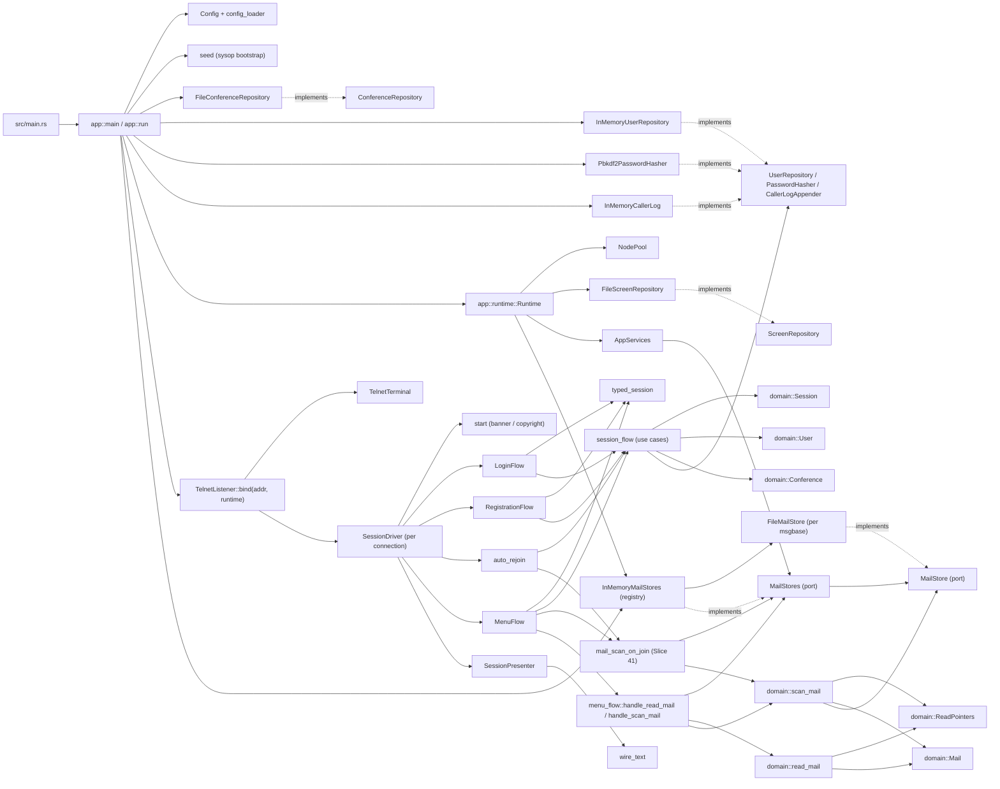

# NextExpress System Notes

This document captures the current internal design of the Rust implementation
under `rust/` and the remaining higher-impact refactorings that would make the
system easier to understand and extend.

## Current Shape

The implementation follows a ports-and-adapters direction:

- `rust/src/domain/` holds core BBS concepts: `Session`, `User`, `Conference`,
  `Node`, `Mail`, `ReadPointers`, persistence ports (`UserRepository`,
  `ConferenceRepository`, `MailStore`, `MailStores`), the messaging rules
  (`read_mail`, `scan_mail`), password hashing, caller logs, and session
  policy.
- `rust/src/app/` is the application layer: configuration, runtime
  composition, session orchestration, terminal/screen ports, typed session
  wrappers, and use-case functions.
- `rust/src/adapters/` holds concrete technology choices: telnet, file-backed
  conferences/screens, file-backed mail store (JSON per message), an in-memory
  mail-stores registry (`InMemoryMailStores`) the composition root populates
  with one `FileMailStore` per known `(conference, msgbase)` coordinate,
  in-memory users/logs, and PBKDF2 hashing.
- `rust/tests/architecture.rs` guards the most important rule today: domain
  code must not import `app` or `adapters`.

Phase 6 messaging is wired end-to-end: `domain::Mail` (Slice 37, entity)
plus the `MailStore` port land per-msgbase via the `FileMailStore` adapter.
Each store writes one JSON file per message at
`<msgbase-dir>/<zero-padded-number>.json`, scans the directory at open time
to recover the cached `highest_message` high-water mark, and backs the spec's
`lock_msgbase(msgbase)` predicate with an in-process `tokio::sync::Mutex`.
Timestamps on the wire (`posted_at`, `received_at`) are RFC 3339 strings in
UTC via the `time` crate's `serde-well-known` adapter; non-UTC offsets in
hand-written files parse to the same instant as their UTC form, which keeps
the door open for sysops migrating data from other systems.

Slice 38 introduces `domain::ReadPointers`, attached as a `Vec` on every
`ConferenceMembership`. The user-level helper `read_pointers_for(user,
msgbase)` is the spec's black box; rows are lazily created on first
`ReadMail` / `ScanMail` for a base.

Slices 39–41 wire the headline read flow. The domain rules stay pure;
the app layer (`app::menu_flow` and `app::mail_scan_on_join`) is what
resolves the per-msgbase `MailStore` handle through the `MailStores`
port (`services.mail_stores().for_msgbase(...)`), locks it, and threads
it into the rule:
- Slice 39 (`domain::read_mail::read_mail` + `can_read`): the rule
  itself takes an already-loaded `&mut Mail`. The `R <num>` menu glue
  in `menu_flow::handle_read_mail` does the `MailStore::load` →
  `read_mail` → `MailStore::save` dance, then renders the legacy header
  block plus body to the terminal.
- Slice 40 (`domain::scan_mail::scan_mail`): the rule takes a
  `MailStore` directly (it walks the base itself). The `M` / `N` menu
  commands in `menu_flow::handle_scan_mail` resolve the store, lock it,
  call the rule (advancing `last_scanned`), and render a summary line.
  The same helper backs the spec's `count_unread_for` /
  `first_unread_number_for` black boxes.
- Slice 41 (`app::mail_scan_on_join`): both the auto-rejoin path (in
  `SessionDriver`) and the explicit-join path (in `MenuFlow`) call the
  shared `scan_mail_on_join` helper after the new `ConferenceVisit` is
  created. When the scan surfaces unread mail the listener writes
  `SCREEN_MAILSCAN` plus the summary line; an empty scan still emits the
  summary so the user knows they were checked.

Slice 41a wires the file-backed `MailStores` registry into the composition
root: `app::run` walks the loaded conferences and opens one `FileMailStore`
per `(conference, msgbase)` coordinate, registering them in an
`InMemoryMailStores` registry served as the `MailStores` port through
`AppServices`. Read pointers ride along with the bound user record and
flush on logoff via the existing `save_bound_user` path.

The transport adapter, runtime composition, session-driving sub-flows, and the
repository port shape were sharpened in recent refactorings:

- `app::runtime::Runtime` is the single composition point for driven adapters,
  configuration-derived policy values (`SessionPolicy`, `DefaultRatio`,
  `NewUserGateConfig`), the screen repository, and the `NodePool`.
  `TelnetListener` no longer constructs any of these; it only binds, accepts
  streams, and delegates to `SessionDriver`.
- `SessionDriver` is a thin orchestrator. The sub-flows live in their own
  modules: `app::login_flow::LoginFlow`,
  `app::registration_flow::RegistrationFlow`, `app::menu_flow::MenuFlow`. The
  rendering helpers shared by the auto-rejoin and explicit-join paths live in
  `app::session_presenter`.
- `UserRepository::allocate_slot_and_create` is the single atomic registration
  entry point. Slot allocation and insertion happen under one lock, with
  explicit `UserCreationError::{Build, DuplicateUser, DuplicateSlot}` variants.
- The `NEW` registration literal is recognised by the login flow
  (`NEW_USER_REGISTRATION_LITERAL` in `app::session_flow`). `UserRepository`
  is pure storage and returns only `NameLookupResult::Found` /
  `NotFound`.

The remaining concentration-of-responsibility hotspots are the two domain
aggregates:

- `domain/session/mod.rs` is the central session aggregate and still contains
  lifecycle, authentication, registration, time budget, conference join/scan,
  caller-log formatting hooks, and a large test body. Helper submodules
  (`budget`, `lockout`, `outcomes`, `errors`, `transitions`, `log_format`)
  already exist, but the main module still carries many feature areas
  directly.
- `domain/user.rs` is the user aggregate, but it is accumulating credentials,
  lockout, time accounting, profile data, access rights, ratios, and
  conference membership state.

## Recommended Refactorings

### 1. Decompose the `Session` aggregate by capability

`domain::Session` is the right aggregate root, but `domain/session/mod.rs` is
now too broad. Some helper modules already exist (`budget`, `lockout`,
`outcomes`, `errors`, `transitions`), but the main module still carries many
feature areas directly.

Refactor toward modules such as:

- `session/state.rs`: `Session`, `SessionShared`, `SessionPhase`, core
  transition helpers.
- `session/identity.rs`: name prompt and unknown-name rules.
- `session/registration.rs`: new-user gate and completion.
- `session/authentication.rs`: password match/mismatch and reset entry points.
- `session/activity.rs`: idle timeout, carrier loss, budget ticking.
- `session/conferencing.rs`: auto-join, explicit join, conference scan.
- `session/logging.rs`: logon/logoff line formatting.

Why this is better:

- new Allium slices have an obvious home;
- tests can sit near the capability they prove;
- reviewing changes becomes less risky because unrelated session behavior is
  physically separated.

### 2. Break `User` into internal value objects

`domain::User` is becoming a broad aggregate. It currently holds identity,
credentials, lockout state, access tier, contact profile, terminal
preferences, time accounting, ratio settings, conference memberships, and
last-joined state.

Keep `User` as the aggregate root, but internally group data and behavior into
small value objects:

- `Credentials`: hash kind, hash, salt, last updated, password-reset flag.
- `AccountStatus`: access level, lock state, validation status, invalid
  attempts.
- `UsageAccounting`: calls, last call, daily counters, time limits.
- `Profile`: location, phone, email, line length, ANSI preference, flags.
- `ConferenceAccess`: memberships and last joined message base.
- `RatioPolicy`: mode and value.

Why this is better:

- future file/message/ratio/admin slices will not all edit one large struct;
- invariants can live near the data they protect;
- persistence adapters get clearer mapping boundaries.

### 3. Introduce a real user-store adapter before more account features

The runtime currently always seeds an in-memory sysop and warns that
production needs a real user store. That is fine for early slices, but account
features such as registration, lockout, password reset, ratios, and conference
membership become hard to reason about when all state is process-local.

Refactor toward:

- a file-backed `UserRepository` before expanding user/account workflows much
  further;
- a bootstrap step that creates the default sysop only when the configured
  store is empty;
- migration-friendly serialization around the smaller `User` value objects
  above.

Why this is better:

- user-facing behavior survives process restart;
- registration and lockout semantics become meaningful operationally;
- storage format decisions are made while the account model is still small
  enough to reshape.

### 4. Strengthen architectural tests

`rust/tests/architecture.rs` catches direct `use crate::app` or
`use crate::adapters` from domain files. That is useful, but narrow.

Refactor toward tests that also assert:

- domain code does not refer to forbidden modules through fully-qualified
  paths;
- adapters do not construct unrelated adapters as part of transport behavior;
- composition-only code stays in the composition root;
- domain modules remain free of Tokio, filesystem, and networking
  dependencies.

Why this is better:

- architecture rules remain enforceable as the codebase grows;
- future contributors get fast feedback when a dependency boundary drifts;
- the intended ports-and-adapters design becomes executable documentation.

## Suggested Order

1. Decompose `Session` and `User` internally as the next feature slices touch
   those areas.
2. Add a durable user repository before building more account/admin behavior.
3. Strengthen architecture tests after the new boundaries exist.

## Refactorings Not Worth Prioritising Yet

- Splitting the crate into multiple crates. The module boundaries are still
  sufficient; separate crates would add ceremony before the domain is stable.
- Introducing a DI framework. Plain construction in the composition root is
  enough.
- Rewriting every async port just for style. The current boxed-future ports
  are serviceable; change them only if they block a concrete refactor.
