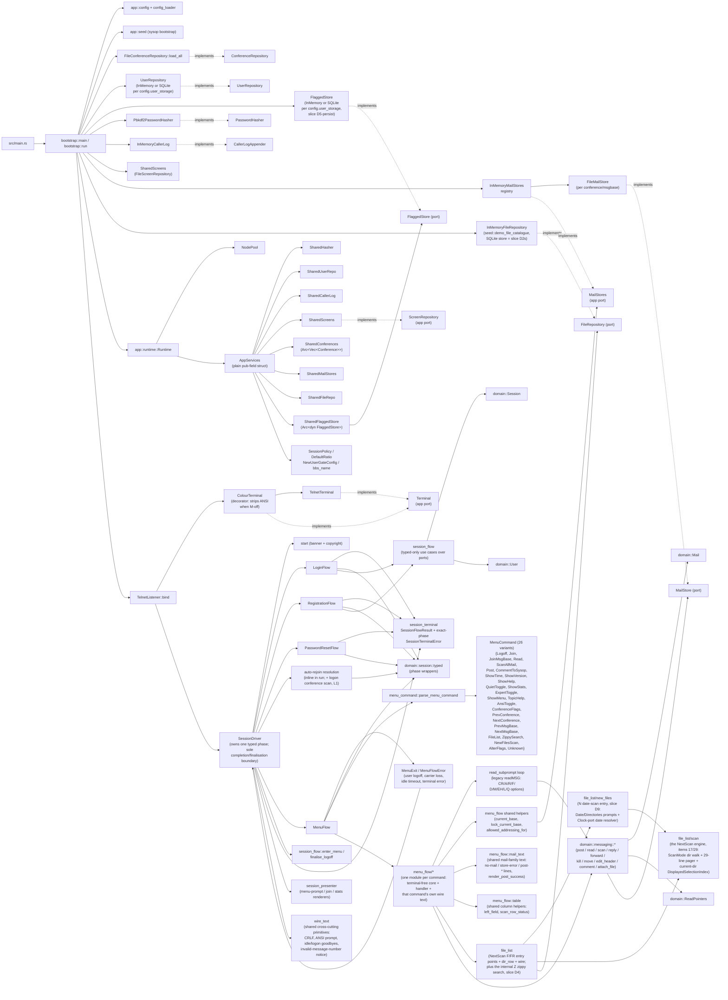

# NextExpress System Notes

This document captures the current internal design of the Rust implementation
under `rust/` and the larger refactorings worth considering next.

## Suggested refactorings (ordered)

The July 2026 forward-looking review, sequenced in application order.
Item numbers refer to the detailed entries under "Large-scale
refactorings worth considering" and "Forward-looking review additions"
below; the slice-by-slice rationale is under "Current recommended order". Effort
and file counts are the review verifiers' adjusted estimates.

| # | Refactoring (item) | Land when | Why it improves the design for what's coming | Files touched | Effort |
|---|---|---|---|---|---|
| 1 | **Unify flag identity to `(conference, name)`** (14) | **Landed** 2026-07-02 | Fixes a live defect: dual `FlaggedKey` identities silently lose flag saves under SQLite and duplicate the `A` listing. D/DS downloads consume this list as the default download set — it must have one identity before anything is pinned against it. | ~10 src/test + 3 docs | 0.5–1 day |
| 2 | **Mutation gate → diff-vs-main** (15) | **Landed** 2026-07-02 | `make check` documents a 6–9 h full sweep nobody runs; agents execute the checklist literally. Aligning the documented and practiced gate keeps TDD+mutants viable as the crate grows through Tier D. | 2 (Makefile, AGENTS.md) | 1–2 h |
| 3 | **Smoke-harness builder** (12 remainder) | **Landed** 2026-07-02 (two-session primitives stage deferred to Tier E) | At landing time six smokes each re-rolled ~110–155 lines of harness and FS was the next consumer. The shared single-session harness landed; two-session primitives remain consumer-driven work for Tier E. | ~8, test-only | ~1 day |
| 4 | **Clock port in `AppServices`** (16) | **Landed** 2026-07-03 | 48 hardwired `SystemTime::now()` sites mean no test can control the date. N's "-X Days" scan, transfer timestamps, and Tier I daily caps/rollover are all untestable deterministically without it. | ~20 (mechanical one-liners) | ~1 day |
| 5 | **`FileRepository` port prep** (18) | **Landed** 2026-07-03 | Result-ifies the port while the blast radius is 8 call sites and gives repository operations an area address (`FileAreaRef`). `FileAreaRef` is **not** stable file identity; row 19's accepted D2s design adds `FileId`. N's date query lands as a since-bounded port method — the contract the D2s SQLite store inherits, instead of client-side filtering. | ~6–9 | 0.5–1 day |
| 6 | **Extract the NextScan scan engine** (17) | **Landed** 2026-07-03 (first task of the N slice) | The pager/dir-walk machine is private to the 862-line `file_list` and welded to F's row source; N is pinned to the same engine. The extraction makes N a thin entry point and serves every later lister (download preflight, FM). | 4–5 | 1–1.5 days |
| 7 | **Prompt-reader merge + `line_for` extraction** (10) | **Landed** 2026-07-03 | Six hand-rolled readers, and the `record_input` idle-stamp is already inconsistent. One reader that stamps internally makes every upcoming prompt (N's date, FM's loops, W, account editor) a one-liner that can't forget the idle clock. | ~6 | 1–1.5 days |
| 8 | **Error-boundary pass** (2 remainder) | **Landed** 2026-07-03 (`UserRepositoryError` folds into row 9) | Port errors diverge four ways; D2s will copy whichever template it finds, and today the prominent one leaks adapter vocabulary into the domain. Pins one opaque-`Backend` convention before the port family doubles. | 12–15 (mostly mechanical) | ~1 day |
| 9 | **Command-style user writes** (1) | **Landed** 2026-07-03 (pulled ahead of N — disjoint file sets, and two of its fixes were live defects: the bare-save tear and same-account lost updates) | The whole-aggregate upsert silently reverts any concurrent writer and isn't transactional. D-T2's ledger deltas are the first second-writer path; Tier G/H sysop edits and Tier I accounting all depend on delta/patch writes existing. The biggest single item. | ~10–14 incl. tests | 4–6 days |
| 10 | **SQLite schema migrations** (22) | Before D2s or any schema change | No mechanism can alter an existing `users.db`; D-T2's first new column would break every login after upgrade, and D2s must not launch another unversioned durable schema. Versioned migrations make later accounting and `row_version` changes routine. | 3–5 | 0.5–1 day |
| 11 | **`AuthenticatedCall` struct** (23a) | **Landed** 2026-07-16 | The per-call payload was duplicated in `Onboarded`/`Menu` and Option-scattered across the terminal phases, with two 8-arm salvage matches; every new field cost ~7 sites. Now `Onboarded`/`Menu` carry one `AuthenticatedCall` and `LoggingOff`/`Ended` carry the `CallSalvage` enum (`Unidentified \| Identified(User) \| Authenticated(AuthenticatedCall)`), so a per-call field is a single-site addition — proven by the first one, the opaque `CallId` stamped at authentication (app-generated entropy passed in like `now`; `Session::call_id()` survives teardown for the D-T1 ledger). | ~6–7 + ~10 test files (call-site sweep) | 0.5–1 day |
| 12 | **UTF-8 policy re-scope + echo-hole fix** (19) | Before D-T1 | The accepted contract keeps interactive text valid UTF-8 and permits arbitrary bytes only in a negotiated binary-transfer window. Implement it in AGENTS/tests before the first Zmodem frame and close today's Latin-1 echo hole. | ~4 (2 docs + codec + test) | ~0.5 day |
| 13 | **Raw binary channel on `Terminal`** (20) | Opening sub-slice of D-T1 | The stack destroys binary in both directions (lossy decode, dropped `IAC IAC`, no 0xFF doubling, ANSI stripping). `read_bytes`/`write_raw` with BINARY negotiation is the one seam all transfer slices flow through. | ~5–8 | 1–3 days |
| 14 | **Sans-IO Zmodem engine** (21) | Shapes D-T1 | The accepted sans-IO shape keeps frame/state logic independent of sockets and lets the smoke harness use the same engine as an embedded peer. Porting `zmodem.e`'s callback-into-serial shape would weld protocol logic to live I/O and force a second implementation. | engine lands inside D-T1..T5 | 1–2 wks in-slice |
| 15 | **Real `has_access` narrowing** (24) | Sysop-only time override before item 27; remaining rights with first refusal | The stub grants every right to any validated account, which would make every validated caller immune to time expiry. The accepted provisional rule grants `OverrideTimeLimit` only to sysops; narrow other variants with their first captured refusing slice. | ~3–6 | 0.5–2 days, staged |
| 16 | **`NodePool` → presence registry** (25) | Immediately before WHO | Today nothing can answer "who is online" — no registry, dead `LoggedOn` transitions, pool unreachable from handlers. `NodePresence` + `snapshot_all` is the read-side seam for WHO/WHD, Tier G's node monitor, and the place delivery handles later hang. | ~8–12 | 1–2 days |
| 17 | **Terminal-delivery `SessionSignal` channel** (26) | **Landed** 2026-07-03 (pulled forward; OLM/page add the send side) | The landed one-variant `Deliver(Vec<u8>)` lane can wake a session blocked on terminal input without losing partially typed text. It is deliberately **delivery-only**: it cannot mutate session state or preserve typed logoff reasons for kick/suspend/time changes. Row 23 records the missing control plane. | ~5–7 | ~3 days |
| 18 | **Activate the time budget** (27) | **Before D-T3** | `tick_minute` has zero callers — "mins. left" is frozen and `OutOfTime` unreachable (a parity gap now). D-T3's transfer eligibility must not read a frozen budget; Tier G's time +/- and Tier I accounting depend on the same live accrual. | ~4–6 + FS-UAE capture | 1–2 days |
| 19 | **Stable file identity + transfer transaction boundary** (28) | **Design accepted**; implementation spans D2s/D-T1/D-T2 | Add stable `FileId` and one durable SQLite metadata database/pool whose unit-of-work atomically updates transfer, file, user and membership projections; ephemeral mode implements the same boundary in memory. Stable configuration area keys preserve identity across renumbering. | ~8–15 | implementation in-slice |
| 20 | **NextScan listed-file index** (29) | **Landed** 2026-07-10 (D10) | The scan-wide `Vec<ListedRow>` incorrectly retained repeated numbers across areas/reloads. A private dense `DisplayedSelectionIndex(Vec<FlaggedKey>)` now replaces identity at each directory/reload boundary and resolves `R n` by direct `n - 1` lookup; captured legacy names deliberately bypass catalogue lookup. The ordered current-page `Vec` remains solely for redraw geometry, and staged flags commit only after terminal output succeeds. | 4 src/test + 4 docs/evidence | capture + 1 day |
| 21 | **Complete flagged-file identity/order lifecycle** (30) | **Design accepted**; implement before D/DS, purge before D-S2 | Allow duplicate names across areas, resolve legacy keys in configured area order to `FileId`, preserve insertion order with sequence + membership index, enforce 1000 entries, persist command deltas, and quarantine/report migration overflow. | ~6–10 | 2–4 days |
| 22 | **Bounded blocking-work boundary** (31) | **Design accepted**; implement before D2s/D-T1 | Put async application facades over bounded blocking workers, with one serialized SQLite writer and a small read pool. Keep pure domain rules synchronous, isolate password/extraction capacity, and stream file bytes with backpressure. | ~8–15 | 3–6 days, staged |
| 23 | **Typed session control plane** (32) | **DECISION REQUIRED before any file mutation that invalidates active flags, or state-changing Tier E/G slices** | Terminal delivery cannot implement flag reconciliation, kick reason, suspend/reserve, time adjustment or chat state. Choose one typed lane owned by the session driver or separate notification/control lanes; terminal `Deliver` may remain the text wake-up mechanism. | design + ~6–12 | decision: 0.5–1 day; implementation with first consumer |
| 24 | **Direct persisted-counter restoration** (33) | **Landed** 2026-07-17 (tell-don't-ask campaign) | SQLite loading replayed `messages_posted` one `bump` at a time — a potential billion-iteration login path. `ConferenceMembership::from_persisted` now restores rows directly (scan flags via `ScanFlagSettings`, pointers upserted internally) and `MembershipPatch::apply_to` applies deltas through the saturating `add_messages_posted` — the counter-API precedent later accounting inherits. | ~3–5 | 0.5–1 day |
| 25 | **In-memory user adapter parity + indices** (34) | Now | Ephemeral mode remains supported under the accepted common unit-of-work contract. Match SQLite's folded-handle uniqueness, and use a slot map plus normalized-handle index to remove repeated scans and prepare H1 queries. | ~2–5 | 0.5–2 days |
| 26 | **Mail header/visibility index** (35) | With the next mail-scale slice | `FileMailStore` caches only the highest number; finding the lowest undeleted message and listing headers repeatedly reparses whole JSON bodies. Cache ordered undeleted numbers and header projections, with an explicit rebuild policy. | ~4–7 | 1–3 days |
| 27 | **Ordered collection wrappers and one-pass walks** (36) | Opportunistically before I1 | Conference/catalogue/membership pointer collections need deterministic order but repeatedly perform nested scans. Sorted-vector wrappers with binary search enforce uniqueness without replacing ordered data with blind hash maps; conference activity can use its last-visit invariant directly. | ~6–12 | 2–4 days, staged |
| 28 | **Server task supervisor** (37) | Before G4 shutdown or D-T6 background work | The listener detaches every session task and has no cancellation/drain path. Track session/background tasks, propagate shutdown, and surface release failures before commands depend on coordinated stop or workers. | ~5–9 | 2–4 days |

Dependencies: 13 depends on 12's policy implementation; 14 depends on 13;
18 wants 4's clock for a deterministic smoke; 19 must shape the D2s
schema and row 21's resolved identity; 22 shapes the D2s adapter and
row 13's streaming content port; 23 grows around rows 16–17 rather
than treating terminal delivery as session control; rows 24–25 are
independent current correctness tidies; rows 26–28 wait for their named
consumers. Row 9 landed
schema-free as its dependency note required (10 had not landed
first). Rows 10–14 and 18–22 form the pre-transfer block (row 11
landed 2026-07-16); row 23 waits
for its first state-changing cross-session consumer.

## Current Shape

The implementation is a hexagonal (ports and adapters) layout split across four
top-level modules under `rust/src/`:

- **`domain/`** — pure behaviour and entities distilled from the Allium specs in
  `specs/`. Aggregates (`Session`, `User`, `Conference`, `ConferenceVisit`,
  `Mail`, `Node`, `File`, `FileArea`) plus the per-session
  `ConferenceActivity` sub-aggregate (owns the `Vec<ConferenceVisit>` +
  `Option<ConferenceScan>` and lives outside the phase enum so it
  survives `Onboarded → Menu`), value objects (`ReadPointers`,
  `MessageBaseRef`, `Bytes`, `ConferenceScan`, and the `pub`
  `FlaggedFiles`/`FlaggedKey` — the session-scoped flagged-file set the
  `F`/`R` pager verbs build, shared by `domain/files`, `domain/session`,
  and `app/menu_flow/file_list`, slice D2f; the `A` alter-flags loop also
  adds (`flag`) and clears (`clear`) it (slices D6a/D6b); the plain-`G`
  logoff confirm reads it via `is_empty()` (slice Ga); slice D5-persist
  saves it on logoff and restores it on logon via the `FlaggedStore` port),
  port traits (`UserRepository`, `ConferenceRepository`, `MailStore`,
  `PasswordHasher`, `CallerLogAppender`, `FileRepository`, `FlaggedStore`), phase-typed session wrappers, the
  `messaging.allium` rule family (`read_mail`, `scan_mail`, `post_mail`,
  `post_comment_to_sysop`, `reply_to_mail`, `forward_mail`, `delete_mail`,
  `edit_mail_header`, `move_mail`, `attach_file_to_mail`), the password
  helpers, caller-log entry shape, and `SessionPolicy`.

- **`adapters/`** — concrete tech: `TelnetListener` (transport; per-session
  task errors are reported with the peer address rather than discarded),
  `FileConferenceRepository`, `FileScreenRepository` (file-backed assets with
  caching), `FileMailStore` (one JSON file per message),
  `InMemoryMailStores` (registry), `InMemoryUserRepository`,
  `SqliteUserRepository`, `InMemoryFlaggedStore` (process-lifetime flag
  persistence — the default when no `user_storage` path is configured),
  `SqliteFlaggedStore` (durable flag persistence in the same `users.db`,
  a `flagged_files (slot_number, conference, name)` table — selected when
  `user_storage` points to a SQLite path, slice D5-persist),
  `InMemoryFileRepository` (the seeded demo file catalogue, slice D1),
  `InMemoryCallerLog`, `Pbkdf2PasswordHasher`,
  `telnet_line` codec (`read_telnet_line` with an `EchoMode` plus
  `read_telnet_key`, the single-keystroke decoder that lets the NextScan
  pager run true hotkeys and emit its own captured echo bytes — slice D2b).

- **`app/`** — application layer: ports, services, flows, and
  transport-agnostic drivers. Carries application-layer ports
  (`Terminal`, `ScreenRepository`, `MailStores`), configuration types,
  the runtime value (`Runtime` + `AppServices`), the per-connection
  orchestrator and sole lifecycle-completion boundary (`SessionDriver`),
  phase-preserving terminal failures (`session_terminal`), four sub-flows
  (`LoginFlow`, `RegistrationFlow`, `PasswordResetFlow`, `MenuFlow`), a command module under
  `app/menu_flow/*` for each non-trivial menu command (terminal-free
  core fn + terminal-aware handler in the same file; simple
  toggles/queries dispatch inline in `MenuFlow::dispatch`), and the
  `ColourTerminal` decorator
  (`app/colour_terminal`) that strips ANSI SGR escapes from output
  while the `M`-toggled colour mode is off. Production code under `app/` is forbidden from
  importing `crate::adapters`; the boundary is enforced by
  `tests/architecture.rs::app_does_not_depend_on_adapters_in_production_code`.

- **`bootstrap.rs`** — composition root (a single file, no submodules).
  The only module allowed to
  construct concrete adapters: it loads the config, picks the user
  repository (in-memory vs. SQLite), opens one `FileMailStore` per
  known msgbase, builds a `FileScreenRepository`, wires the lot through
  `Runtime::new`, binds the `TelnetListener` and runs the accept loop.
  The `nextexpress` binary's `main` calls `bootstrap::main` and does
  nothing else.

### Architectural invariants

`rust/tests/architecture.rs` walks the source tree and rejects:

1. Any `use` path under `src/domain/` that names `crate::adapters`,
   `crate::app`, or a bare `adapters::` / `app::` sibling.
2. Any non-comment line under `src/domain/` that mentions an
   infrastructure crate or module (`tokio::`, `serde_json::`, `toml::`,
   `std::fs::`, `std::io::`, `std::net::`).
3. Any production-code `use` path under `src/app/` that names
   `crate::adapters` (or the bare sibling). Test modules
   (`#[cfg(test)] mod …`) are excluded since unit tests legitimately
   reach for adapter test doubles; the walker tracks braces to skip
   those blocks. Only `src/bootstrap.rs` is allowed to import adapter
   types.

The infrastructure-reference guard is stronger than a plain import
check — a domain error like `source: serde_json::Error` would fail it
even without an import, so the domain stays free of those infrastructure
types in signatures as well as bodies.

`std::io::` is on the list as of the June 2026 error-boundary pass: the
domain port errors no longer name any concrete I/O type. `MailStoreError`
and `ConferenceRepositoryError` previously embedded `std::io::Error`
directly (`MailStoreError::Io`); they now carry an
infrastructure-agnostic `Backend { source }` variant whose `source` is
the type-erased `Box<dyn Error + Send + Sync>` (`StoreSourceError` /
`ConferenceRepositorySourceError`). Each file adapter owns a
`From<std::io::Error>` impl that boxes its native error at the port
boundary — the single place `std::io::Error` meets the port. `Box<dyn
Error>` is retained deliberately as the opaque source: it is the
standard type-erasing idiom, not an infrastructure-specific leak, so the
guard does not forbid it. (Refactoring 2's larger moves — relocating
`ConferenceRepository` out of the domain and collapsing
`MailStoreError`'s rich variants — remain open.)

### Sync domain, async edges

Every domain port (`UserRepository`, `ConferenceRepository`, `MailStore`,
`PasswordHasher`, `CallerLogAppender`) is **synchronous**. Async only
appears at the application boundary: `Terminal`, `ScreenRepository`, and
`MailStores` are async traits, defined in `app/`. The pattern lets the
messaging rules and session rules stay free of `await`, while the
listener and the menu loop drive I/O cooperatively. The async traits
return `Pin<Box<dyn Future + Send + 'a>>`. For `ScreenRepository` and
`MailStores` this keeps them object-safe behind `Arc<dyn …>` (they are
genuinely held as `Arc<dyn …>`). `Terminal` is the odd one out — it is
**always** a generic `T: Terminal` bound (there is no `dyn Terminal`
anywhere in the tree), so it carries the boxed-future alias only for
shape consistency and is monomorphised at every call site.

The `Terminal` port offers `write` and `flush` for rendered BBS output,
`read_line` (one line under an echo policy + timeout), `read_key` (one
single hotkey, no echo — the caller owns every visible byte; the
NextScan pager drives its `More?`/ns-confirm/flag prompts off this,
slice D2b), and `ansi_colour`/`set_ansi_colour` (the `M`-toggle colour
state the `ColourTerminal` decorator reads).

### Build-time provenance

`rust/build.rs` captures the short git SHA (`git rev-parse --short HEAD`)
into the `NEXTEXPRESS_GIT_SHA` compile-time env var. The connect banner
(`app::session_driver::COPYRIGHT_LINES`) and the startup log line emitted by
`bootstrap::run` (via `startup_version_line`) both embed the SHA so operators can pin a running process to
a source commit. The build script falls back to `unknown` outside a
working tree.

### Composition diagram



### Phase-typed session

`domain::session::typed` lifts the phase enum into eight wrapper types so
the wrong handle for a given transition becomes unrepresentable at
compile time:

`ConnectingSession` → `IdentifyingSession` → `AuthenticatingSession` →
(`NewUserRegisteringSession`) → `OnboardedSession` → `MenuSession` →
`LoggingOffSession` → `EndedSession`.

A ninth construct, the `ActivePhase` enum, folds the five phases from
which carrier loss can occur (`Identifying`/`Authenticating`/
`NewUserRegistering`/`Onboarded`/`Menu`) together so a connection exit
can consume the currently owned wrapper and return a `LoggingOffSession`.
`ConnectingSession` has the corresponding pre-prompt carrier-loss
transition.

Inside the entity, the authenticated phases share one payload
(item 23a, `domain/session/call.rs`): `Onboarded`/`Menu` carry an
`AuthenticatedCall` (`call_id`, `user`, `authenticated_at`,
`time_remaining` — the `CallId` is stamped at authentication from
caller-supplied entropy, like `now`), and `LoggingOff`/`Ended` carry
the `CallSalvage` enum (`Unidentified | Identified(User) |
Authenticated(AuthenticatedCall)`), so an authentication timestamp
without a user is unrepresentable and a new per-call field is a
single-site addition. `Session::call_id()` exposes the identity
through teardown for the future D-T1 transfer ledger.

Type safety still governs transition ownership. Genuine phase changes
consume a wrapper and return the next one; same-phase operations do not.
In particular, `SessionDriver` owns one `MenuSession`, while `MenuFlow`,
dispatch and command handlers borrow `&mut MenuSession`. Explicit joins
mutate that borrowed menu phase and return metadata rather than consuming
and re-wrapping the session. A confirmed `G` similarly returns a
`UserRequestedLogoff` intent; only the driver consumes `MenuSession` into
`LoggingOffSession`.

Terminal failures preserve that ownership too. `app::session_terminal`
defines `SessionFlowResult` and `SessionTerminalError`, which pair the
adapter's original error with the exact phase current at the failed
operation (`Connecting`, an `ActivePhase`, `LoggingOff`, or `Ended`).
`preserve_phase` wraps individual terminal operations in login,
registration, password reset and driver-owned rendering. This prevents a
bare terminal `?` from discarding the only value capable of making the next
typed transition.

`SessionDriver::run` is the single connection completion/finalisation
boundary. On a terminal error it applies carrier loss to connecting/active
ownership, preserves an existing `LoggingOffSession` and its reason, and
does nothing to an already `EndedSession`; every resulting logging-off
value is finalised once before the original adapter error is returned.
Inside the menu tree, EOF and idle timeout are `MenuExit` values propagated
immediately from any nested prompt. They are never collapsed into a local
command abort or deferred until the next menu read. A submitted blank line
remains a distinct, command-local answer according to that prompt's policy.

There are **no** mail/messaging transitions on `Session` (the narrowing
refactor removed them): the menu use cases obtain `&mut User` via
`MenuSession::user_mut()` and call the `domain::messaging::*` rules
directly, so the typed module imports no messaging rules and stays
focused on the state machine rather than acting as a command registry.

### Application services container

`bootstrap.rs` is the composition root. Its `app::runtime::Runtime` value
is the shared runtime container for services and the `NodePool`; the
listener clones it per accepted connection. `Runtime` holds an
`AppServices` value (also `Clone`, `Arc`-backed). `AppServices` carries:

| Field | Type |
|---|---|
| `user_repo` | `Arc<dyn UserRepository + Send + Sync>` |
| `hasher` | `Arc<dyn PasswordHasher + Send + Sync>` |
| `caller_log` | `Arc<dyn CallerLogAppender + Send + Sync>` |
| `screens` | `Arc<dyn ScreenRepository + Send + Sync>` |
| `conferences` | `Arc<Vec<Conference>>` |
| `mail_stores` | `Arc<dyn MailStores + Send + Sync>` |
| `file_repo` | `Arc<dyn FileRepository + Send + Sync>` (slice D1: file areas + listings for the `F` family; the seeded in-memory demo catalogue until slice D2s lands the SQLite metadata store) |
| `flagged_store` | `Arc<dyn FlaggedStore + Send + Sync>` (per-slot flag persistence; in-memory or SQLite with `user_storage`) |
| `clock` | `Arc<dyn Clock + Send + Sync>` (the application layer's testable source of wall-clock time) |
| `session_policy` / `default_ratio` / `new_user_gate` | `Copy` / small `Arc` |
| `bbs_name` | `Arc<str>` (menu-prompt BBS name) |

The container replaced a borrow-bag that threaded lifetimes through every
flow signature; cloning is now one `Arc` bump per port. After
refactoring 6 there are no accessor methods (no `impl AppServices`, no
`AppServices::new`): the sub-flows take `&AppServices` and read its
fields directly — `services.<port>.as_ref()` for the `Arc<dyn …>` ports
and a plain field read for the `Copy` policy values.

### Menu command surface

`app::menu_command::parse_menu_command` is effect-free. The
`MenuCommand` enum currently covers (with the corresponding handler
module under `app::menu_flow/`):

| Command | Variant | Handler |
|---|---|---|
| `G` / `G Y` | `Logoff { auto }` | dispatch (plain `G` with a non-empty session flag set runs the `checkFlagged` confirm via `confirm_leave_flagged` — the live-captured `Do you leave without them? (y/N)?` single-key `yesNo`, default N → return to menu; `G Y`, a `Y` answer, or an empty flag set log off, slice D5/Ga) |
| `J` / `J <n>` / `J <n>.<b>` / `J <n> <b>` | `Join(JoinArg)` | `join` (direct in-range arg joins; everything else opens the legacy `Conference Number (1-N): ` single-shot prompt; the dotted / two-token forms carry a message-base request, out-of-range bases opening the `Message Base Number (1-N): ` prompt whose answer goes to the join unclamped) |
| `JM` / `JM <b>` | `JoinMsgBase(MsgBaseArg)` | `join` (message base of the current conference; single-base conferences get the legacy "does not contain multiple message bases" notice; missing/out-of-range args open the base prompt, whose answer is clamped — the legacy `J`/`JM` asymmetry; a dotted arg delegates to `J`) |
| `<` / `>` | `PrevConference` / `NextConference` | `join` (nearest granted conference below/above, primary base, skipping revoked; past the edge → the `J` prompt) |
| `<<` / `>>` | `PrevMsgBase` / `NextMsgBase` | `join` (current base ∓ 1; past either edge → the `JM` no-arg flow) |
| `R` / `R <n>` | `Read(NumberArg)` | `read_mail` → `read_subprompt` (bare `R` = prompt-first at the read-pointer resume point; `R <n>` = read-first; the `RP`/`FW`/`K`/`MV`/`EH` verbs live inside the sub-prompt, not at the menu — Tier B B8) |
| `E` / `E <to>` | `Post(PostArg)` | `post_mail` (body via `read_editor_body` — the ruler / numbered-line editor + `Msg. Options:` save menu) |
| `C` | `CommentToSysop` | `post_mail` (same ruler editor) |
| `T` | `ShowTime` | dispatch (`render_time_line`) |
| `VER` | `ShowVersion` | dispatch (`VERSION_BANNER`) |
| `H` | `ShowHelp` | dispatch (`bbs_help_screen` asset) |
| `Q` | `QuietToggle` | dispatch (`toggle_quiet_mode`) |
| `S` | `ShowStats` | dispatch (`render_stats_screen`) |
| `X` | `ExpertToggle` | dispatch (`toggle_expert_mode`; gates menu display) |
| `?` | `ShowMenu` | dispatch (`render_menu_screen`, expert mode only) |
| `^<topic>` | `TopicHelp(String)` | dispatch (`screens().topic_help`) |
| `M` | `AnsiToggle` | dispatch (`terminal.set_ansi_colour`; `ColourTerminal` strips ANSI when off) |
| `MS` | `ScanAllMail` | multi-conference mail scan — `scan_all_mail`; per base with matched mail, offers `Would you like to read it now` and (on Yes) attaches that base as a transient read visit and drops into `read_subprompt`, restoring the home conference after |
| `CF` | `ConferenceFlags` | `conf_flags` — the M/A/F/Z scan-flag editor (legacy `internalCommandCF`); redraws the listing, reads a mask key then a conference expression (`+`/`-`/`*`/list) and applies it to the caller's own `ConferenceMembership` flags via `domain::conference_flags`. Gated on `Right::EditConferenceFlags`. |
| `F [R] [dir] [Q] [NS]` / `F ?` / `FR …` | `FileList(FileListArg)` | `file_list` — the NextScan lister (Tier D D1+D2; parity target is the AquaScan door the stock deployment shadows `F` with, NextScan-branded — `comparison/evidence-tierD/live-observations.md`). The `FR` reverse token (slice D3) reuses this code path via a `reverse` flag on `FileListArg::Span`: banner `'fr ?'` (dash run flexed 40→39), `Reverse-scanning dir N... Ok!` header, files newest-first, multi-dir spans descending; bare `FR` opens the `Directories:` prompt under the reverse banner (symmetric with bare `F`), then reverse-walks the chosen span — following `express.e:27645` over the AquaScan capture (which skips the prompt for `FR`). The 2026-07-04 re-probe (`ae_tierd_fr_probe.txt`) proved the door honours its advertised spaced forms, now shipped: `F R` prompts in reverse under the **`'f ?'` banner** (`fr_banner` on `FileListArg` decouples the banner label — it follows the typed head — from `reverse`), `F R <dir>` reverse-scans immediately, and `F <dir> Q` runs the quick scan (first description line only) through the same engine `quick` flag `N` uses. `dir_row` renders the legacy upload-writer row layout from `File` fields; `wire` holds the capture-pinned `&[u8]` constants (banners, separator art, prompts, in-pager help, `F ?` screen) and the date-group frame assembler; the module-local `ScanState` pager pages at 29 lines with the captured `More?` verb set (`Y`/`n`-hold/`ns`+confirm/`C`/`F`/`R`/`?`/`Q`, plus — landed 2026-07-04 from the `ae_tierd_help_audit.txt` probes — `K` skip-dir/`L` reload-dir via `ScanFlow::SkipDir`/`ReloadDir` and the Ctrl-C `**Break` quit) over true single-key hotkey reads (`Terminal::read_key`, slice D2b; held-`n`/Enter and bare-LF corners probe-pinned). `F`/`R` flag into the session's `FlaggedFiles` set, rendered as an on-row `[X]` marker and repainted in place when ANSI is on. D10's private dense `DisplayedSelectionIndex` replaces numeric identity at every directory/reload boundary, while name input follows the legacy unchecked whole-line rule; flag keys are staged through terminal redraw and committed only after successful output. `DirectoryOrder` is independent from row reversal; the A/A/A gate retains current/source `FR A` high→low traversal and unchanged `N R`. Reads `services.file_repo` only — listings are generated at runtime; no DIR files on disk. |
| `N` / `N [S\|mm-dd[-yy]\|T\|Y\|-x\|!x\|R] [dir] [Q] [NS]` / `N ?` | `NewFilesScan(NewFilesArg)` | `file_list/new_files::handle_new_files` — the NextScan new-files scan (Tier D D9; parity target is the AquaScan door's date-scan mode, byte-pinned to the dedicated capture `comparison/transcripts/ae_tierd_newfiles.txt` N1–N9; the internal `internalCommandN`, `express.e:25275`, is door-shadowed — diff record only). Bare `N` runs the door's own `Date: (MM-DD-YY), (-X) Days, (R)everse, (Enter)=<mm-dd-yy> ?` prompt (Enter default = day of the previous call via `user.last_call()`, today for a first-time caller; bad answer → single-shot `Error in date!`; the 2026-07-04 re-probe showed the prompt also accepts `T`/`S`/`!x` and tolerates trailing tokens after any recognised first token, while `Y` alone stays rejected — `ae_tierd_newfiles2/3.txt`) then `F`'s `Directories:` prompt — **current conference only, no `CF` involvement** (that flag gates only the logon `confScan`). Inline forms resolve a `ScanRequest` through the `Clock` port (UTC day boundary; two-digit years pivot at 77) into the item-17 engine's `ScanKind::NewSince { cutoff, label }` (inclusive `uploaded_at >= cutoff` via `FileRepository::list_new_since`, filtered rows renumbered from `[ File #1 ]`), `NewestLast { count }` (`!x`, ascending tail, saturating) or `Full { reverse: true }` (`R` = the FR mode); `Q` (quick) drops description continuations via `assemble_dir_lines`' quick flag; `NS` suppresses every `More?`. Two capture-pinned page-1 models: the prompt path counts from the post-answer blank (the door resets its counter at prompts), the inline path counts its preamble (F's span-path model). `N W` is advertised by the rebranded help screen but unported → Argument error. Nine TO-CONFIRM edges were live-probed 2026-07-04 (three refuted and fixed same day: the date-prompt verb family, the `!1` count-less singular header, trailing-junk tolerance after a valid date; the same pass fixed the `F ?`/`N ?` help-diagram indent stripped by trailing-`\` string continuations); the remainder ship provisionally (PLAUSIBLE rows in COMMAND_PARITY.md). |
| `Z` / `Z <token>` | `ZippySearch(ZippyArg)` | `file_list::handle_zippy_search` — the internal zippy text search (Tier D D4; `internalCommandZ`, `express.e:26123`). **Not** AquaScan-shadowed, so parity is the genuine internal command — captured live (`comparison/transcripts/ae_tierd_zippy{,2}.txt`). Emits plain text (raw `dir_row` rows, **no** NextScan frames/colour): the `Enter string to search for:` prompt (bare `Z`), the internal `getDirSpan('')` `Directories: …=none? ` prompt (distinct from the AquaScan `=None ?` form), `Scanning directory N` headers, and the `No such directory.` error. The prompt's number/`U`/`A`/`H`/none/out-of-range answers are honoured. The inline `item(1)` form `Z <term> <span>` (slice D7) resolves the span with the same `getDirSpan` logic but **without** the prompt — `Z ART 1` scans immediately (`ZippyArg::QueryInDir`); large-match pagination still defers. Matching is `UpperStr`+`InStr` over each rendered row (filename included) — a hit dumps the whole block. Reads `services.file_repo` only. |
| `A` | `AlterFlags` | `handle_alter_flags` — the genuine internal `alterFlags` -> `flagFiles` loop (Tier D D6a/D6b; `express.e:24601`, `:12648`, `:12594`). **Not** AquaScan-shadowed, captured live (`comparison/transcripts/ae_tierd_alterflags.txt`). Each pass renders the `showFlags` listing (`No file flags` or the upper-cased flagged names space-joined, `render_flag_listing`) then the `Filename(s) to flag: (F)rom, (C)lear, (Enter)=none? ` prompt (`FLAG_PROMPT`). A typed name flags via `MenuSession::flag_file` (`addFlagToList`, `express.e:12523` — no on-disk existence check; the session owns the `(current conference, upper-cased name)` key derivation and the `StrLen>1` gate) and exits to the menu with no trailing line; bare `C` opens the `Filename(s) to Clear: (*)All, …` sub-prompt (`CLEAR_PROMPT`) where `*` clears the whole set and re-prompts; `<CR>`=none ends the loop. The `FlaggedFiles` set is the same session aggregate the `F`/`R` pager verbs build. Deferred: `F`-from (`flagFrom`), clear-by-name (`removeFlagFromList`), the `ACS_DOWNLOAD` gate. |
| `FS` | `FileStatus` | dispatch (`HIGHER_ACCESS_LINE`) — FAITHFUL DENY (Tier D D8; `internalCommandFS`, `express.e:24871-24874`, gates on `ACS_CONFERENCE_ACCOUNTING` and on the shipped board **no** account holds the right, so every `FS` denies via `higherAccess()`, `:3038` — captured `comparison/transcripts/ae_tierd_fs.txt`). The arm writes the deny **unconditionally**: no `Right` variant, no `has_access` call, no granted branch. `HIGHER_ACCESS_LINE` is the dispatcher's shared generic deny surface — any future ACS-gated command reuses it (and a `higher_access()` helper becomes the refactor when a second denying command lands). The granted `fileStatus(0)` accounting table and the real ACS gate (both branches live) are **deferred to slice A11** (design Option G, `designs/2026-07-04-fs-design.md`). Not advertised in `Menu5.txt` (the reference menu has no FS row; a 100%-deny advert would be the advertise-then-reject class). |
| anything else | `Unknown` | dispatch (`UNKNOWN_COMMAND_LINE`) |

`read_subprompt` is the legacy `readMSG` sub-prompt loop (Tier B). `R <n>`
and the `MS` read-it-now flow enter it read-first (display the message,
then loop with the pointer past it); bare `R` enters prompt-first at the
read-pointer resume point and reads the first message on the first `<CR>`
(slice B10). The range lower bound is the next message to read and
collapses to `( QUIT )` once the pointer passes the last message; `<CR>`
walks forward to the next message and `Q` returns to the menu. The
message-action options dispatch to their existing rules, preserving the
legacy post-action navigation: `A`gain re-displays (stays), `R`eply
advances, `F`orward stays, `D`elete advances (gated by
`delete_mail::can_delete`), `M`ove advances on success only (gated by
`move_mail::can_move`), `EH` edits the header then re-displays (gated by
`edit_mail_header::can_edit_header`). `?` / `??` render the short / long
help list (gated the same way), and `L`ist shows the legacy `listMSGs`
table (start-message prompt, addressed-to-reader rows via
`menu_flow/list_messages`) paginated through the shared `menu_flow::pager`
(`(Pause)...More(y/n/ns)?`). The surface is modelled in
`messaging.allium:MailReadPrompt`. The three access gates currently
diverge from the legacy `ACS_*` flags — tracked as Tier B slice B9.

Each non-trivial command lives in **one module** under
`app/menu_flow/*`: a terminal-free core fn (plus its outcome enum)
that resolves stores/repositories and returns an outcome, followed by
the `impl MenuFlow` handler that owns the prompts and wire rendering.
The terminal-free seam is the core fn's *signature* (it never takes a
`Terminal`), which is what the unit tests drive with in-memory stores;
a separate core fn is added only when there is real store/repository
resolution to keep terminal-free — never to ceremonially forward a
domain transition. The one outsized command, `MS`, keeps its walk in a
`scan_all_mail/core.rs` submodule. Adding a new command means adding a
module under `app/menu_flow/`, a `MenuCommand` arm, and (usually) a
domain rule. It must also be advertised in the main menu: the
`main_menu_advertises_exactly_the_implemented_commands` test pins
`Conf02/Menu5.txt` against the `MenuCommand` set via an exhaustive
`advertised_token` match, so a new variant fails to compile until it is
given a menu token and the assertion then fails until the menu asset
lists it (simple toggles/queries are otherwise handled inline in
`MenuFlow::dispatch` rather than in their own module).

### Driver and sub-flow split

`TelnetListener` binds, accepts streams, runs the IAC negotiation, and
constructs a per-connection `SessionDriver`. Its node-release guard runs
for both success and failure, and the spawned task reports a returned I/O
error with the peer address instead of discarding it. `SessionDriver` is a
thin orchestrator and the only lifecycle completion owner:

1. `start` — write banner + copyright, return an `IdentifyingSession`.
   A failed preamble retains `ConnectingSession` for carrier-loss cleanup.
2. `LoginFlow::identify` — ask the graphics question (`ANSI_PROMPT`;
   `n`/`N` turns the terminal's live colour mode off so screens render
   with ANSI stripped), then prompt for name, dispatch to register,
   verify password, return
   `Onboarded | LoggingOff | Ended | Aborted | NeedsRegistration`
   (`Aborted` is the post-password save-failure outcome added by the
   June-2026 don't-panic fix; the driver turns it into a clean close).
3. `RegistrationFlow::run` — only on `NeedsRegistration`. Owns the
   new-user gate, profile collection, hash + persist, returns
   `Onboarded | LoggingOff`.
4. Auto-rejoin resolution (inline in `run`) — apply
   `conferences.allium:JoinConference`, attaching the home visit and
   **capturing** the `JOINED` announcement (it is replayed in step 6,
   after the logon scan — the legacy emits it at
   `SUBSTATE_DISPLAY_CONF_BULL`, after `confScan`). No join scan fires
   here: the legacy auto-rejoin carries `FORCE_MAILSCAN_SKIP` because
   the logon scan (step 6) covers every flagged base.
5. `enter_menu_after_password_reset` — attempt `enter_menu`; when it reports
   `PasswordResetRequired`, run `PasswordResetFlow` and retry with the returned
   `OnboardedSession`. Terminal failures retain that exact onboarded/logging-off
   phase; hashing or persistence failures keep their existing clean-abort path.
6. **Logon conference scan** (L1) —
   `MenuFlow::run_logon_conference_scan` runs the legacy `confScan`
   before the menu: the same multi-conference `scan_all_mail` walk the
   `MS` command renders (header, per-conference banner, listing, and the
   read-it-now offer), but filtered to `mail_scan`-flagged bases
   (`ScanFilter::MailScanFlagged`) and skipped on a quick logon. The
   driver then **replays** the captured auto-rejoin `JOINED` + name-type
   promotion and renders the user-stats screen (`render_stats_screen`,
   post-`enter_menu` so `times_called` reflects the logon bump).
7. `MenuFlow::run` — borrow the driver's `MenuSession` through the command
   tree. It returns a `MenuExit` (normal-logoff intent, carrier loss or idle
   timeout), or `MenuFlowError::Terminal`; it never performs a lifecycle
   transition itself. Nested EOF/idle exits reach the driver immediately,
   while explicit blank input can still cancel only the current prompt.
8. Completion — map the menu exit or exact-phase terminal failure to the
   appropriate typed transition, then apply `session_flow::finalise_logoff`
   and persist exactly once. For a normal `G`, the driver first consumes
   `MenuSession -> LoggingOffSession`, then writes the logoff screen and
   goodbye. Because the transition precedes that fallible tail, a screen,
   goodbye or flush failure still finalises the normal-logoff state and
   retains its reason.

Rendering helpers shared by the auto-rejoin and explicit-join paths
(`render_menu_prompt`, `auto_rejoin_line`, `explicit_join_line`,
`render_stats_screen`) live in `app::session_presenter`. Each command's
own user-facing text lives beside the module that emits it under
`app::menu_flow/*`; the connect banner's `COPYRIGHT_LINES` (and
`NO_CONFERENCE_ACCESS_LINE`) live in `app::session_driver`, the
login/registration/password-reset text in the respective flow modules,
and `app::wire_text` keeps only the handful of cross-cutting primitives
no single command owns.

### Phase 6–8 messaging behaviour

The messaging rule family is wired end-to-end. The domain rules stay
pure; the app layer resolves the per-msgbase `MailStore` handle through
the `MailStores` registry service
(`services.mail_stores().for_msgbase(...)`), locks it, threads it into
the rule, and writes the legacy ANSI output.

- **Phase 6 (read)**:
  - `domain::Mail` (Slice 37) plus the `MailStore` port. `FileMailStore`
    writes one JSON file per message at `<msgbase-dir>/<seven-digit
    zero-padded number>.json`, scans the directory at open time to
    recover `highest_message`, and holds the spec's
    `lock_msgbase(msgbase)` predicate as an in-process
    `tokio::sync::Mutex`. Timestamps on the wire (`posted_at`,
    `received_at`) are RFC 3339 strings in UTC via the `time` crate's
    `serde-well-known` adapter.
  - `domain::ReadPointers` (Slice 38) attached as a `Vec` on every
    `ConferenceMembership`. `read_pointers_for(user, msgbase)` is the
    spec's black box; rows are lazily created on first
    `ReadMail`/`ScanMail` for a base.
  - Slices 39–41 wire `read_mail`, `scan_mail` and the join scan. The
    `R <num>` handler does the `MailStore::load` → `read_mail` →
    `MailStore::save` dance; `MS` walks the stores via `scan_mail`
    (bare `M` is the ANSI toggle since the A8 rebind); the
    explicit-join path fires `scan_mail_on_join` (inlined beside the
    `J` handler in `menu_flow/join.rs`). The auto-rejoin no longer
    scans on join (L1): the logon conference scan covers every flagged
    base just before the menu opens.
  - Slice 41a wires the file-backed registry into the composition root:
    `bootstrap::run` walks the loaded conferences and opens one
    `FileMailStore` per `(conference, msgbase)` coordinate.

- **Phase 7 (write)**:
  - Slice 42: `domain::post_mail` plus the `E` / `E <to>` handler. The
    rule allocates the next number via the store, persists, and bumps
    the user-level `messages_posted` and per-membership counters.
  - Slice 43: `AllowedAddressing` / `AllScanScope` land as
    `[[msgbase]]` fields. `domain::mail::addressing_allows` is the
    permission black box; `post_mail` enforces it; the `E` handler
    normalises `ALL` / `EALL` / empty before the rule sees them.
  - Slice 44: `domain::post_comment_to_sysop` reuses `post_mail::apply_post_mail`
    so users with `CommentToSysop` but not `EnterMessage` can post. The
    recipient resolves through `UserRepository::find_sysop`.
  - Slice 47: `User.censored` and the visibility downgrade
    (censored → `PrivateToSysop`, EALL → `Public` still wins).

- **Phase 8 (advanced + sysop ops)**:
  - Slice 45 `reply_to_mail`, Slice 46 `forward_mail`, Slice 48
    `attach_file_to_mail` (with the `domain::bytes::Bytes`
    newtype), Slice 49 `delete_mail` / `edit_mail_header` /
    `move_mail`.
  - Slice 49a / 49b wire `RP`, `FW`, `K`, `MV`, `EH` through
    `menu_flow/{reply_forward, sysop_admin}` (terminal-free cores +
    handlers in the same modules). `tests/phase7_smoke.rs` /
    `phase8_smoke.rs` drive the compiled binary end-to-end over
    telnet.

### User storage

The composition root picks the user-repository adapter from
`config.user_storage`:

- `None` → `InMemoryUserRepository`. Always seeds the default sysop.
  Data is lost on shutdown. Default for `cargo run` against a fresh
  tree, and the default for every test.
- `Some(path)` → `SqliteUserRepository::open(path)`. Three tables:
  `users` (single-valued fields), `conference_memberships` (joined to
  `users`), `read_pointers` (joined to memberships). Schema laid out in
  `designs/USERS.md`. Round-trips through the domain's
  `PersistedUser` snapshot.

Writes are command-style (item 1, landed 2026-07-03): flows persist
through `record_auth_outcome` (verify-password), `apply_user_patch`
(menu entry + logoff, a baseline-diff of additive deltas and monotonic
merges), and `record_password_change` (forced reset) — there is no
whole-aggregate `save`. Full-row writes happen only when a row is born
(`create_user`, `insert_seed`), each inside a transaction. The merge
semantics are defined once in `domain/user/commands.rs` and pinned
across both adapters by the shared contract suite.

Seeding the default sysop runs only when the chosen store is empty
(`SqliteUserRepository::is_empty`), so restarting against an existing
database preserves on-disk state. `tests/sqlite_user_storage_smoke.rs`
covers two-boot persistence with a `tempdir`.

### Concentration-of-responsibility hotspots

The current top files by line count (figures re-measured June 2026,
after the slice-13 directory-module promotions and the wire_text
migration — refactoring 9 below). The largest files are
now **test** modules: the inline test blocks of `file_list`, `join` and
`telnet_listener` were carved out to sibling `tests.rs` files
(refactoring 13), so each command/adapter's production `mod.rs` is small
(`file_list/mod.rs` 434 after the item-17 engine extraction,
`join/mod.rs` 605, `telnet_listener/mod.rs` 214) while its co-located
test sibling rises to the top. `app/wire_text.rs`
no longer appears: the per-command text it once accumulated now lives
beside each command (refactoring 9 below), leaving it at 36 lines of
shared cross-cutting primitives.

| File | Lines | Notes |
|---|---|---|
| `app/menu_flow/file_list/scan/tests.rs` | ~2308 | The NextScan engine's capture-replay tests (pager verbs, page boundaries, flag/repaint suite, D10 directory/reload identity and failure-path regressions); they still drive `handle_file_list`. `file_list/tests.rs` keeps the F-entry + zippy tests (~770). |
| `domain/session/tests.rs` | 2062 | Cross-capability session tests in 14 nested mods, internally grouped but monolithic. |
| `app/menu_flow/join/tests.rs` | 1615 | `J`/`JM`/`<`/`>`/`<<`/`>>` family tests, sibling of `join/mod.rs` (605 production lines + the inlined `scan_mail_on_join`); refactoring 13. |
| `adapters/telnet_listener/tests.rs` | 1574 | In-process integration tests (44 fns) for `TelnetListener`/`TelnetTerminal`, sibling of `telnet_listener/mod.rs` (214 production lines); refactoring 13. |
| `app/menu_command.rs` | ~1740 | `parse_menu_command` if-chain + the 26-variant `MenuCommand` enum + the parse/reject test battery + the `advertised_token` safety net. |
| `domain/user/mod.rs` | 1527 | `User` aggregate, cross-VO invariants, co-located tests. Private value objects now live in sibling files (`account_status.rs`, `conference_access.rs`, `credentials.rs`, `profile.rs`, `ratio_policy.rs`, `usage_accounting.rs`) plus the public DTOs (`draft.rs`, `persisted.rs`). |
| `app/session_flow.rs` | 1496 | Login-path use cases over the phase wrappers + `(UserRepository, PasswordHasher, CallerLogAppender)` plus the registration-flow facade (refactoring 5 deleted the twin layer). |
| `app/session_driver.rs` | 1390 | Per-connection orchestrator + logon-order tests; now also owns `COPYRIGHT_LINES` / `NO_CONFERENCE_ACCESS_LINE` (wire_text migration). |
| `adapters/file_mail_store.rs` | 1350 | Per-msgbase JSON store + lock + tests. |
| `adapters/sqlite_user_repository.rs` | 1205 | Schema init + row codec + queries + ~30 tests. Flat-file `tests.rs` promotion candidate (refactoring 13). |
| `adapters/file_screen_repository.rs` | 1019 | File-backed screen assets with caching + tests. Flat-file `tests.rs` promotion candidate (refactoring 13). |
| `domain/messaging/scan_mail.rs` | 941 | Scan rule + extensive test fixtures. |
| `app/menu_flow/file_list/wire.rs` | ~1190 | Capture-pinned `F`-family wire constants + the date-group frame assembler (refactoring 9 colocation) + the "Slice D9" `N` section (banner, `Date:` prompt, scan headers, rebranded help screen); `ScanLine`/`ListedRow` moved out to `file_list/scan.rs` (item 17). |
| `domain/conference.rs` | 896 | `Conference`, `MessageBase`, `ConferenceMembership` (incl. the M/A/F/Z `ScanFlag` accessors), `NameType`, `AllowedAddressing`, `AllScanScope`. The `CF` edit semantics live in the focused `domain/conference_flags.rs`. |
| `domain/messaging/post_mail.rs` | 886 | Post rule + helpers + tests. |
| `app/menu_flow/post_mail.rs` | 789 | The `E`/`C` editor command module (core fns + editor handlers + co-located mail-entry/editor wire text + tests). |
| `domain/session/typed.rs` | 650 | Phase-typed wrappers and their constructors. |
| `app/menu_flow/mod.rs` | 631 | `MenuFlow` dispatch + shared base helpers + the menu-command consts colocated by the wire_text migration (`VERSION_BANNER`, toggle lines, `GOODBYE_LINE`, `render_time_line`, …). |

## Idiomatic-Rust read

What is already idiomatic:

- **Domain ports are sync, application ports async.** The domain has
  zero `tokio::*` references; `async` lives at the boundary
  (`Terminal`, `ScreenRepository`, `MailStores`). This makes the rules
  trivial to test with stack-allocated stores and keeps `await`
  pressure on the I/O side.
- **Hexagonal invariants are enforced by an integration test**, not by
  convention. The infrastructure-reference guard catches the leak shape
  most projects miss (`source: serde_json::Error`).
- **Cheap-clone services container** (`AppServices`). Each port is held
  behind `Arc`, so per-session clone is a fixed cost and no lifetimes
  leak into flow signatures.
- **Phase-typed session wrappers**. Eight wrappers turn "session is in
  state X" assertions into compile errors. Phase-owning terminal flows retain
  the exact wrapper on failure; same-phase menu handlers borrow the wrapper,
  and only the driver consumes it for a lifecycle transition.
- **Tight value-object grouping inside `User`** — six private structs
  group related fields; two of them (`Credentials`, with
  `SaltMatchesAlgorithm`, and `AccountStatus`, with
  `LockoutClearsAttempts`) enforce their own invariants in their
  constructors, the other four are plain field bundles.
- **`thiserror` enums everywhere**, with `#[from]` only where the
  conversion is unambiguous. `Box<dyn Error + Send + Sync>` is used at
  the binary entry point and as the type-erased `#[source]` on two
  domain port errors (`StoreSourceError` on `MailStoreError`,
  `ConferenceRepositorySourceError` on `ConferenceRepositoryError`).
  That is the intentional opaque-source idiom, not an infrastructure
  leak: no concrete I/O type appears in the domain (`std::io::Error` was
  removed from both in the June 2026 error-boundary pass and is now
  guarded against).
- **Effect-free parsers** (`menu_command`) decoupled from the dispatch
  loop. `parse_menu_command` is pure; reasonable to fuzz.
- **`#![forbid(unsafe_code)]` plus clippy pedantic at warn level.**

What is less idiomatic and worth flagging:

- **`NameLookupResult::Found(Box<User>)`** boxes the resolved record to
  keep the enum small. Sensible (User is ~2 KB) but ad-hoc.
- **Production `ConferenceVisit` resolution is already clean.** (An
  earlier note here claimed "six `panic!` accessors" — that was wrong on
  every count: there are three `panic!`s, all inside `#[cfg(test)]`
  helpers (`assert_resolved`/`assert_granted`, test mod starts at line
  339), and the production accessors at `conference_visit.rs:64-97` never
  panic. The resolvers return data enums — `JoinResolution{Resolved|NoAccess}`,
  `ExplicitJoinResolution{Granted|Denied}` — that callers match
  exhaustively, so the `ResolvedVisit`/`PendingVisit` type-state idea
  solved a non-problem. Bullet retained only to record the correction.)
- **`Pin<Box<dyn Future + Send + 'a>>` boilerplate** on `Terminal` and
  `ScreenRepository`. With Rust 1.75+ `async fn` in trait, the
  `Terminal` trait could shed the alias (`Terminal` is already generic
  at call sites — there is no `dyn Terminal`); `ScreenRepository` would
  need `async_trait` or the `RPITIT` variant because it lives behind
  `Arc<dyn …>`. The boilerplate is overwhelmingly in **test** code:
  there are 11 `impl Terminal` sites, **9 of them `#[cfg(test)]`
  doubles**, carrying ~29 `Box::pin` wrappers vs ~6 in production. So
  the win is in writing the consolidated capture-terminal double once
  without `Box::pin` — fold the conversion into refactoring 12 (which
  rewrites those exact impls), not as a standalone change. (`Send` must
  still hold at the `tokio::spawn` boundary, which it does because the
  spawn resolves at the concrete `ColourTerminal<TelnetTerminal>`.)
- **`std::sync::Mutex::lock().expect("…")`** in three adapters
  (`SqliteUserRepository`, `InMemoryUserRepository`,
  `InMemoryCallerLog`). Panic-on-poison is acceptable here, but the
  duplication suggests a thin helper.
- **`eprintln!` for operational logging** in `file_mail_store.rs` (1
  call) and `sqlite_user_repository.rs` (5 calls);
  `file_conference_repository.rs` has none. No structured logging or
  level control. Acceptable while there's no `tracing` dependency, worth
  revisiting before more adapters land.
- **Bespoke TOML mirror enums** (`NameTypeToml`, `AllowedAddressingToml`,
  `AllScanScopeToml`) in `file_conference_repository.rs`. Each exists
  only to satisfy serde's snake_case deserialization. A
  `serde(rename_all = "snake_case")` attribute directly on the domain
  enums would remove the mirrors — but that couples domain types to
  serde, which the architecture test would (correctly) reject. The
  mirrors are the right tradeoff; just noting them as boilerplate.

## Large-scale refactorings worth considering

The list below focuses on system-boundary improvements rather than
naming or small local cleanups. It skips refactorings already landed,
including the `domain/user/` value-object split, the repository
`create_user(NewUserDraft)` shape, the bootstrap/app split (a
dedicated `bootstrap` module owns adapter construction; the `app`
module is forbidden from importing `crate::adapters` in production
code, enforced by `tests/architecture.rs`), the mail-store
registry's locking API (the trait now exposes `lock(msgbase) ->
MailStoreGuard` and `lock_pair(source, target) ->
MailStorePairLockOutcome`; the raw `Arc<tokio::sync::Mutex<_>>` is
gone, and `lock_pair` centralises lock ordering and detects
same-store requests before acquiring a second lock), and the
session-typed narrowing (`domain::session::typed` no longer imports
any messaging rules; the per-command `read_mail`/`post_mail`/etc.
methods on `MenuSession` are gone. `MenuSession` now exposes only
state-machine and phase concerns as inherent `pub(crate)` methods (e.g.
`current_msgbase` (`typed.rs:287`), `user_mut` (`typed.rs:264`)) — none
of them per-command messaging operations —
and the menu use cases under `app/menu_flow/*` call the
`domain::messaging::*` rules directly with `session.user_mut()`).

Items 3–12 come from a multi-lens design assessment (June 2026): five
independent review lenses (command-dispatch friction, idiomatic Rust,
hexagonal boundaries, duplication, structural simplicity), with every
suggestion adversarially verified against the code before inclusion.
LOC figures are the verifier's adjusted estimates, not the finders'
optimistic originals. The headline finding: the add-a-command friction
was accidental, not essential to the hexagon — it came from the
then-parallel `app/menu/` + `app/menu_flow/` trees (now folded into one
by refactoring 3 — there is no `app/menu/` directory today), dead
generality left behind by the L1 refactor, and `wire_text.rs` being a
mandatory stop on every command's tour. Items 3, 4 and 9 together cut
the add-a-command tour from ~6 app-layer touch-points to ~4 (empirical
baseline: the `CF` commit touched 9 files / ~630 lines; `MS` touched
13 files).

Items 14–27 came from a second, **forward-looking assessment
(July 2026)** run against the SLICES.md roadmap: seven parallel
subsystem readers, seven design lenses (ports/boundaries, domain
modelling, concurrency readiness, binary-transport readiness,
persistence evolution, app structure, test strategy), deduplication,
then adversarial per-item verification against the code — 18
candidates survived, 0 refuted. Four of the 18 re-timed existing items
in place (1, 2, 10, 12); the rest are new, under "Forward-looking
review additions" below. The headline finding: the next tiers each
stress a seam that does not exist yet — Tier D transfer needs a
binary-clean transport (item 20) and schema evolution (item 22),
Tier E needed cross-session state (items 25–26; at that review point
there was no registry or channel, and production nodes never left
`Connecting`). Item 26's delivery-only channel has since landed; presence
and typed state control remain open. Tiers G–I need finer-grained user writes than the
whole-aggregate upsert (item 1). The review also surfaced three live
defects (now tracked by the numbered items and current order below). Sizes are the
verifiers' adjusted estimates.

### 1. Evolve user persistence away from full aggregate saves

`UserRepository::save(User)` persists the whole aggregate, and flows
clone the session-bound user back to storage after logon, menu entry,
logoff, read-pointer changes, message-post counters, and account-state
changes. The SQLite adapter responds with a broad upsert over almost
every user column.

That is simple and has worked well for a single active session, but it
becomes a lost-update risk as more mutable user subdomains land or if a
user can be touched by background/sysop actions while logged in.
Consider command-style writes or optimistic versioning for separate
state families: login/account status, read pointers, usage counters,
conference position, profile fields, and password changes.

This does not need to happen immediately. It becomes important before
adding cross-session sysop edits, background maintenance jobs, or
multiple concurrent logons for the same account.

**Re-timed + mechanism decided (July 2026 review): land after N,
before D-T2.** The accepted transfer design (designs/FILES.md's ledger
deltas — `SET bytes_downloaded_total = bytes_downloaded_total + ?`)
applies additive projection deltas that a whole-aggregate save at the
session's next save point silently reverts, so the first real
second-writer path arrives with D-T2, not Tier H. Mechanism:
**command-style writes, not optimistic versioning** — three naturally
commutative commands, each one SQL transaction:
`record_auth_outcome` (invalid attempts / lock / force-reset, at
verify_password), `record_logon` (times_called additive, last_call
monotonic MAX, at enter_menu), and `apply_logoff_patch`
(time_used_today delta, preference/last_joined patch, messages_posted
delta, per-row read-pointer MAX-upserts, at finalise). Versioning is
rejected for now: a `row_version` column cannot be added to existing
users.db files until migrations (item 22) exist, and it turns
commutative counter bumps into retry loops — keep it in reserve for
the Tier H preference-editor UX. The same pass fixes a verified tear:
`save` runs the 32-column upsert + membership DELETE/reinsert **bare**
on the connection while `create_user` gets a transaction
(`sqlite_user_repository.rs:494-511` vs `:513-546`), so a crash
mid-save tears the aggregate. Verified size: 4–6 days, ~10–14 files —
`apply_logoff_patch` needs the domain to yield per-call deltas rather
than absolutes, plus dual-adapter parity tests.

**Landed (2026-07-03), pulled ahead of N** — the "after N" sequencing
was pure scheduling (disjoint file sets), while two of the item's
fixes were live defects: the non-transactional save tear, and
same-account lost updates (no double-logon guard exists, so two
sessions could already interleave). What landed differs from the
sketch above in three deliberate ways:

- **Two patch commands collapsed into one.** `record_logon` and
  `apply_logoff_patch` were the same mechanism — a baseline-diff patch
  — so one port method `apply_user_patch(slot, &UserPatch)` serves
  both call sites (`enter_menu`, `finalise_logoff`). `UserPatch`
  carries additive deltas (times_called, times_called_today,
  time_used_today, messages_posted, per-membership posted), monotonic
  `MAX` merges (`last_call`, pointer rows, preserving
  `last_read <= last_scanned` pairwise), and set-iff-changed
  last-writer-wins fields (expert_mode, flags, last_joined pair,
  scan flags), plus membership create-if-missing via true UPSERT.
  `last_call` rides the finalise patch (where the code writes it), not
  `record_logon` as sketched.
- **A fourth save site the sketch missed.** `complete_password_reset`
  gets `record_password_change` (authoritative credential overwrite +
  flag clear), per designs/USERS.md's "security fields are immediate
  authoritative writes".
- **The domain yields deltas by baseline-diff, not accumulators.**
  `Session.persist_baseline` (a `Box<PersistedUser>` beside the other
  phase-surviving fields) snapshots stored state at bind
  (identify/registration) and after every persist;
  `Session::pending_user_patch()` diffs the live user against it
  (`UserPatch::between`). Zero mutation sites re-routed.

`record_auth_outcome(slot, &AuthOutcome)` landed as sketched: additive
`invalid_attempts` bump / absolute clear, one-way lock and force-reset
flags, and the daily-counter decision (`DailyBudgetOutcome`, computed
by the shared `budget::daily_budget_outcome` so the command and the
in-session rule cannot disagree; suppressed on the rejected-logon
path). The merge semantics live once in the domain
(`domain/user/commands.rs` `apply_to` fns); the in-memory adapter
applies them directly, the SQLite adapter implements them
statement-by-statement (each command one transaction), and the shared
contract suite (`adapters/user_repository_contract.rs`, instantiated
by both adapters) pins the two together with sentinel-value tests —
the load cargo-mutants can't carry for SQL strings. `save()` is
deleted from the port and both adapters, taking the tear-prone bare
DELETE+reinsert with it; full-row writes remain only where a row is
born (`create_user`, `insert_seed`), both transactional, with a
rollback pin proving a failing pointer row takes the whole patch down
with it. Verified by the flow-level two-session test, the contract
interleaving test, and `tests/two_session_logons_smoke.rs` (S screen
`# Times On : 3` after the stale session logs off last). Optimistic
versioning stays rejected/in reserve as documented above.

### 2. Rebalance port error boundaries

**Partially landed (June 2026): `std::io::Error` removed from both domain
port errors.** `MailStoreError::Io(std::io::Error)` and
`ConferenceRepositoryError::Io(std::io::Error)` became
`Backend { source: Box<dyn Error + Send + Sync> }`; each file adapter now
owns the `From<std::io::Error>` translation, and `std::io::` joined the
architecture guard's forbidden list to keep it out. The `NotFound` →
`Ok(None)` check moved into the adapter's read helper (at the I/O
boundary, before the error is type-erased).

What remains: `MailStoreError` still carries path strings and the rich
`Malformed`/`Serialise`/`*Mismatch` variants; `ConferenceRepositoryError`
still models TOML/path failures and lives in `domain` even though
conference loading is a startup/configuration concern.

Prefer semantic domain/application errors at port boundaries and keep
adapter-native details in adapter-specific error types or log context.
`MailStore` may still belong near the messaging rules because the rules
need a storage port, but the error shape can be less file-specific.
`ConferenceRepository` is a stronger candidate to move out to
app/bootstrap because runtime rules consume an already-loaded
`Vec<Conference>`, not a repository.

Verified June 2026 (both are real but LOC-modest, not LOC-wins):

- **`ConferenceRepository` move (~−15 to −25 net).** The trait is never
  used polymorphically — `bootstrap.rs:47` is the *only* production
  import, in scope solely so `bootstrap.rs:197` can call `load_all()` on
  the concrete `FileConferenceRepository`; `AppServices` holds
  `Arc<Vec<Conference>>`, not a repository. All five
  `ConferenceRepositoryError` variants are constructed only in the
  adapter. The clean version: make `load_all` an inherent method on
  `FileConferenceRepository`, re-home the error enum into the adapter,
  delete the trait and the `bootstrap.rs:47` import, retarget the three
  domain doc-comment cross-references.
- **`MailStoreError` reshape (≈ LOC-neutral; architectural hygiene).**
  No caller above the adapter destructures any variant — every domain
  rule just `#[from]`-wraps it, and every app consumer only `Display`s
  it (`eprintln!` + a fixed `MAIL_STORE_ERROR_LINE`). The rich
  variants are constructed and matched exclusively inside
  `file_mail_store.rs`, so they can collapse to one opaque port error
  with the file-specific enum moved adapter-private. The `std::io::Error`
  coupling itself is already gone (June 2026, see the refactoring 2
  intro); what this optional further step buys is collapsing the
  remaining path strings and `Malformed`/`Serialise`/`*Mismatch` detail
  out of the domain enum. Expect the rich enum to *reappear*
  adapter-side, so it is hygiene, not reduction. Best done as one
  error-boundary pass alongside the `ConferenceRepository` move.

**Landed (2026-07-03).** The pass shipped in three moves: (1) the
`ConferenceRepository` trait is gone — `load_all` is an inherent
method on `FileConferenceRepository`, the TOML/path error enum lives
adapter-side, and the domain doc comments now state the
ascending-order loader contract without naming a repository type;
(2) `MailStoreError` collapsed to `Backend { source }` +
`MessageMissing` + a path-less caller-contract `MsgbaseMismatch`,
with the rich file diagnostics reborn as the adapter-private
`MailFileError` (verbatim fields and format strings) boxed into
`Backend` — adapter tests downcast through the source chain;
(3) `FlaggedStoreError::Backend(String)` became the boxed-source
`Backend { source }` shape, restoring the diagnostic chain. The
convention D2s inherits: one opaque `Backend` + only contractual
variants. **Explicitly deferred:** `UserRepositoryError::Storage
{ context, message }` is also stringly, but it leaks no adapter
vocabulary and converting it touches every construction site in both
user-repo adapters — fold it into item 1's command-style-writes pass,
which rewrites those adapters anyway. Original notes follow.

**Re-verified + scope widened (July 2026): do the pass before D2s.**
Status before landing: nothing had landed. The convention actually diverges four
ways, not two: `FlaggedStoreError::Backend(String)`
(`domain/files/flagged_store.rs`) is stringly and discards the source
chain, and `UserRepositoryError::Storage { context, message }`
(`domain/user_repository.rs:31-46`) likewise (it leaks no adapter
vocabulary, but a pass claiming to pin one convention must include or
explicitly defer it). Pin the convention as: one opaque
`Backend { source: Box<dyn Error + Send + Sync> }` plus only genuinely
contractual variants (e.g. `MessageMissing`, `MsgbaseMismatch`), rich
diagnostics adapter-private and Display-chained into `Backend`.
Timing: **before slice D2s mints the port family's fourth member** by
copying whichever template it finds — and today the most prominent
template (`MailStoreError`) is the leaky one. No wire impact: app
consumers only emit the fixed `MAIL_STORE_ERROR_LINE`. Verified size:
~1 day, realistically 12–15 files (doc-comment retargeting in
conference.rs / conference_visit.rs / conferencing.rs / join /
services.rs, ~15 file_mail_store test assertions reworked against the
adapter-private enum, the composition diagram above).

### 3. One module per menu command: fold `app/menu/*` into `app/menu_flow/*`

**Landed** (one command per commit: J, R, E/C, RP/FW, K/MV/EH, MS, L).
The `app/menu/` tree is gone. Each command's terminal-free core fn +
outcome enum now sit at the top of its `app/menu_flow/<cmd>.rs` module
(module-private — the handlers were their only consumers), with the
`impl MenuFlow` handler below; unit tests kept calling the core fns
with in-memory stores throughout the move. The terminal-free seam that
matters for TDD is the *function signature* (no `Terminal` parameter),
not the directory boundary.

Two layers were pure ceremony and were deleted outright:
`app/menu/join.rs` (a rewrap of the domain `ExplicitJoinTransition`
into an identically-shaped enum) and the driver's `AutoRejoinResult` +
`resolve_auto_rejoin` repackaging (inlined into `SessionDriver::run`,
which owns the terminal for the `NoAccess` notice;
`AutoRejoinAnnouncement` stays — deferring the `JOINED` line past the
logon scan is real behaviour). The substantive cores (`post_mail`,
`reply_forward`, `sysop_admin`, `scan_all_mail`, `list_messages`) earn
their keep — real lock acquisition, repo lookups, recipient
classification — and survived as terminal-free fns in the merged
modules. The rule going forward: a separate core fn exists to keep
store/repo resolution terminal-free, never to ceremonially forward a
domain transition. `MS` (the outsized one) keeps its walk in a
`menu_flow/scan_all_mail/core.rs` submodule.

Add-a-command touch-points dropped from ~6 to ~4; new files per
command from 2 to 1.

### 4. Delete the pre-L1 scan-on-join generality

**Landed.** `app/mail_scan_on_join.rs` and `app/menu/scan_mail.rs`
existed so scan-on-join could run from either an `OnboardedSession`
(auto-rejoin) or a `MenuSession` (explicit join); since slice L1 the
auto-rejoin path no longer scans, leaving exactly one production
caller. Both modules are deleted: the lock-and-call body lives in a
single `scan_mail_on_join` fn beside the `J` handler
(`menu_flow/join.rs`), with the `JoinScanMode::FollowPointer`
semantics inlined as the `from_message = 0` sentinel — now pinned by a
behavioural test (a broadcast message behind the read pointer must not
re-surface on the next join) instead of the old enum-accessor pins.
The `BoundMenuUser` trait and both impls are gone; `MenuSession` has
an inherent `user_mut` and the menu use cases call it directly
(−160 net lines).

### 5. Merge `session_flow`'s typed/untyped twin functions

**Landed.** Every login-path use case existed twice: an untyped fn
over `&mut Session` (`name_typed`, `verify_password`,
`verify_new_user_password`, `enter_menu`, `finalise_logoff`,
`NewUserRegistrationFlow::complete`) and a typed wrapper in the nested
`typed` module doing `into_inner → call → expect → from_session`.
Production code called only the typed variants. Each pair is now one
function taking/returning the phase wrappers directly; the untyped
twins, the `typed` delegation module, and the now-redundant
`WrongState` guards are gone (the wrong-state test for registration
completion was deleted with them — the wrapper type makes the case
unrepresentable). Tests build wrappers via the existing `pub(crate)`
`from_session`/`into_inner` and assert on the returned transition — a
stronger pin than post-state checks. (`complete_password_reset`, the
documented last holdout, joined 2026-07-17: it consumes and returns
`OnboardedSession` via the `CompletePasswordResetTransition` enum
(`Reset`/`Rejected { reason }`), so the caller's `into_inner` /
triple `from_session` re-wrap is gone and the `WrongState`/
`UserMissing` guards are unrepresentable.) Net −130 lines; a new flow
rule is written once, not twice, and the per-rule file split
(refactoring 13) got cheaper.

### 6. Make `AppServices` a plain pub-field struct

**Landed.** The 10-positional-argument constructor and ten accessor
methods were ceremony around a bag of `Arc` fields; `services.rs` is
now a documented pub-field struct (~75 lines shorter). Construction
sites use named struct literals (the test fixtures read better than
the positional list did); port reads are `services.<port>.as_ref()`
and `Copy` policy values are plain field reads. Adding a service field
is now the field plus the construction sites — no constructor or
accessor to keep in sync.

### 7. Delete the dead `NumberArg` plumbing in the read-subprompt handlers

**Landed.** `handle_reply` / `handle_forward` / `handle_kill` /
`handle_move_mail` / `handle_edit_header` were called only from
`read_subprompt.rs`, always with `NumberArg::Number`; their
`Missing`/`Invalid` match arms were unreachable and untested. They now
take a plain `u32`; the five match blocks, the `NumberArg` imports in
the read-subprompt handlers, and the orphaned `READ_REQUIRES_NUMBER_LINE`
constant are gone (−76 net lines). `NumberArg` itself is unchanged — it
remains the parser's numeric-argument representation in
`menu_command.rs` (`Read(NumberArg)`, `parse_number_command`).

### 8. Shared current-base helpers for the mail use cases

**Landed.** The `current_msgbase → lock → addressing` preamble was
copy-pasted across the mail command cores (including three
byte-identical `current_msgbase()` resolution copies). Three private
helpers in `menu_flow/mod.rs` — `current_base`, `lock_current_base`
(returns the `(MessageBaseRef, MailStoreGuard)` pair) and
`allowed_addressing_for` — now serve every command module via
`super::`; the existing `NoMailBase` outcome tests keep killing
mutants inside them.

### 9. Colocate command-specific wire bytes with the command module

**Landed (June 2026).** A new command's single-consumer renderers and
prompt constants now live in its own `menu_flow` module (`pub(super)`
items or a private `wire` submodule), not in `app/wire_text.rs`. The
full migration of the pre-existing text followed: every per-command and
per-flow string that had accumulated in `wire_text.rs` (~1746 lines at
its peak) moved to the module that emits it, no string changes — only
relocation, with the bytes-pinned tests moving next to the handler.

The end state:

- **Login / registration / password-reset text** → `app::login_flow`,
  `app::registration_flow`, `app::password_reset_flow`.
- **`COPYRIGHT_LINES` + `NO_CONFERENCE_ACCESS_LINE`** → `app::session_driver`.
- **`render_menu_prompt`, `auto_rejoin_line`, `explicit_join_line`,
  `render_stats_screen`** (and its private `STATS_DATE_FORMAT` /
  `write_stat_line`) → `app::session_presenter`.
- **Per-command text** into each command's `app::menu_flow` submodule
  (`conf_flags`, `read_subprompt`, `scan_all_mail`, `list_messages`,
  `read_mail`, `sysop_admin`, `reply_forward`, `post_mail`, `join`) —
  so the `CF` block and `MS` block that this item once flagged as
  "what remains" moved too.
- **Menu-command consts** (`VERSION_BANNER`, `HELP_UNAVAILABLE_LINE`,
  the `QUIET`/`EXPERT`/`ANSI_COLOR` toggle lines, `UNKNOWN_COMMAND_LINE`,
  `GOODBYE_LINE`, `LEAVE_FLAGGED_CONFIRM`, `YESNO_*`, `render_time_line`,
  `MENU_PROMPT_SUFFIX`) → `app::menu_flow::mod`.
- **Two new shared submodules** absorb the cross-command duplication
  rather than forcing it back into `wire_text`:
  `app::menu_flow::mail_text` (mail-family shared lines —
  `NO_MAIL_BASE_LINE`, `MAIL_STORE_ERROR_LINE`, `POST_ABORTED_LINE`,
  `POST_RECIPIENT_NO_ACCESS_LINE`, `POST_ACCESS_DENIED_LINE`,
  `POST_ADDRESSING_NOT_ALLOWED_LINE`, `SOURCE_NOT_FOUND_LINE`,
  `FORWARD_UNKNOWN_USER_LINE`, `render_post_success`) and
  `app::menu_flow::table` (shared column helpers `left_field`,
  `scan_row_status`, which this item had flagged as needing
  `pub(crate)` widening).
- `app/wire_text.rs` is **slimmed to 36 lines** of five genuinely
  cross-cutting primitives: `CRLF`, `ANSI_PROMPT`, `IDLE_TIMEOUT_LINE`,
  `LOGON_REJECTED_LINE`, `INVALID_MESSAGE_NUMBER_LINE`.

The per-command growth concern is resolved by co-location: `wire_text.rs`
is no longer a mandatory stop on every command's tour, and it no longer
grows ~100–200 lines per command. This was never the skip-listed
"rewriting `wire_text.rs`" — no shared constant changed and no string
changed; the text simply moved to where it is emitted.

### 10. One parameterised line reader + pure outcome-to-bytes functions

Two mechanical de-duplications inside `menu_flow`, no new layer (this
supersedes the earlier "small menu renderer" idea):

- Merge the three near-identical single-line readers
  (`read_required_line`, `read_optional_line`,
  `read_optional_unchanged_line`) into one helper parameterised by
  empty-line meaning and abort-notice policy, keeping thin named
  wrappers at the call sites. The `record_input` idle-clock stamp then
  cannot be forgotten on a new prompt. The **`EH` abort bug** this merge
  would have prevented has since been fixed directly (see below), so what
  remains here is the dedup, not a correctness fix.
- Convert the static error-rendering matches (`sysop_admin.rs`'s
  `render_delete/move/edit_header_error`, the static arms of
  `render_post_outcome`) from async methods into pure
  `fn line_for(err) -> &'static [u8]` functions co-located with each
  handler — unit-testable with a plain `#[test]`, no capture terminal
  or async runtime, and friendly to cargo-mutants. Caveat: the
  `Store(err)` arms carry an `eprintln!` side-effect and `Posted(mail)`
  needs the message number, so only the *static* arms extract; a smaller
  async `match` remains per handler.

> **Fixed (2026-06-23), lifecycle handling superseded 2026-07-13: `EH`
> edit-header abort bug.**
> `read_optional_unchanged_line` (`sysop_admin.rs:438`) previously
> returned `Ok(None)` for **both** a blank line ("keep current") **and**
> `Eof`/`IdleTimedOut` (abort), while its doc comment claimed a
> three-state `Some(None)`/`Some(Some)`/`None` API the
> `Result<Option<String>, _>` signature could not express. Its caller,
> `handle_edit_header` (`sysop_admin.rs:330`), fed that `Option` straight
> into `edit_mail_header`, where `None` means "keep current" — so an idle
> timeout or dropped carrier during the subject/recipient prompt was
> silently treated as "keep current" and the header edit proceeded instead
> of aborting. The intermediate fix returned the three-state
> `Result<Option<Option<String>>, _>` and stopped the handler on the outer
> `None`. The lifecycle-ownership refactor now makes the distinction at the
> stronger boundary: blank still returns `Some(None)` (keep), while EOF/idle
> propagates `MenuFlowError::Exit` immediately and never becomes a field
> value. The exit remains **silent**, matching the legacy `editHeader`
> (`express.e:11602`) and its absence of a command-specific notice.

Verified impact: net production LOC is roughly neutral to −25 (the
finder's −35 to −55 was optimistic — the named wrappers, the
empty-meaning/abort-policy enum, and the residual error `match`es claw
most of it back). Test LOC *grows* (~+40 to +80): the remaining readers
(`read_required_line`, `read_optional_line`) and the static error arms
are still unpinned by any unit test — the `mod tests` added with the
`EH` abort fix covers only `handle_edit_header`'s abort/keep paths — so
the sync byte asserts are net additions. Justify the
slice on the bug fix and mutant-resistance, not the line count. Land
the error-arm `line_for` extraction + asserts as a standalone TDD move;
fold the reader merge into the next slice that touches `post_mail.rs` or
`sysop_admin.rs`.

**Landed (2026-07-03), menu_flow scope.** `MenuFlow::prompt_line(
session, prompt, EmptyMeaning, AbortNotice) -> PromptLine` is the one
line-prompt reader: it stamps `record_input` on every accepted line
(pinned by `flag_prompt_stamps_the_idle_clock`, written first and
watched to fail), with `EmptyMeaning::{Abort, Keep, Verbatim}` and
`AbortNotice::{Silent, MessageAborted}` as the two axes the old copies
differed on. The three named readers (`read_required_line`,
`read_optional_line`, `read_optional_unchanged_line`) are thin
wrappers; the previously UNSTAMPED prompts — the `A` flag loop and its
clear sub-prompt, the `F` `Directories:` prompt, both `Z` zippy
prompts — now route through it (wire bytes unchanged, suite-pinned).
The join/number prompts keep their bespoke no-trim semantics and
already stamped. Item 10's second half landed too: pure
`delete/move/edit_header_error_line` fns (sysop_admin) and
`post_outcome_line` (post_mail) with plain byte-assert pins, plus a
handler-level test after mutants-diff caught the render-nothing gap.
Two accepted equivalent survivors: deleting the handler log arms
(`LookupFailed`/`Rejected(Store)` `eprintln!`s) is wire-identical.
The cross-flow outcome-mapping consolidation stays cut, as decided.
Original notes follow.

**Sharpened (July 2026): land the menu_flow scope before the N and FM
slices.** Two updates. (a) The duplication is six near-identical
readers across the flows once the join/menu variants are counted, not
three, and the `record_input` idle-stamp convention is quietly
fraying — stamped at 17 menu_flow sites but absent from the `A`
flag-loop reads, the `F` `Directories:` prompt, and both `Z` zippy
prompts. The merged reader (`prompt_line(prompt, EmptyMeaning,
AbortNotice)`) should stamp `record_input` internally so the idle
clock cannot be forgotten, and the unstamped prompts should be swept
onto it or documented as intentional. The `EmptyMeaning` enum must
encode join's no-trim/lone-CRLF blank semantics vs post_mail's
trim+notice. (b) N and FM are the next prompt-heavy slices, so this is
this item's own "fold into the next slice that touches these files"
trigger arriving; ~1–1.5 days for the menu_flow scope. The wider cross-flow
`Eof`/`IdleTimedOut` outcome-enum consolidation was reviewed and **cut** in
that form. The 2026-07-13 lifecycle refactor later solved the underlying
ownership problem without one shared outcome enum: login, registration and
password reset use exact-phase `SessionFlowResult`, while the borrowed menu
tree uses `MenuExit`/`MenuFlowError`.

### 11. Declarative command listing in `menu_command.rs` (low priority)

A const table (`&[(&str, ArgSpec)]`) or a ~40-line `commands!` macro
can drive the parser if-chain, `every_menu_command`, and the **ten**
near-identical `*_rejects_extra_tokens` test fns from one listing —
mirroring the legacy dispatch shape (`express.e:28286` splits the line
into `(cmdcode, cmdparams)` then string-matches the code). The
`main_menu_advertises_exactly_the_implemented_commands` safety net
survives either way: `advertised_token` stays as the one exhaustive
match. Scope it to the no-arg/exact-token commands only — the bespoke
`parse_*` helpers (`J`/`JM`/`R`/`E`/`F`, the angle-brackets) and their
**load-bearing ordering** (bare-token `eq_ignore_ascii_case` checks must
precede the greedy prefix parsers — commit `3899bb8` was a mis-binding
fix) stay untouched. Verified at ~−60 to −90 lines, the bulk of it
test-side (the reject-test battery), confined to one file, so do it for
the shape — one row per command beats a 16-branch if-chain — when next
in the file, not as a priority.

### 12. Test-support consolidation

Zero production risk, large test-code wins:

- **`tests/support/` smoke harness.** There are **two** harness
  families, and only one is addressable: the **7 in-process** smokes
  (`cf_conference_flags`, `confnav`, `logon_conference_scan`,
  `quickwins`, `tierb_read_subprompt`, `tierd_file_list`,
  `tierb_mail_scan`) re-roll a byte-identical async helper quintet
  (`write_line`/`drain_until`/`contains`/`end_session`/
  `sign_in_seeded_sysop`) plus a stable bind/spawn tail. The **6
  binary-subprocess** smokes (`phase1/4/6/7/8`, `sqlite_user_storage`)
  use an incompatible sync `Result<_, String>` shape over a spawned
  binary and must stay separate (they deliberately exercise the argv /
  config path, per AGENTS.md item 6). Extract a `tests/support/mod.rs`
  (declared `mod support;`) for the in-process family only, with a
  parameterised `TestBoard` builder carrying optional conferences /
  memberships / file-repo / seeded-mail / config fields (the
  scenario-specific seed prologues stay caller-passed). Verified net
  **−330 to −360** test lines (the earlier −440/−480 figure counted
  both families); every future in-process command smoke starts
  ~100–130 lines smaller.
- **Crate-root `#[cfg(test)] mod test_support`.** The clean win is
  `test_services()` — **4 byte-identical copies** (`menu_flow/mod.rs`,
  `read_subprompt.rs`, `pager.rs`, `reply_forward.rs`) collapse to one
  builder. `CaptureTerminal` is messier than once thought: **6 copies
  in 4 distinct shapes** — only the two identical `output+inputs` pairs
  (`pager`+`reply_forward`, `mod.rs`+`read_subprompt`) cleanly share a
  double; `colour_terminal.rs` (different field name) and the
  63-line `file_list/mod.rs` superset (adds `keys`/`ansi`) realistically
  stay local. Realistic net **−90 to −150** test lines, not −180/−280.
  Pairs well with the `Terminal` RPITIT conversion (write the shared
  double once without `Box::pin`).

Test clarity beats DRY in this codebase: only the scaffolding moves;
scenario-specific assertions stay in the test files.

**Smoke-harness half landed (2026-07-02).** `tests/support` grew
builder knobs on `TestRuntime` (`.with_config` for `Config` overrides
incl. `max_nodes`, `.with_sysop` for seeded-sysop adjustments,
`.with_user(|hasher| …)` for extra users hashed by the runtime's
hasher), plus the generalised `sign_in(addr, handle, password)`,
`end_session_forced` (`G Y`), the keystroke primitives
`write_key`/`read_idle`, and a `drain_until` that panics with distinct
timeout/EOF/read-error messages. All six hold-out smokes migrated
(assertion literals untouched): −609 test lines net. The shared
keys-capable `CaptureTerminal` has also landed in
`app/menu_flow/test_support.rs`. Still deferred are the two-session
primitives (`sign_in_as`, `expect_within`), which stage with the first
Tier E slice. Historical pre-landing assessment follows.

**Historical pre-landing assessment (superseded by the landed status
above):** the July review originally found a one-shape
`tests/support/mod.rs`, six duplicated smoke harnesses and no shared
keystroke primitives. It scheduled that cleanup before the then-next FS
smoke. The shared builder and migrations described in the landed note
above subsequently completed that work; only two-session primitives
remain deferred until their first Tier E consumer.

### 13. Keep file-size refactors opportunistic

The older navigability refactors are still useful, just lower leverage
than the work above:

- **Carve `app/session_flow.rs` into per-rule modules** when the next
  slice would otherwise add to it. Refactoring 5 (which deleted the
  typed/untyped twin layer) has landed, so the split is now smaller.
  Suggested shape:

  ```
  app/session_flow/
    mod.rs              -- re-exports + shared types (NewUserGateConfig, DefaultRatio)
    name_typed.rs       -- + NameTypedFlowError
    verify_password.rs  -- + VerifyPasswordFlowError
    enter_menu.rs       -- + EnterMenuFlowError
    finalise_logoff.rs  -- + FinaliseLogoffFlowError
    registration.rs     -- NewUserRegistrationFlow + Complete* errors
    password_reset.rs   -- complete_password_reset + CompletePasswordResetFlowError
  ```

- **Sibling test files for large modules (convention adopted June
  2026).** When a module's inline `#[cfg(test)] mod tests { … }` grows
  to dominate the file (rule of thumb: test block ≳1000 lines /
  test-dominated), extract it to a sibling `#[cfg(test)] mod tests;` →
  `tests.rs`. This is the form `rust-lang/rust` enforces (via `tidy`)
  and that `domain/session/tests.rs` already used — **not** `foo_test.rs`
  / `#[path]` (which no surveyed large Rust codebase uses). Inline stays
  the default for the ~60 small modules; do not convert them. It is a
  pure code move (net-zero LOC — navigability, not reduction): the
  sibling `mod tests` is still a child of the same parent, so every
  `super::`/`super::super::` path resolves unchanged.

  Mechanics: a module already shaped as a directory (`foo/mod.rs`) takes
  `mod tests;` → `foo/tests.rs` directly; a flat `foo.rs` must first be
  **promoted** to `foo/mod.rs`. The architecture guard
  (`app_does_not_depend_on_adapters_in_production_code`) strips only
  *inline* test modules, so it now also skips files named `tests.rs` or
  under a `tests/` directory (`is_sibling_test_module`, matching `tidy`'s
  name-based rule) — otherwise a sibling test file's adapter-double
  imports would trip it.

  **Landed (one commit each):** `app/menu_flow/file_list/` (2241 → 626),
  `app/menu_flow/join/` (2186 → 605, promoted to a directory),
  `adapters/telnet_listener/` (1793 → 214, promoted; its `#[cfg(test)]`
  `wire_text` import moved into the test file). **Remaining adapter
  candidates:** `adapters/sqlite_user_repository.rs` (1127) and
  `adapters/file_screen_repository.rs` (1019) — same flat-file promote.
  Do these one-per-commit when the file is otherwise quiet (the move
  noises up `git blame`).

## Forward-looking review additions (July 2026, extended pre-transfer)

Items 14–27 came from the July review; items 28–37 were added by the
pre-transfer audit after F/N landed. Each is listed with its **trigger**
because some are current correctness work while others should still land
only with the first slice that consumes them.

### 14. Unify flag identity to `(conference, name)` — live defect

**Landed (2026-07-02).** `FlaggedKey` is now `(conference, name)` —
`area` deleted from the struct, all five production construction sites
and both adapters updated; the in-memory store's save-time
normalisation loop reduced to a plain clone;
`assemble_dir_lines`/`stream_dir_body` dropped their now-unused `area`
parameters. Pinned by three new tests (domain identity, the SQLite
save that used to roll back, prompt-flagged files painting `[X]` in
listings). The marker-repaint question needed no FS-UAE session: the
`[X]` marker is a NextExpress-only aid (the AquaScan door has none),
so the only legacy semantics in play is the flag identity itself,
which `express.e:12534` (`isInFlaggedList`) settles as
`(confNum, fileName)`. Original problem statement follows.

`FlaggedFiles` had two competing identities by convention:
listing-driven flags carry the real dir number
(`file_list/wire.rs:294`, sourced from `run_span`) while the
`A`-prompt (`menu_flow/mod.rs:246`), the logon restore
(`mod.rs:387-392`), and both `FlaggedStore` adapters
(`sqlite_flagged_store.rs:104`, `in_memory_flagged_store.rs:41`) build
`area = 0` keys — and `FlaggedKey`'s `Ord` includes `area`
(`domain/files/flagged.rs:10-15`), so the same file can occupy two
`BTreeSet` keys in one session (flag from an `F` listing plus the same
name at the `A` prompt, or restore-then-reflag). Verified
consequences: `names()` duplicates the name in the `A` listing (any
config); `entries()` emits duplicate `(conference, name)` pairs; and
under `user_storage = sqlite` the logoff save's plain `INSERT` under
`PRIMARY KEY (slot_number, conference, name)` hits a PK violation and
the transaction rolls back — **the session's flag changes are silently
lost** (previously persisted rows survive the rollback; the in-memory
store is unaffected because its `save` dedupes through
`FlaggedFiles::flag`).

Fix: drop `area` from `FlaggedKey` so the domain identity equals the
legacy and persisted identity, `(conference, UPPER(name))`. The
documented "restored flags don't repaint the `[X]` marker" limitation
dissolves as a side effect — validate the marker semantics for a
same-named file in two areas against the FS-UAE reference before
re-pinning, and add the restore → re-flag → save round-trip regression
test. ~0.5–1 day: flagged.rs, `flag_add`, file_list wire+mod, both
adapters, the bootstrap seed, tests, and the three docs restating the
repaint limitation (SLICES.md, this file, designs/FILES.md).
**Trigger: now — the defect is live, and D-T2 consumes the flag list
as the default download set.**

### 15. Re-scope the routine mutation gate to diff-vs-main

**Landed (2026-07-02).** `make check`'s final step is now
`$(MAKE) mutants-diff` (working-tree diff vs `DIFF_BASE`, default
`HEAD`); AGENTS.md's workflow step 4 and Before-Committing item 4 both
name `make mutants-diff`; the full sweep is documented on the
`mutants` target as a scheduled/sharded job
(`MUTANTS_ARGS='--shard k/n'`) with `mutants-run.log`/`mutants.out` as
the baseline artifacts. No `exclude_globs` added, per the review's
warning. Original problem statement follows.

`make check` — the target mirroring AGENTS.md's "Before Committing"
checklist — still runs the FULL `cargo mutants` sweep (Makefile:61):
1,882 mutants at an observed ~11–17 s each ≈ 6–9 hours serial. Nobody
runs it; the practiced norm is the per-commit `--in-diff` run recorded
under "Current recommended order" — so the documented gate and the practiced
gate have diverged, and the checklist is executed literally by agents.
Point `check` at `mutants-diff DIFF_BASE=main`, reword AGENTS.md
item 4 to match, keep the full sweep as a scheduled/sharded target
(`--shard k/n` already passes through via `MUTANTS_ARGS`, Makefile:11)
and persist `mutants.out` as the baseline artifact. Explicitly do NOT
add `exclude_globs`: excluding wire-const modules would blind the
sweep to exactly the smoke-killed mutants this project cares about.
1–2 hours, no production code. **Trigger: now.**

### 16. Clock port in `AppServices`

**Landed (2026-07-03).** `app::clock::Clock` (`fn now(&self) ->
SystemTime`) with `adapters::system_clock::{SystemClock, ManualClock}`
(the latter settable/steppable, public so integration smokes can use
it); `SharedClock` on `AppServices`, `RuntimePorts` and
`RuntimeAdapters`; a `.with_clock(...)` knob on the `tests/support`
builder for the N smoke; all 48 production `SystemTime::now()` sites
replaced with `services.clock.now()` (the narrow
`PasswordResetServices` gained a `clock` field). Ratcheted by a new
architecture guard, `app_resolves_now_through_the_clock_port`, which
walks `src/app/` production code and rejects direct
`SystemTime::now()` calls — written first and watched to fail on all
~47 remaining sites. Kill test:
`t_command_renders_the_clock_ports_instant_exactly` pins `T`'s exact
wire bytes under a `ManualClock`. Original problem statement follows.

The domain is already clock-clean (rules take `now: SystemTime`; zero
`SystemTime::now()` hits in domain/), but the app layer resolves "now"
directly at 48 production sites across 14 flow files, so no in-process
test can control the date — the `T` smoke asserts date *shape*, not
value, and the `N` date-scan smoke ("(-X) Days" against the seeded
2026-01..06 corpus) cannot be deterministic. Add a minimal app-layer
`Clock` port (`fn now(&self) -> SystemTime`) as one more `Arc` field
on `AppServices`, a trivial `SystemClock` adapter, a steppable
`TestClock` in test_support plus a clock knob on the `tests/support`
builder (item 12), and mechanically substitute the 48 sites; domain
signatures are unchanged. Upgrade one shape-only time assertion to an
exact pin as the kill test. ~1 day (~20 files; `AppServices` has 17
construction sites across 7 files, mostly the consolidated test
helpers). Also the groundwork for Tier I daily-cap/rollover tests and
item 27's exact-minutes smoke. **Trigger: before the N slice; every
date-stamping slice built first adds migration sites.**

### 17. Extract the NextScan scan engine from `file_list`

**Landed (2026-07-03, first task of slice D9).** Final shape:

- **`file_list/scan.rs`** is the engine — `ScanState`, `ScanFlow`,
  `ScanLine`/`ListedRow` (moved from `wire.rs`; machinery, not bytes),
  `begin_listing` (the deduplicated counted preamble), `run_span` (the
  one wrapper that appends the two-reset exit tail) over an inner
  `walk_span`/`walk_hold` pair, `stream_dir_body`, `emit_scan_line`,
  `scan_more_prompt` (the held-`n`/Q/C/F/R/`?` verb machine),
  `apply_flags`, the repaint helpers and one parameterised
  `overprint_clear(width)` behind the two named 69/79 wrappers. Engine
  methods stay on `MenuFlow<'_, T>` in a second `impl` block —
  deliberately **not** a standalone engine struct: the flows interleave
  engine emits with `prompt_line` (which needs `&mut self` + the
  session), so a struct borrowing the terminal out of `MenuFlow` would
  deadlock the interleaving.
- **The generalisation is a mode enum owned by the engine**
  (`ScanMode { kind: ScanKind, quick }`), not the caller-supplied
  rows/headers this item originally sketched: closure suppliers fight
  the borrow checker and eager pre-fetch loses quit-stops-fetching.
  The caller picks the kind (`Full { reverse }` for `F`/`FR`/`N R`;
  `NewSince`/`NewestLast` land with `N`); the engine keeps lazy per-dir
  acquisition (`dir_rows`/`hold_rows`) and per-mode headers. The inner
  walk fns return `()` — the wrapper emits the tail on every exit, so a
  surfaced flow value would only breed ignored-value mutants.
- **One shared A/U/H/digit span-token resolver** —
  `menu_command::parse_span_token` — replaces the tripled logic in the
  `F` parser (`menu_command/files.rs:37-48`), the door's
  `Directories:` prompt (`file_list/mod.rs:138-143`) and
  `resolve_zippy_span` (`file_list/mod.rs:397-421`); each caller keeps
  its own pinned error envelope and span expansion (the divergent
  `Error in input!` / `No such directory.` / `Argument error!` wires
  are legacy parity, not accidents).
- **Test moves, byte pins frozen**: the ~30 engine capture-replay
  tests moved to `scan/tests.rs` with assertions verbatim (they keep
  driving `handle_file_list`); the shared `CaptureTerminal` /
  session/user/services fixtures hoisted to `menu_flow/test_support.rs`
  (superseding the near-duplicate in `menu_flow/tests.rs`); the
  wire-dependent expectation builders live in
  `file_list/test_support.rs` (visibility is subtree-closed — no
  `pub(super)` widening was needed anywhere). `file_list/mod.rs` is
  down to ~434 lines (F entry points + zippy), `file_list/tests.rs` to
  ~770.

**Deferred, recorded here:** the multi-conference section layer
(SCAN/NSU `Conference: [ … ]` banners, `(S)kip Conf` verb, the logon
`confScan`'s plainer pager, non-interactive `N S U` entry) is a future
`run_walk`-per-conference wrapper plus a `ScanFlow::SkipGroup`
extension — not built, because the live capture proves menu `N` is
single-conference. Also deferred: moving zippy to `file_list/zippy.rs`
(cheap, but doubles same-slice test churn) and crate-wide fake-terminal
consolidation (8 variants — bigger blast radius). `F <dir> Q` has since
landed through the shared engine after its capture.

### 18. `FileRepository` port prep: fallibility + area addressing

**Landed (2026-07-03).** The four read methods return
`Result<_, FileRepositoryError>` (one opaque
`Backend { source: Box<dyn Error + Send + Sync> }` variant, the item-2
convention); `find_in_area` takes the new
`FileAreaRef { conference, area }` (`domain/files/area.rs`, with
`FileArea::area_ref()`). This is an **area address**, analogous to
`MessageBaseRef`; it does not identify a particular file. `File`
still has no stable ID and carries no area, and repository reads still
return detached values. Item 28 now selects stable `FileId` plus a unified
metadata unit-of-work; their implementation remains D2s/transfer work rather
than part of this landed read-port preparation.
The error policy — a backend failure logs and
renders exactly like an empty catalogue — lives in one place
(`file_list`'s read helpers + `empty_on_error`) and is pinned by
an equivalence test written first and watched to fail
(`failing_repository_renders_like_an_empty_catalogue`). The accepted
follow-up shape (unit-of-work writes with their consuming slices, the
`FileContentStore` split at D-T1, no lock registry until a writer needs one)
is recorded in designs/FILES.md §"Port prep decisions".
One surviving mutant accepted as equivalent: deleting
`empty_on_error`'s `eprintln!` is wire-identical (log-only). Original
problem statement follows.

**Historical pre-landing proposal:** the port was read-only and infallible by explicit deferral
(`domain/files/repository.rs:7-9` defers `Result` plumbing to D2s),
which bundles a breaking signature change across every call site into
the same slice as a brand-new SQLite adapter — and N and V/VS add more
infallible call sites first. The blast radius is still small: seven
production call sites, all in `file_list/mod.rs`, plus
`bootstrap.rs:354-356`. Prep slice, three decisions: (1) convert the
three read methods to `Result<_, FileRepositoryError>` now, using
item 2's opaque-`Backend` convention; (2) introduce
`FileAreaRef { conference, area }` (mirroring `MessageBaseRef`) as the
port's addressing type — at that time the proposed natural lookup key
`(conference, area, name)` matches designs/FILES.md's
`UNIQUE(area_id, name)`, but this is not a durable ledger identity;
(3) record the concurrency decision (no
per-area lock registry until a writer slice needs one) in
designs/FILES.md. Query methods land rule-named with their consuming
slices: `list_new_since` with N; cross-aggregate transfer/file/user writes
land on the selected metadata unit-of-work with D-T2/D-T4a rather than on
separately transactional repositories; a separate `FileContentStore` port
(content bytes vs metadata) lands with D-T1. ~0.5–1 day. **Trigger:
before the N slice — its date query must be a since-bounded port
method, not client-side filtering, because that is the contract D2s
inherits.** This paragraph is retained to explain the landed shape;
item 28 is the current pre-transfer follow-up.

### 19. Re-scope the UTF-8 wire policy to interactive text mode

AGENTS.md declares "the NextExpress wire is valid UTF-8, always",
enforced by `utf8_gate_every_session_byte_decodes`
(`tierd_file_list_smoke.rs:328-350`). A Zmodem payload is arbitrary
bytes — the first transfer slice violates the written contract as-is,
so the accepted policy is: **interactive text-mode traffic is valid
UTF-8; arbitrary bytes are permitted only between item 20's negotiated
raw-channel entry and exit**. Implement that policy in AGENTS.md and the
wire gates before D-T1; the existing `F` gate survives unchanged and new
tests assert UTF-8 immediately before and after a binary window. Two adjacent facts: (a) a
pre-existing hole — in `EchoMode::Visible` the codec echoes any
accepted byte ≥ 0x20 raw (`telnet_line.rs:97-109`), so a Latin-1
client typing `©` (lone 0xA9) puts invalid UTF-8 on the wire *today*;
fix alongside item 20 and record the COMMAND_PARITY.md row. (b)
`file_screen_repository.rs:154-157` serves operator screen files as
raw bytes with no validation — text-mode assets must be validated or
decoded to UTF-8 rather than treated as a binary exception. Binary test
primitives (`read_exact_n` with deadline, raw
write, an IAC escape/unescape helper so expected frames are stated
unescaped, frame-level pins plus before/after-window UTF-8 asserts)
land inside the first slice that exchanges binary bytes — earlier
would be speculation before the raw seam exists. Policy ~1 hour; echo
fix ~0.5 day; primitives 0.5–1 day. **Trigger: policy recorded before
D-T1 starts and implemented before its first binary exchange.**

### 20. Raw binary channel on the `Terminal` port

The stack cannot carry a Zmodem frame in either direction:
`read_line` lossy-decodes to `String` (`telnet_line.rs:63,83,87`),
`read_key` collapses bytes ≥ 0x80 to `KeyEvent::Other`, `skip_iac`
silently **drops** escaped data 0xFF (IAC IAC —
`telnet_line.rs:167-191`), outbound writes never double 0xFF
(`telnet_listener/mod.rs:160-162` — safe today only because valid
UTF-8 cannot contain 0xFF), and `ColourTerminal::strip_ansi_sgr` would
delete ESC-`[`…`m` byte patterns inside a binary payload while colour
is off. Extend the `Terminal` port (not a separate stream-stealing
transfer port — the D handler reaches the transport only through the
port) with a minimal raw pair: `read_bytes(timeout) ->
RawRead { Bytes(Vec<u8>) | Eof | TimedOut }` — drains the pushback
slot first, no echo by construction, unescapes IAC IAC, and is
**cancellation-safe**: the deadline returns whatever is buffered
rather than dropping already-read payload (the opposite of today's
timeout-wraps-the-future shape) — and `write_raw` (doubles outbound
0xFF); `ColourTerminal` forwards both verbatim regardless of the
colour flag; transfer entry/exit negotiates telnet BINARY (option 0)
in both directions. Default-method trap: a default `write_raw`
delegating to `write` would silently skip 0xFF-doubling if a transport
forgot to override — use inert defaults the transport MUST override,
gated by a smoke (the `read_key` precedent). 1–3 days, ~5–8 files
(socket-pair codec tests, a pushback-drain listener test, mutants
pass). **Trigger: opening sub-slice of D-T1 — wire-neutral and
technically landable earlier, but dead code until then.**

### 21. Zmodem as a sans-IO engine in `app/` (slice-shaping decision)

D-T1 names `amiexpress/zmodem.e` (3,198 lines of callback-into-serial
E code) as the reference. Porting that *shape* would couple protocol
logic to live sockets — untestable without TCP pairs, hostile to the
per-turn mutants discipline on the largest new code body in Tier D —
and D-T-wire explicitly requires an embedded test client, which would
otherwise mean writing the protocol twice. Shape D-T1 as: a pure,
synchronous Zmodem engine (frame encode/decode, CRC16/32, ZDLE
escaping, send/receive session state; inputs = received byte chunks +
elapsed-time ticks; outputs = bytes-to-emit + file-data requests +
progress/outcome events) in `app/zmodem/` — `adapters/` is the one
placement that cannot work, since the handler in `app/menu_flow`
cannot import adapters — plus a thin async pump (~100–200 lines beside
the D handler) marrying engine outputs to item 20's
`write_raw`/`read_bytes` (hard dependency). The smoke harness embeds
the same engine in the opposite role (client-receiver for D-T-wire,
sender for D-T-wire-up). Parity is at the wire, not the E code's
structure (style rule 5). Cost now: recording the decision; the engine
itself is 1–2 weeks spread across D-T1..D-T5. **Trigger: decided
before D-T1 starts; it shapes that slice rather than preceding it.**

### 22. SQLite schema migrations (`PRAGMA user_version`)

There is no schema-evolution mechanism: both SQLite adapters run
`CREATE TABLE IF NOT EXISTS` on every open
(`sqlite_user_repository.rs:96-161`), which never alters an existing
database, and no `user_version`/migration tooling exists anywhere in
src. D-T2 adds `bytes_downloaded_total` to users; `load_user`'s
named-column SELECT (`:350-361`) then fails at statement-prepare on
any pre-existing users.db — **every login breaks after upgrade**. And
D5-persist just made users.db durability a user-visible feature (flags
survive restarts), so existing databases are now expected to survive
upgrades. Small hand-rolled versioned runner in adapters/ (no new
dependency): read `PRAGMA user_version`, apply numbered migrations in
a transaction, bump; wrap the existing DDL as migration 1 so fresh and
old DBs converge; both `open()` paths run it; the D2s file store
starts versioned from day one. Fold in uniform connection setup
(WAL / synchronous / foreign_keys / busy_timeout — currently
asymmetric between the two adapters). ~0.5–1 day, 3–5 files.
**Trigger: before D2s introduces another durable schema, and before D-T2
alters the existing user schema.**

### 23. Pre-commit the transfer-accounting domain shape

Two halves. (a) **`AuthenticatedCall` struct — LANDED 2026-07-16.**
The authenticated-call triple
`(user, authenticated_at, time_remaining)` was duplicated verbatim
across `SessionPhase::Onboarded` and `::Menu` and Option-scattered
across `::LoggingOff`/`::Ended` (the latter pair encoded
authenticated-ness by convention via independently nullable Options),
with two hand-rolled 8-variant salvage matches and an 8-variant
`time_remaining` accessor; every new per-call field cost ~7
destructure/rebuild sites. As landed (`domain/session/call.rs`): the
triple plus `call_id` folded into `struct AuthenticatedCall` carried
by Onboarded/Menu; LoggingOff/Ended carry the `CallSalvage` enum
(`Unidentified | Identified(User) | Authenticated(AuthenticatedCall)`),
whose `from_phase` constructor replaced both salvage matches; accessors
kept signatures so flows didn't change. The first per-call field is the
durable opaque `CallId` selected in `designs/FILES.md` (never a reused
node number): `apply_password_match` and
`complete_new_user_registration` take it as a parameter — entropy is a
caller-supplied input like `now`, so the domain rules stay
deterministic — and `session_flow` generates it via `rand` at the two
authentication-success sites. `Session::call_id()` survives teardown
salvage, ready for the D-T1 transfer ledger's `call_id` column.
(b) **Design pre-commitments, zero code now** (a note to attach to
slices/cmds-files-transfer.md): byte accounting lands as a NEW
`TransferAccounting` value object on `User` (fields typed as `Bytes`),
not more fields on `UsageAccounting`; per-call transfer state lives as
a `Session` **field** (the `ConferenceActivity`/`FlaggedFiles`
sub-mode precedent), never a ninth `SessionPhase` variant; and the
Begin/Complete rule split is already mandated by specs/files.allium
(`BeginDownload`:265, `CompleteDownload`:284, `BeginUpload`:313,
`CompleteUpload`:368), following the messaging rule-module anatomy.
**Trigger: shape accepted before D-T1; executes inside D-T1..D-T4b (the
schema-growth rule forbids adding the fields earlier).**

### 24. Replace the `has_access` all-rights stub

`User::has_access` grants every `Right` — including `Download`,
`Upload`, `OverrideTimeLimit` and `EditFiles` — to any validated
account (`user/mod.rs:580-586`); the doc comment at `:575-578`
concedes the per-tier mapping is "not yet modelled". Harmless while
every gated surface was a messaging command any validated user may
use; load-bearing the moment a command must REFUSE a validated user —
per the slice plan that is FM (legacy gates on `ACS_EDIT_FILES`,
`express.e:24901`) and US (`ACS_SYSOP_COMMANDS`, `express.e:25660`);
D-T2 deliberately ships baseline download *without* the eligibility
check. Scope it minimally: a per-variant narrowing inside
`has_access` (e.g. `EditFiles`/sysop-command rights require
`is_sysop || access_level >= threshold` per the spec's existing
disjuncts), keeping every currently-exercised right granted and
pinning no-behaviour-change over `Right::all()` for landed commands.
Do NOT build a full level→rights table: express.e has no code-level
tier map — `checkSecurity` resolves each ACS flag from per-deployment
icon tooltypes (`express.e:8455-8497`), and specs/core.allium:131-135
leaves the mapping open — so a faithful table is deployment
configuration. The accepted provisional rule grants `OverrideTimeLimit` only
to sysops until that configurable ACS surface lands. Usage time still accrues
for an override holder; only the expiry transition is bypassed. Narrow the
remaining rights with their first captured refusing slice (D/U eligibility,
FM/US, then Tier G/H). ~0.5–2 days, staged.

Slice D8 (`FS`) is deliberately **not** that first refusing slice: on
the shipped reference board the `ACS_CONFERENCE_ACCOUNTING` gate
denies every account, so the dispatcher writes `HIGHER_ACCESS_LINE`
unconditionally with no `Right` variant and no `has_access` call — the
all-rights stub claim above stays intact. The real ACS gate arrives
with A11 (design Option G), when the granted `fileStatus(0)` branch
first becomes reachable and both branches can be exercised.

### 25. Grow `NodePool` into the who's-online presence registry

Nothing can answer "who is logged on". `NodePool` currently keeps two
parallel, separately locked vectors: `Mutex<Vec<Node>>` for
`{number, status}` and per-node terminal-delivery senders. Neither stores
presence, and separate locks cannot produce one coherent future WHO/control
snapshot (`node_pool.rs`, `domain/node.rs`). Production nodes never leave
`Connecting`
(`NodeStatus::LoggedOn` has zero production references — the
LoggedOn/LoggingOff arcs are dead vocabulary), everything WHO needs
(handle, conference, activity, quiet_mode) is task-local in the
session task, and command handlers cannot even reach the pool
(`Runtime` owns it at `runtime.rs:30`; it is never threaded into
`AppServices`). Keep it concrete — no trait port: the pool is already
app-layer shared state and tests use the real thing. Consolidate it into
one dense `Vec<NodeSlot { node, signal, presence }>` behind one mutex;
known node numbers direct-index their slot while lowest-idle allocation
keeps its small linear scan. `NodePresence` includes `{handle, action,
location, conference, baud, logon_at, quiet_mode}` with
`publish`/`update`/`snapshot_all`; add
`nodes: Arc<NodePool>` to `AppServices`; publish at enter_menu, update
at join and the `Q` toggle, clear at logoff. Two adjacent fixes ride
along: the domain transition table REJECTS `LoggedOn → Idle`
(`node.rs:86-97`) and `release_node_after` discards release errors
(`telnet_listener/mod.rs:149`). Session write errors now pass through the
driver's completion boundary and finalise the typed session, but release must
still clear future presence and force Idle from any live node status even if
that finalisation or release persistence fails. 1–2 days, ~8–12 files.
**Trigger: immediately before Tier E's WHO slice — E1 (page-sysop
comment branch) needs none of it, and building it mid-Tier-D would sit
unconsumed for several slices.**

### 26. Per-session `SessionSignal` channel selected inside the terminal

**Landed (2026-07-03), pulled forward by user decision (ahead of its
Tier E trigger).** Two stages, exactly as planned: (1) the codec
state-hoist — `read_telnet_line`'s line buffer moved from a
function-local into `TelnetTerminal::line_buf` (with the CR-trailer
`pushback` already there), so cancelling the read future mid-line
loses nothing; pure refactor, suite-pinned. (2)
`app::terminal::SessionSignal` (one variant, `Deliver(Vec<u8>)`);
`NodePool` carries a per-node
`mpsc::UnboundedSender<SessionSignal>` slot (`attach_signal_sender` /
`signal_sender`, cleared by `release`) — the minimal cross-session
seam item 25's presence registry will grow around; the receiver rides
inside `TelnetTerminal`, and `read_line`/`read_key` are a
`tokio::select!` over {codec, signal, idle deadline} that writes a
delivery and resumes the same read with buffer and echo intact.
Pinned by an adapter-level race test
(`delivery_mid_line_writes_payload_and_preserves_the_typed_prefix`,
written first and watched to fail) and the `session_signal_smoke`
(delivery into a parked menu prompt; the next command still works;
release clears the lane). Tier E's OLM/page slices now only write the
send side.

**Current limitation:** the receiver lives inside `TelnetTerminal`,
and the only variant writes bytes and resumes the same terminal read.
That is a notification/delivery mechanism, not a session control
plane. A terminal-level `Kick` converted to synthetic EOF would lose
the distinction between `SysopKicked` and carrier loss, while time,
reserve/suspend, chat and active flagged-file purge must mutate state
owned above the terminal. Do not grow `SessionSignal` with stateful
variants until item 32's ownership decision is made.

**Historical pre-landing proposal (retained for context; superseded
where it proposes terminal-owned kick handling):**

OLM and the page notification must deliver text into a session parked
at a prompt, but a blocked session is suspended inside
`tokio::time::timeout(socket read)` with no other wake source — there
is no mpsc/broadcast/watch/Notify anywhere in production src, and the
`TcpStream` is exclusively `&mut`-borrowed by `TelnetTerminal`
(`telnet_listener/mod.rs:143-146`), so nothing outside the session
task can write to the socket. Hidden trap in the obvious `select!`
retrofit: `read_telnet_line`'s input buffer is a function-local
(`telnet_line.rs:57`) whose per-byte echo has already been emitted, so
a select arm that cancels and restarts the read future silently
discards the user's half-typed command while its echo remains on
screen. Plan: hoist the line buffer (plus an in-progress-read marker)
from codec locals into `TelnetTerminal` fields beside `pushback`, as a
separately-tested codec refactor FIRST; then `NodePresence` (item 25)
carries an `mpsc::UnboundedSender<SessionSignal>`, the per-connection
task keeps the receiver, and `read_line`/`read_key` become a select
over {socket byte, signal, deadline}; on `Deliver(bytes)` the terminal
writes the notification and resumes the same read with buffer and echo
state intact (what the notification does to the on-screen partial line
is a slice-level wire decision, captured against the reference). Start
with exactly one variant, `Deliver(Vec<u8>)`; the select deadline is item
27's future precise-expiry hook. Stateful kick handling belongs to item
32, not this terminal lane. ~3 days. **Trigger: opening move of the first delivery slice
(E2 page notification or E5 OLM, whichever schedules first) — not
needed by WHO/WHD; resist landing it with item 25.**

### 27. Activate the inert time budget

`budget::tick_minute` — the only code that decrements
`time_remaining`, accrues `user.time_used_today`, and fires
`LogoffReason::OutOfTime` (`session/budget.rs:74-98`) — has **zero
production callers**; the only budget fn wired in is
`initialise_daily_budget` (from `on_enter_onboarded`,
`lifecycle.rs:231`). So the menu prompt's "mins. left" is frozen for
the whole call and time expiry is unreachable — a live legacy-parity
gap today, and Tier I's daily accounting would otherwise launch on
data that was never recorded. Fix without a ticker task or channels:
track a last-tick timestamp beside `last_input_at` and, at each
menu-loop iteration, apply `tick_minute` once per whole elapsed minute; on
`TickMinuteOutcome::TimeExpired`, return a new lifecycle exit to the driver,
which consumes `MenuSession` into the appropriate logging-off phase before
rendering the expiry notice. Every read is already bounded by the 5-minute
input timeout, so
expiry fires at worst one idle-timeout late (time spent inside
sub-flows accrues retroactively on return) — acceptable until Tier G,
when precise mid-read expiry can ride item 26's select deadline. The
expiry notice is a NEW wire surface: FS-UAE capture + type-at-it check
required. Preserve the `ACS_OVERRIDE_TIMELIMIT` behaviour
(`express.e:557`): callers granted `Right::OverrideTimeLimit` never expire;
item 24 first implements the accepted sysop-only provisional grant because the
current stub grants it to every validated caller. 1–2 days.
**Trigger: before D-T3.** Download eligibility and transfer preflight
must read a live budget; waiting for Tier E/G would build transfer
rules on known-stale state.

### 28. Stable file identity and transfer transaction ownership

`FileAreaRef` identifies only the area supplied to a repository
operation. `File` has no ID or area, and `FileRepository` returns
detached values. That is sufficient for read-only listing but not for
the durable `Transfer.file_id` ledger or an idempotent completion rule.
The transfer design also requires completion to update transfer, file,
user and membership projections together, while the current services
expose independently locked repositories and the D2s draft proposes a
separate file database.

The accepted topology places users, memberships, flags, file metadata,
transfers and accounting projections in one SQLite metadata database/pool.
A metadata unit-of-work owns one writer connection/transaction for completion;
WAL uses `synchronous = FULL`. Incompatible split `user_storage` /
`file_storage` configuration fails at startup, while ephemeral mode implements
the same unit-of-work contract in memory.

D2s introduces stable `FileId` and identity-sensitive reads return an explicit
resolved value such as `LocatedFile { id, area, file }`. Configuration also
carries an opaque stable area key so renumbering does not change durable area
identity. A display key such as `(conference, area, name)` remains useful for
legacy lookup but is not a foreign key. This accepted shape governs D2s
migrations, flag resolution, D-T2 retries and deletion.

### 29. Index the scan-wide listed-file registry — landed 2026-07-10

The D10 live capture proved that display numbers are directory-local and a
reload replaces the mapping. The former `ScanState.listed: Vec<ListedRow>`
accumulated rows across directories/reloads and linearly searched repeated
numbers, so `R 1` could select an earlier directory's file.

`ScanState` now owns a private
`DisplayedSelectionIndex { keys: Vec<FlaggedKey> }`. Numbered rows are dense,
so one-based `R n` resolves by checked `n - 1` indexing in O(1), without a
hash map that could represent holes. The index:

- clears before every directory or HOLD fetch, including empty results and
  every `L` reload;
- records a numbered row only after both its bytes and CRLF are written, but
  before a page-boundary `More?` can accept `R`;
- retains identity across pages and `?` redraws within one directory; and
- never registers assembled-but-not-yet-visible rows.

The ordered current-page `Vec<ScanLine>` remains separate because redraw and
cursor repaint need presentation order. A normalized-name index was rejected
after capture: AquaScan and `express.e:12523-12542,12638` accept one unchecked,
trimmed, upper-cased whole line, including unknown names. Numeric input uses
strict decimal whitespace tokens and a small `BTreeSet` only to suppress
repeated staged keys while retaining first-occurrence order in the returned
`Vec`.

Flag handling is plan/render/commit: it computes owned keys without mutation,
writes the clear/repaint/restored prompt, then commits to `FlaggedFiles` only
after every terminal write succeeds. `DirectoryOrder` is also explicit and
separate from per-directory row reversal, so a future `FR` authority change
cannot silently alter `N R`. D10's A/A/A gate retains current/source `FR A`
high-to-low traversal and permits populated-HOLD numbers as an uncaptured,
Allium-departing compatibility extrapolation. Stable duplicate identity stays
with item 30.

### 30. Complete flagged-file identity, order and purge semantics

The landed `(conference, name)` key fixed the prior `area=0`/real-area
split, but it assumes a filename is unique across every area in a
conference. The planned file schema only promises uniqueness inside an
area. `BTreeSet` also sorts flags rather than retaining selection order,
the aggregate has no maximum-size rule, and `FlaggedStore` has no
reverse purge operation for D-S2.

The accepted model allows duplicate filenames across areas. A legacy
`(conference, name)` key resolves in configured area order and then retains
the stable `FileId`. Preserve insertion order with an ordered vector plus
membership index and persist an ordinal; live capture still pins the exact
observable batch order. Persist add/remove commands rather than replacing a
whole stale set. Enforce the legacy 1000-file cap in the aggregate; migration
keeps the first deterministic 1000 and quarantines/reports overflow. D-S2
additionally needs an offline store-wide purge and, for online callers, the
typed control mechanism in item 32.

### 31. Put blocking adapter work behind a bounded boundary

The async listener currently invokes synchronous `rusqlite`, PBKDF2
and filesystem-mail operations directly on session tasks. That remains
small today but D2s indexing, archive extraction and content transfer
will make scheduler stalls user-visible.

The accepted boundary uses async application-facing facades over bounded
blocking workers. SQLite has one serialized writer plus a small read pool;
password hashing and extraction/scanning use separately bounded capacity.
Pure domain rules remain synchronous. `FileContentStore` exposes
cancellation-aware streaming chunks with backpressure instead of loading an
entire blob into a `Vec<u8>`. Add a many-node regression proving one slow
adapter job does not stall unrelated terminal input.

### 32. Add a session-owned typed control plane

The landed `SessionSignal::Deliver(Vec<u8>)` is consumed inside the
terminal and should remain a terminal-notification lane. Stateful
commands need an owner that can update the `Session`, choose an exact
`LogoffReason`, persist consequences and then render any terminal
notice.

**DECISION REQUIRED before D-S2, a move/status/area mutation that invalidates
active flags, or the first state-changing Tier E/G slice:**
either route one typed control channel through the session driver/menu
loop or split terminal notifications and session-control messages into
separate lanes. Required control outcomes include kick, reserve or
suspend, time adjustment, chat entry and active-session flag reconciliation.
Do not encode kick as synthetic EOF: that loses `SysopKicked` and
misrecords it as carrier loss. Use bounded channels and define the
backpressure/coalescing policy with the first consumer.

### 33. Restore persisted counters directly

**Landed 2026-07-17** (tell-don't-ask campaign).
`SqliteUserRepository::load_memberships` reconstructed
`messages_posted` by calling `bump_messages_posted()` once for every
persisted message, and `MembershipPatch::apply_to` repeated the same
loop for a delta — work proportional to a lifetime counter rather than
the number of membership rows. `ConferenceMembership::from_persisted`
now rehydrates a row in one call (counter set directly; scan flags as
one `ScanFlagSettings` value, moved to `domain/conference.rs` and
re-exported from `domain::user`; pointers upserted internally to keep
the one-row-per-msgbase invariant), and the patch path applies deltas
through the saturating `add_messages_posted`, to which
`bump_messages_posted` now delegates. Restoration, saturation and
adapter-contract parity are pinned by the membership round-trip
tests.

### 34. Index the default in-memory user repository

`InMemoryUserRepository` is the default when `user_storage` is unset, so
it is a real fresh-install adapter rather than only a test fake. It scans a
`Vec<User>` for every slot update, handle login, sysop lookup and duplicate
check, allocates slots with `max()`, and compares handles case-sensitively.
SQLite instead stores a unique folded handle and resolves it
case-insensitively, so the same login/registration behaves differently by
configuration.

Fix case-insensitive lookup and duplicate handling now through the shared
repository contract. Ephemeral mode remains a supported implementation under
item 28, so use a small adapter-private table: `BTreeMap<slot, User>`,
`HashMap<NormalizedHandle, slot>`, and `next_slot`. Validate normalized
duplicates at construction and update both indices atomically when a
future H1 edit permits handle changes.
**Trigger: parity and indexing now; ephemeral mode is retained by the accepted
topology.**

### 35. Index mail headers and undeleted numbers

`FileMailStore` caches only `highest_message`. The default
`lowest_undeleted_message` implementation loads and deserializes messages
from 1 upward, while the `L` listing then walks the base again and parses
full bodies only to build header rows. Repeated read-subprompt navigation
incurs the same work.

Maintain an ordered set of undeleted message numbers and, when scale
justifies it, a `MailHeader` projection keyed by number. Build it during
the existing integrity scan and update it on insert/visibility changes.
Define whether operator edits made behind the process are unsupported or
force a rebuild; do not silently maintain a permanently stale cache.
**Trigger: with the next mail-scale/ZOOM/H slice; a one-pass `L` tidy is
safe earlier.**

### 36. Wrap ordered lookup collections instead of replacing them blindly

Conference catalogue, memberships and per-base read pointers are ordered
and small, but several paths repeatedly nest linear searches and then sort
again. Preserve their observable order with value-object wrappers around
sorted `Vec`s, enforcing unique keys and exposing `get`/`get_mut` through
`binary_search_by_key`. `scan_all_mail` can then make one catalogue-order
pass instead of repeatedly finding the next conference and looking it up
again.

`ConferenceActivity` needs no new collection: the sole open visit is
always appended last, so `current_visit` and attach/close can use
`last()`/`last_mut()` rather than scanning or closing the whole history.
Keep vectors for current pager rows, visit history, attachments and other
wire-ordered data. **Trigger: stage with I1 or the next touched aggregate;
the `ConferenceActivity` change is an independent low-risk tidy.**

### 37. Supervise session and background tasks

`TelnetListener::run` spawns each connection and discards its task handle;
there is no shutdown signal, drain deadline, or way to await background
work. `release_node_after` also discards node-release errors. That is
adequate for an accept-forever prototype but cannot implement G4 shutdown
or safely own D-T6 extraction/check workers.

Introduce an application-level supervisor which tracks session and worker
tasks, propagates cancellation, stops accepting, drains to a bounded
deadline, and reports teardown failures. Keep transport acceptance in the
adapter; the supervisor owns lifecycle policy. **Trigger: before G4 or
D-T6, whichever comes first.**

## Refactorings to skip for now

- **Splitting the crate into workspace members.** Module boundaries and
  the architecture test already give us the invariants a workspace
  split would enforce. The split would add ceremony before the domain
  is stable.
- **A DI framework.** `AppServices` plus plain `Arc<dyn …>` is already
  the simplest thing that works.
- **Generic-everywhere `AppServices`.** Parameterising on
  `<U: UserRepository, H: PasswordHasher, …>` would buy compile-time
  specialisation at the cost of code-size blow-up across every flow
  signature, and would block runtime adapter swapping (which is the
  whole point of holding ports behind `Arc<dyn …>`). Type erasure here
  is intentional.
- **Async-fn-in-trait for `ScreenRepository`.** Until `RPITIT` works
  cleanly behind `Arc<dyn Trait>`, the manual `Pin<Box<dyn Future>>`
  alias is the shortest path. Revisit when `dyn` support catches up.
- **Standalone RPITIT conversion of `Terminal`.** There are 11
  `impl Terminal` sites, **9 of them `#[cfg(test)]` doubles** (~29
  `Box::pin` wrappers in test code vs ~6 in production), so the win is
  in writing the consolidated capture-terminal double once without
  `Box::pin` — fold it into refactoring 12, which rewrites those exact
  impls, not as a standalone change. Verify `Send` still holds at the
  `tokio::spawn` boundary (it should, since the spawn resolves at the
  concrete `ColourTerminal<TelnetTerminal>`). Keep `ScreenRepository`
  and `MailStores` on the manual alias — they are genuinely `Arc<dyn>`.
- **A dyn `Command`-trait registry for menu dispatch.** Handlers are
  inherent async methods on `MenuFlow<'a, T: Terminal>`; a dyn
  registry would force type-erasing the terminal (rippling through
  `ColourTerminal` and every flow) for no line savings. The dispatch
  `match` arms also encode real heterogeneous behaviour — `G`'s
  early return, `J`'s NoAccess→logoff, `CF`'s rights gate — not
  ceremony. Checked and rejected by the June 2026 assessment; the
  data-driven shape that *does* fit is the parser-side listing
  (refactoring 11).
- **Rewriting the legacy wire strings.** The legacy strings *are* the
  wire contract and stay verbatim: nothing about their content is a
  refactoring target. (Refactoring 9 — co-locating each command's text
  with its command, now landed — moved the strings to where they are
  emitted without changing any of them; `app/wire_text.rs` is left at 36
  lines of cross-cutting primitives. That was a placement policy, not a
  rewrite.)
- **Moving the flag sub-mode (the `A` loop, `G` confirm + autosave,
  logon restore) out of `menu_flow/mod.rs` into a sibling module.**
  Checked by the July 2026 review: a pure ~2–4 h code move with no
  roadmap blocker. Do it opportunistically when next in the file
  (item 13's rule), not as a scheduled slice.

## Current recommended order

This is the live dependency order as of the July 2026 pre-transfer
review. Earlier `before FS` and `before N` schedules described work
which has since landed; they are retained only in the historical notes
inside the relevant numbered items.

The pre-schema choices are settled: unified durable metadata with stable file,
area and call identity; command-persisted insertion-ordered flags; bounded
blocking workers; full transfer accounting in its consuming D slices; a raw
binary transfer window; and a provisional sysop-only time override.

1. **Close current correctness gaps.** Item 29's current-directory lookup
   index has landed; next implement item 24's minimal `OverrideTimeLimit`
   mapping, item 27's
   elapsed-time accounting (before D-T3), item 33's direct counter
   restoration, item 34's repository parity fix, and item 19's Latin-1
   echo fix plus text/binary policy. Each new wire surface remains
   capture-pinned.
2. **Prepare persisted and per-call state.** Item 23a's
   `AuthenticatedCall` plus its post-authentication `CallId` landed
   2026-07-16; item 22's SQLite migrations and uniform connection setup
   remain (they precede D2s).
3. **Install the bounded adapter boundary.** Implement item 31's async
   application facade, serialized metadata writer, small read pool and
   separately bounded CPU/filesystem workers before D2s copies today's
   synchronous adapter shape.
4. **Build D2s from the accepted architecture, not the current in-memory
   shape.** The schema owns stable `FileId` and configuration area keys, one
   metadata unit-of-work, exact legacy-search semantics, `FULL` durability and
   versioned migrations from day one.
   This is the recommended ordering because D-T1 creates the first
   durable transfer attempt; D2s therefore precedes D-T1.
5. **Complete flags before D/DS and deletion.** Resolve every persisted
   legacy flag in configured area order, persist its `FileId`, replace the
   `BTreeSet` with ordered sequence + membership index, persist command deltas,
   enforce the cap/migration policy, and add offline purge.
   D-S2 and any move/status/area change that invalidates flags cannot land
   until item 32 also supplies active-session reconciliation.
6. **Open D-T1 with binary-clean boundaries.** Land item 20's raw
   terminal channel and streaming `FileContentStore` on the item-31 boundary.
   Item 21's accepted sans-IO engine is the protocol shape; item 23b grows
   only with the transfer slices which consume it.
7. **Land D-T2 only after the above boundaries exist.** Implement the
   unfinished-transfer reservation model and the download-side accounting
   fields assigned in `SLICES.md`. Completion is idempotent under retry and
   atomically updates the transfer, file, user and membership projections;
   D-T3 adds the accepted ratio/credit/daily eligibility model.
8. **Add later seams with their first consumer.** Narrow the remaining
   `has_access` rights with each captured refusing slice; add presence immediately
   before WHO; decide and implement item 32 before kick, reserve,
   suspend, time-adjust, chat-state or active-session purge. The landed
   item 26 remains terminal delivery only. Stage item 35 with the next
   mail-scale slice, item 36 with I1/touched aggregates, and item 37
   before G4 or D-T6.

Still opportunistic and unscheduled: the declarative command listing
(11); remaining file-size moves (13) such as per-rule
`session_flow.rs` extraction and adapter test promotions; and the
`Terminal` RPITIT conversion when a terminal-heavy slice already
touches the doubles.

### Historical landing record

- Item 23a landed 2026-07-16: `AuthenticatedCall` (with the `CallId`
  stamped at authentication as its first field) carried by
  `Onboarded`/`Menu`, and the `CallSalvage` enum carried by
  `LoggingOff`/`Ended` in place of the two 8-arm salvage matches.
  Item 23b (the transfer-accounting shape) remains a design
  pre-commitment executed inside D-T1..D-T4b.
- The 2026-07-13 lifecycle-ownership refactor made `SessionDriver::run` the
  single completion/finalisation boundary. Login, registration and password
  reset now retain the exact typed phase on terminal failure; menu handlers
  borrow one driver-owned `MenuSession`; nested EOF/idle exits propagate
  immediately; and normal-logoff finalisation survives a failed logoff screen,
  goodbye or flush. The listener reports the original per-session I/O error
  after its node-release guard runs.
- Refactorings 3–9 landed in June/July 2026 with the suite and a
  diff-scoped mutants run per commit. The shared reader, clock,
  read-only file-port preparation, scan-engine extraction,
  error-boundary pass and command-style user writes are current code,
  not pending prerequisites.
- The `EH` abort fix landed 2026-06-23: blank and EOF/idle are distinct.
  Blank keeps the field; EOF/idle now propagates silently as a lifecycle exit,
  preserving the legacy's absence of a command-specific abort notice.
- Persistence errors at authentication, menu entry and finalisation no
  longer use `.expect()`; they abort or close cleanly according to the
  session phase.
- The 2026-07-02 flag-key change removed the conflicting real-area and
  `area=0` identities. Item 30 is a different, still-open question:
  duplicate filenames, ordering, cap and purge semantics.
- Item 26 landed only the cancellation-safe terminal delivery lane.
  The historical proposal to turn future kick into synthetic EOF is
  superseded by item 32 because it would erase the logoff reason.
