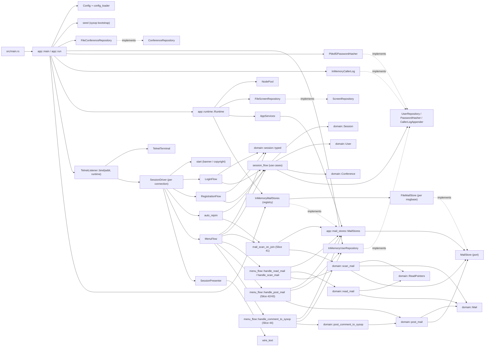

# NextExpress System Notes

This document captures the current internal design of the Rust implementation
under `rust/` and the remaining higher-impact refactorings that would make the
system easier to understand and extend.

## Current Shape

The implementation follows a ports-and-adapters direction:

- `rust/src/domain/` holds core BBS concepts: `Session`, `User`, `Conference`,
  `Node`, `Mail`, `ReadPointers`, persistence ports (`UserRepository`,
  `ConferenceRepository`, `MailStore`), phase-typed session wrappers, the
  messaging rules (`read_mail`, `scan_mail`, `post_mail`,
  `post_comment_to_sysop`), password hashing, caller logs, and session
  policy.
- `rust/src/app/` is the application layer: configuration, runtime
  composition, session orchestration, terminal/screen ports, the app-level
  `MailStores` registry service, menu-command parsing, shared terminal I/O
  helpers, and use-case functions.
- `rust/src/adapters/` holds concrete technology choices: telnet, file-backed
  conferences/screens, file-backed mail store (JSON per message), an in-memory
  mail-stores registry (`InMemoryMailStores`) the composition root populates
  with one `FileMailStore` per known `(conference, msgbase)` coordinate,
  in-memory users/logs, and PBKDF2 hashing.
- `rust/tests/architecture.rs` guards the most important rules today: domain
  code must not import `app` or `adapters`, and it must not reference
  runtime/adapter crates such as Tokio, serde_json, TOML, filesystem, or
  networking APIs.

Phase 6 messaging is wired end-to-end: `domain::Mail` (Slice 37, entity)
plus the `MailStore` port land per-msgbase via the `FileMailStore` adapter.
Each store writes one JSON file per message at
`<msgbase-dir>/<zero-padded-number>.json`, scans the directory at open time
to recover the cached `highest_message` high-water mark, and backs the spec's
`lock_msgbase(msgbase)` predicate with an in-process `tokio::sync::Mutex`.
Timestamps on the wire (`posted_at`, `received_at`) are RFC 3339 strings in
UTC via the `time` crate's `serde-well-known` adapter; non-UTC offsets in
hand-written files parse to the same instant as their UTC form, which keeps
the door open for sysops migrating data from other systems.

Slice 38 introduces `domain::ReadPointers`, attached as a `Vec` on every
`ConferenceMembership`. The user-level helper `read_pointers_for(user,
msgbase)` is the spec's black box; rows are lazily created on first
`ReadMail` / `ScanMail` for a base.

Slices 39–41 wire the headline read flow. The domain rules stay pure;
the app layer (`app::menu_flow` and `app::mail_scan_on_join`) is what
resolves the per-msgbase `MailStore` handle through the app-layer
`MailStores` registry service (`services.mail_stores().for_msgbase(...)`),
locks it, and threads it into the rule:
- Slice 39 (`domain::read_mail::read_mail` + `can_read`): the rule
  itself takes an already-loaded `&mut Mail`. The `R <num>` menu glue
  in `menu_flow::handle_read_mail` does the `MailStore::load` →
  `read_mail` → `MailStore::save` dance, then renders the legacy header
  block plus body to the terminal.
- Slice 40 (`domain::scan_mail::scan_mail`): the rule takes a
  `MailStore` directly (it walks the base itself). The `M` / `N` menu
  commands in `menu_flow::handle_scan_mail` resolve the store, lock it,
  call the rule (advancing `last_scanned`), and render a summary line.
  The same helper backs the spec's `count_unread_for` /
  `first_unread_number_for` black boxes.
- Slice 41 (`app::mail_scan_on_join`): both the auto-rejoin path (in
  `SessionDriver`) and the explicit-join path (in `MenuFlow`) call the
  shared `scan_mail_on_join` helper after the new `ConferenceVisit` is
  created. When the scan surfaces unread mail the listener writes
  `SCREEN_MAILSCAN` plus the summary line; an empty scan still emits the
  summary so the user knows they were checked.

Slice 41a wires the file-backed `MailStores` registry into the composition
root: `app::run` walks the loaded conferences and opens one `FileMailStore`
per `(conference, msgbase)` coordinate, registering them in an
`InMemoryMailStores` registry served through `AppServices`. The registry and
its `tokio::sync::Mutex` handle live in `app::mail_stores`; the domain sees
only the single-base `MailStore` port. Read pointers ride along with the bound
user record and flush on logoff via the existing `save_bound_user` path.

Slices 43 / 44 / 44a complete Phase 7 (Messaging — write):

- `messaging.allium:AllowedAddressing` and `AllScanScope` (Slice 43)
  land as fields on `domain::conference::MessageBase`, exposed via the
  `[[msgbase]]` keys `allowed_addressing` and `all_scan_scope` in
  `conference.toml`. Both default to the permissive legacy behaviour
  (`Any` / `AllUsersInConf`) so existing files continue to load
  unchanged. The pure helper `domain::mail::addressing_allows` is the
  spec's black box; `domain::post_mail` enforces it at post time and
  the `E` handler in `app::menu_flow` normalises empty / `ALL` / `EALL`
  recipients before the rule sees them.
- `domain::scan_mail` and the explicit/auto join helper in
  `app::mail_scan_on_join` thread the per-msgbase `AllScanScope`
  through the rule's signature. Single-msgbase scans treat both modes
  identically (broadcasts always count for the visiting member); the
  semantic split lands when cross-conference scanning arrives in a
  future slice. The toggle is plumbed in now so adapters and the spec
  agree on the read path.
- `messaging.allium:PostCommentToSysop` (Slice 44) lives in
  `domain::post_comment_to_sysop` and reuses the shared
  `post_mail::apply_post_mail` helper so the `C` (comment to sysop)
  command can fire even for users in the pending-validation tier (who
  hold `Right::CommentToSysop` but not `Right::EnterMessage`). The
  recipient is resolved through a new `UserRepository::find_sysop`
  port, defaulting to the spec's `is_sysop: slot_number = 1`
  invariant; the resulting mail is always `visibility = Private` and
  addressed to handle `"Sysop"` per the spec.
- Slice 44a's wire-and-smoke test
  (`rust/tests/phase7_smoke.rs::binary_walks_phase7_broadcast_and_comment_to_sysop_over_telnet`)
  drives the compiled binary against a `Conf01/` whose msgbase forbids
  EALL, exercising the `E ALL`, refused `E EALL`, and `C` flows
  end-to-end and reading the resulting mail back to confirm the
  legacy ANSI render shows `Recv'd: N/A` for broadcasts and
  `Status: Private Message` / `To: Sysop` for the comment.

Slice 42 opens Phase 7 (Messaging — write) with the single-addressee
`PostMail` rule and the `E` / `E <to>` menu command:

- `domain::post_mail::post_mail` is the pure rule. It takes the bound
  `&mut User`, the visit's `MessageBaseRef`, an unlocked
  `&mut dyn MailStore`, and a `PostMailDraft` whose `to_name` /
  `from_name` / `addressee_slot` fields the caller has already resolved
  (the spec's `lookup_user_by_name` and `display_name_of` black boxes
  live in the app layer). The rule gates on
  `has_access(EnterMessage)` and a granted `ConferenceMembership` for
  the message base's conference, then asks the store to allocate the
  next number and persist the new mail; on success it bumps both the
  user-level `messages_posted` counter and the per-conference
  membership counter, neither of which had been read before.
- `User.messages_posted` and `ConferenceMembership.messages_posted`
  (spec `core.allium`) are introduced in Slice 42; this is the first
  rule that reads either, so per the schema-growth principle they
  default to `0` on every construction path and Slice 42 wires the
  single bump site.
- The `E` / `E <to>` handler (`menu_flow::handle_post_mail`) drives a
  minimal line-mode editor: To: (skipped when supplied inline),
  Subject: (empty aborts), Private (y/N), then body lines terminated
  by a single `.` on its own line (`/A` aborts). Recipient resolution
  goes through the `UserRepository`'s `find_by_handle`; the resolved
  user must have a granted membership for the current conference,
  matching `amiexpress/express.e:10837-10840`. Slice 42 always uses
  `BroadcastTo::None`; ALL / EALL fan-out lands with Slice 43, the
  censored / private-to-sysop branch with Slice 47.
- Display names are still rendered as the user's handle. The
  `NameType::RealName` / `NameType::InternetName` branches of
  `display_name_of(_, conference)` depend on `User.real_name` /
  `User.internet_name` fields that no slice has yet introduced; the
  conference's `accepted_name_type` is wired through every other
  rendering path so the lookup is ready when those fields arrive.

The transport adapter, runtime composition, session-driving sub-flows, and the
repository port shape were sharpened in recent refactorings:

- `app::runtime::Runtime` is the single composition point for driven adapters,
  configuration-derived policy values (`SessionPolicy`, `DefaultRatio`,
  `NewUserGateConfig`), the screen repository, and the `NodePool`.
  `TelnetListener` no longer constructs any of these; it only binds, accepts
  streams, and delegates to `SessionDriver`.
- `SessionDriver` is a thin orchestrator. The sub-flows live in their own
  modules: `app::login_flow::LoginFlow`,
  `app::registration_flow::RegistrationFlow`, `app::menu_flow::MenuFlow`. The
  rendering helpers shared by the auto-rejoin and explicit-join paths live in
  `app::session_presenter`.
- `domain::session::typed` is the single phase-typed API over `Session` for
  the interactive driver. Mail-specific raw transition helpers on `Session`
  are private implementation details used by these wrappers, so the app layer
  cannot bypass the menu/onboarded phase guarantees.
- `app::menu_command` owns effect-free parsing for `G`, `J`, `R`, `M`, `N`,
  and `E` command lines. `MenuFlow` switches on the typed command and keeps
  only the terminal/session/repository effects.
- `app::terminal::{read_prompted, write_and_flush}` centralise the common
  prompt/flush/read pattern shared by login, registration, and menu flows.
- `UserRepository::allocate_slot_and_create` is the single atomic registration
  entry point. Slot allocation and insertion happen under one lock, with
  explicit `UserCreationError::{Build, DuplicateUser, DuplicateSlot}` variants.
- The `NEW` registration literal is recognised by the login flow
  (`NEW_USER_REGISTRATION_LITERAL` in `app::session_flow`). `UserRepository`
  is pure storage and returns only `NameLookupResult::Found` /
  `NotFound`.
- `domain::Session` remains the aggregate root, but its rule surface is now
  split by capability: `identity`, `registration`, `lifecycle`,
  `conferencing`, `budget`, `lockout`, `conference_activity`, `log_format`,
  `outcomes`, `errors`, and `transitions`. `domain/session/mod.rs` now holds
  the state shape, shared accessors, core phase moves, and public re-exports.

The remaining concentration-of-responsibility hotspots are:

- `domain/user.rs` is the user aggregate, but it is accumulating credentials,
  lockout, time accounting, profile data, access rights, ratios, and
  conference membership state.
- `domain/session/tests.rs` remains a large cross-capability test module. It
  is grouped internally, but future session changes may benefit from moving
  tests closer to the capability modules they exercise.
- `domain/session/mod.rs` still owns `Session`, `SessionShared`,
  `SessionPhase`, and the core phase-move helpers. That is acceptable after
  the capability split, but a `session/state.rs` extraction would be a natural
  next cleanup if state-shape changes become frequent.

## Recommended Refactorings

### 1. Break `User` into internal value objects

`domain::User` is becoming a broad aggregate. It currently holds identity,
credentials, lockout state, access tier, contact profile, terminal
preferences, time accounting, ratio settings, conference memberships, and
last-joined state.

Keep `User` as the aggregate root, but internally group data and behavior into
small value objects:

- `Credentials`: hash kind, hash, salt, last updated, password-reset flag.
- `AccountStatus`: access level, lock state, validation status, invalid
  attempts.
- `UsageAccounting`: calls, last call, daily counters, time limits.
- `Profile`: location, phone, email, line length, ANSI preference, flags.
- `ConferenceAccess`: memberships and last joined message base.
- `RatioPolicy`: mode and value.

Why this is better:

- future file/message/ratio/admin slices will not all edit one large struct;
- invariants can live near the data they protect;
- persistence adapters get clearer mapping boundaries.

### 2. Introduce a real user-store adapter before more account features

The runtime currently always seeds an in-memory sysop and warns that
production needs a real user store. That is fine for early slices, but account
features such as registration, lockout, password reset, ratios, and conference
membership become hard to reason about when all state is process-local.

Refactor toward:

- a file-backed `UserRepository` before expanding user/account workflows much
  further;
- a bootstrap step that creates the default sysop only when the configured
  store is empty;
- migration-friendly serialization around the smaller `User` value objects
  above.

Why this is better:

- user-facing behavior survives process restart;
- registration and lockout semantics become meaningful operationally;
- storage format decisions are made while the account model is still small
  enough to reshape.

### 3. Finish the smaller `Session` cleanup opportunistically

The high-value `Session` capability split is done. The remaining work is lower
priority and should ride along with future slices that already touch the area:

- Move `Session`, `SessionShared`, `SessionPhase`, and core phase-move helpers
  into `session/state.rs` if `mod.rs` starts accumulating state-specific churn.
- Split `domain/session/tests.rs` into capability-local test modules once
  editing the monolithic test file becomes a real review burden.
- Keep `Session` as the aggregate root; avoid introducing extra domain
  services unless a new Allium slice has behavior that does not naturally
  belong to one session.

### 4. Extract menu use cases from effectful handlers

`app::menu_command` now removes parsing pressure from `MenuFlow`, but
`MenuFlow` still owns the full command effect for read, scan, post, and join:
it resolves repositories, locks stores, calls typed session operations, and
maps every outcome to wire text.

Refactor toward small app-level use cases such as:

- `menu/read_mail.rs`: resolve store, load/read/save mail, return a renderable
  outcome enum;
- `menu/scan_mail.rs`: resolve store, scan, return summary data;
- `menu/post_mail.rs`: collect already-entered fields, resolve recipient,
  call the post rule, return a post outcome enum;
- `menu/join.rs`: run explicit join plus scan-on-join orchestration.

Why this is better:

- each command can be tested without a terminal loop;
- `MenuFlow` becomes only prompt orchestration and wire rendering;
- future commands do not make one menu module grow without bound.

## Suggested Order

1. Break `User` internally as the next account, ratio, file, or admin slices
   touch those fields.
2. Add a durable user repository before building more account/admin behavior.
3. Finish the smaller `Session` state/test cleanup only when future session
   slices make the current layout painful.
4. Extract menu use cases as the next messaging/admin commands land.

## Refactorings Not Worth Prioritising Yet

- Splitting the crate into multiple crates. The module boundaries are still
  sufficient; separate crates would add ceremony before the domain is stable.
- Introducing a DI framework. Plain construction in the composition root is
  enough.
- Rewriting every async port just for style. The current boxed-future ports
  are serviceable; change them only if they block a concrete refactor.
