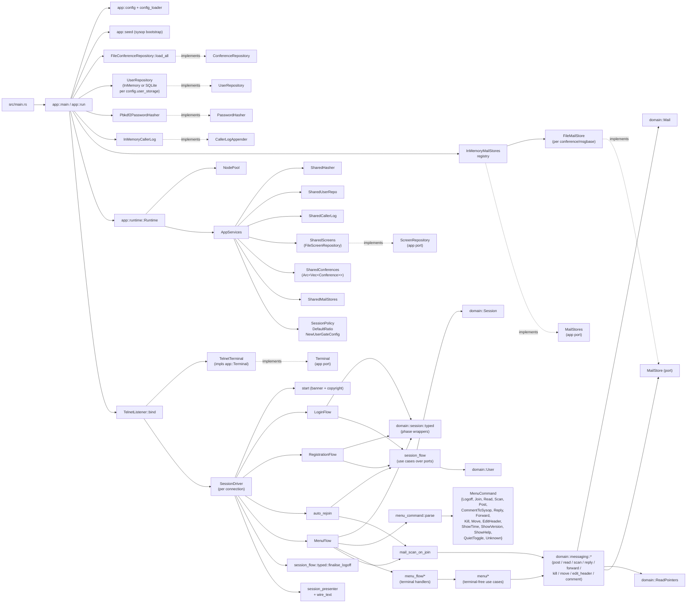

# NextExpress System Notes

This document captures the current internal design of the Rust implementation
under `rust/` and the larger refactorings worth considering next.

## Current Shape

The implementation is a hexagonal (ports and adapters) layout split across three
top-level modules under `rust/src/`:

- **`domain/`** — pure behaviour and entities distilled from the Allium specs in
  `specs/`. Aggregates (`Session`, `User`, `Conference`, `ConferenceVisit`,
  `Mail`, `Node`), value objects (`ReadPointers`, `MessageBaseRef`, `Bytes`),
  port traits (`UserRepository`, `ConferenceRepository`, `MailStore`,
  `PasswordHasher`, `CallerLogAppender`), phase-typed session wrappers, the
  `messaging.allium` rule family (`read_mail`, `scan_mail`, `post_mail`,
  `post_comment_to_sysop`, `reply_to_mail`, `forward_mail`, `delete_mail`,
  `edit_mail_header`, `move_mail`, `attach_file_to_mail`), the password
  helpers, caller-log entry shape, and `SessionPolicy`.

- **`adapters/`** — concrete tech: `TelnetListener` (transport),
  `FileConferenceRepository`, `FileScreenRepository` (file-backed assets with
  caching), `FileMailStore` (one JSON file per message),
  `InMemoryMailStores` (registry), `InMemoryUserRepository`,
  `SqliteUserRepository`, `InMemoryCallerLog`, `Pbkdf2PasswordHasher`,
  `telnet_line` codec.

- **`app/`** — composition root, transport-agnostic driver, and the menu
  command surface. Carries application-layer ports (`Terminal`,
  `ScreenRepository`, `MailStores`), configuration types, the runtime
  container (`Runtime` + `AppServices`), the per-connection orchestrator
  (`SessionDriver`), three sub-flows (`LoginFlow`, `RegistrationFlow`,
  `MenuFlow`), and the menu use-case modules (`app/menu/*`) paired with
  their terminal-aware handlers (`app/menu_flow/*`).

### Architectural invariants

`rust/tests/architecture.rs` walks `src/domain/` and rejects:

1. Any `use` path that names `crate::adapters`, `crate::app`, or a bare
   `adapters::` / `app::` sibling.
2. Any non-comment line that mentions an infrastructure crate or module
   (`tokio::`, `serde_json::`, `toml::`, `std::fs::`, `std::net::`).

The second guard is stronger than a plain import check — a domain error
like `source: serde_json::Error` would fail the test even without an
import, so the domain stays free of infrastructure types in signatures
as well as bodies.

### Sync domain, async edges

Every domain port (`UserRepository`, `ConferenceRepository`, `MailStore`,
`PasswordHasher`, `CallerLogAppender`) is **synchronous**. Async only
appears at the application boundary: `Terminal`, `ScreenRepository`, and
`MailStores` are async traits, defined in `app/`. The pattern lets the
messaging rules and session rules stay free of `await`, while the
listener and the menu loop drive I/O cooperatively. The async traits
return `Pin<Box<dyn Future + Send + 'a>>` so they remain object-safe
behind `Arc<dyn …>`.

### Build-time provenance

`rust/build.rs` captures the short git SHA (`git rev-parse --short HEAD`)
into the `NEXTEXPRESS_GIT_SHA` compile-time env var. The connect banner
(`app::wire_text::COPYRIGHT_LINES`) and the startup log line emitted by
`app::run` both embed the SHA so operators can pin a running process to
a source commit. The build script falls back to `unknown` outside a
working tree.

### Composition diagram



### Phase-typed session

`domain::session::typed` lifts the phase enum into eight wrapper types so
the wrong handle for a given transition becomes unrepresentable at
compile time:

`ConnectingSession` → `IdentifyingSession` → `AuthenticatingSession` →
(`NewUserRegisteringSession`) → `OnboardedSession` → `MenuSession` →
`LoggingOffSession` → `EndedSession`.

`SessionDriver::run` threads these wrappers across the sub-flows. The
mail-specific raw transitions on `Session` are kept private to the
typed module so the app layer cannot bypass the phase invariants.

### Application services container

`app::runtime::Runtime` is the single composition point for driven
adapters, policy values, the screen repository, and the `NodePool`. It
holds an `AppServices` value (also `Clone`, `Arc`-backed) that the
listener clones per accepted connection. `AppServices` carries:

| Field | Type |
|---|---|
| `user_repo` | `Arc<dyn UserRepository + Send + Sync>` |
| `hasher` | `Arc<dyn PasswordHasher + Send + Sync>` |
| `caller_log` | `Arc<dyn CallerLogAppender + Send + Sync>` |
| `screens` | `Arc<dyn ScreenRepository + Send + Sync>` |
| `conferences` | `Arc<Vec<Conference>>` |
| `mail_stores` | `Arc<dyn MailStores + Send + Sync>` |
| `session_policy` / `default_ratio` / `new_user_gate` | `Copy` / small `Arc` |

The container replaced a borrow-bag that threaded lifetimes through every
flow signature; cloning is now one `Arc` bump per port. The sub-flows
take `&AppServices` and downcast to `&dyn …` accessors on demand.

### Menu command surface

`app::menu_command::parse_menu_command` is effect-free. The
`MenuCommand` enum currently covers (with the corresponding handler
module under `app::menu_flow/`):

| Command | Variant | Handler |
|---|---|---|
| `G` | `Logoff` | dispatch |
| `J <n>` | `Join(NumberArg)` | `join` |
| `R <n>` | `Read(NumberArg)` | `read_mail` |
| `M` / `N` | `Scan(ScanArg::All/New)` | `scan_mail` |
| `E` / `E <to>` | `Post(PostArg)` | `post_mail` |
| `C` | `CommentToSysop` | `post_mail` |
| `RP <n>` | `Reply(NumberArg)` | `reply_forward` |
| `FW <n>` | `Forward(NumberArg)` | `reply_forward` |
| `K <n>` | `Kill(NumberArg)` | `sysop_admin` |
| `MV <n>` | `Move(NumberArg)` | `sysop_admin` |
| `EH <n>` | `EditHeader(NumberArg)` | `sysop_admin` |
| `T` | `ShowTime` | dispatch (`render_time_line`) |
| `VER` | `ShowVersion` | dispatch (`VERSION_BANNER`) |
| `H` | `ShowHelp` | dispatch (`bbs_help_screen` asset) |
| `Q` | `QuietToggle` | dispatch (`toggle_quiet_mode`) |
| anything else | `Unknown` | dispatch (`UNKNOWN_COMMAND_LINE`) |

Each non-trivial command lives in two files: a terminal-free use case
under `app/menu/*` that resolves stores/repositories and returns an
outcome enum, and a sibling handler under `app/menu_flow/*` that owns
the prompts and wire rendering. `MenuFlow` collects prompts and maps
outcomes to wire text; the use-case module never sees the terminal.
Adding a new command means adding a use case under `app/menu/`, a
handler under `app/menu_flow/`, a `MenuCommand` arm, and (usually) a
domain rule. No other plumbing is needed.

### Driver and sub-flow split

`TelnetListener` only binds, accepts streams, runs the IAC negotiation,
and constructs a per-connection `SessionDriver`. `SessionDriver` is a
thin orchestrator:

1. `start` — write banner + copyright, return an `IdentifyingSession`.
2. `LoginFlow::identify` — prompt for name, dispatch to register, verify
   password, return `Onboarded | LoggingOff | Ended | NeedsRegistration`.
3. `RegistrationFlow::run` — only on `NeedsRegistration`. Owns the
   new-user gate, profile collection, hash + persist, returns
   `Onboarded | LoggingOff`.
4. `auto_rejoin` — apply `conferences.allium:JoinConference`, render
   `JOINED` + any name-type promotion screen, fire
   `mail_scan_on_join::scan_mail_on_join` in `FollowPointer` mode.
5. `MenuFlow::run` — the command loop above, returns `LoggingOffSession`.
6. `finalise` — apply `finalise_logoff` and persist via
   `session_flow::typed`.

Rendering helpers shared by the auto-rejoin and explicit-join paths live
in `app::session_presenter`. The wire byte constants live in
`app::wire_text`.

### Phase 6–8 messaging behaviour

The messaging rule family is wired end-to-end. The domain rules stay
pure; the app layer resolves the per-msgbase `MailStore` handle through
the `MailStores` registry service
(`services.mail_stores().for_msgbase(...)`), locks it, threads it into
the rule, and writes the legacy ANSI output.

- **Phase 6 (read)**:
  - `domain::Mail` (Slice 37) plus the `MailStore` port. `FileMailStore`
    writes one JSON file per message at `<msgbase-dir>/<seven-digit
    zero-padded number>.json`, scans the directory at open time to
    recover `highest_message`, and holds the spec's
    `lock_msgbase(msgbase)` predicate as an in-process
    `tokio::sync::Mutex`. Timestamps on the wire (`posted_at`,
    `received_at`) are RFC 3339 strings in UTC via the `time` crate's
    `serde-well-known` adapter.
  - `domain::ReadPointers` (Slice 38) attached as a `Vec` on every
    `ConferenceMembership`. `read_pointers_for(user, msgbase)` is the
    spec's black box; rows are lazily created on first
    `ReadMail`/`ScanMail` for a base.
  - Slices 39–41 wire `read_mail`, `scan_mail` and
    `mail_scan_on_join`. The `R <num>` handler does the
    `MailStore::load` → `read_mail` → `MailStore::save` dance; `M`/`N`
    walk the store via `scan_mail`; the auto-rejoin and explicit-join
    paths share `scan_mail_on_join`.
  - Slice 41a wires the file-backed registry into the composition root:
    `app::run` walks the loaded conferences and opens one
    `FileMailStore` per `(conference, msgbase)` coordinate.

- **Phase 7 (write)**:
  - Slice 42: `domain::post_mail` plus the `E` / `E <to>` handler. The
    rule allocates the next number via the store, persists, and bumps
    the user-level `messages_posted` and per-membership counters.
  - Slice 43: `AllowedAddressing` / `AllScanScope` land as
    `[[msgbase]]` fields. `domain::mail::addressing_allows` is the
    permission black box; `post_mail` enforces it; the `E` handler
    normalises `ALL` / `EALL` / empty before the rule sees them.
  - Slice 44: `domain::post_comment_to_sysop` reuses `post_mail::apply_post_mail`
    so users with `CommentToSysop` but not `EnterMessage` can post. The
    recipient resolves through `UserRepository::find_sysop`.
  - Slice 47: `User.censored` and the visibility downgrade
    (censored → `PrivateToSysop`, EALL → `Public` still wins).

- **Phase 8 (advanced + sysop ops)**:
  - Slice 45 `reply_to_mail`, Slice 46 `forward_mail`, Slice 48
    `attach_file_to_mail` (with the new `core::bytes::Bytes`
    newtype), Slice 49 `delete_mail` / `edit_mail_header` /
    `move_mail`.
  - Slice 49a / 49b wire `RP`, `FW`, `K`, `MV`, `EH` through
    `app/menu/{reply_forward, sysop_admin}` and the matching
    `menu_flow` handlers. `tests/phase7_smoke.rs` /
    `phase8_smoke.rs` drive the compiled binary end-to-end over
    telnet.

### User storage

The composition root picks the user-repository adapter from
`config.user_storage`:

- `None` → `InMemoryUserRepository`. Always seeds the default sysop.
  Data is lost on shutdown. Default for `cargo run` against a fresh
  tree, and the default for every test.
- `Some(path)` → `SqliteUserRepository::open(path)`. Three tables:
  `users` (single-valued fields), `conference_memberships` (joined to
  `users`), `read_pointers` (joined to memberships). Schema laid out in
  `designs/USERS.md`. Round-trips through the domain's
  `PersistedUser` snapshot.

Seeding the default sysop runs only when the chosen store is empty
(`SqliteUserRepository::is_empty`), so restarting against an existing
database preserves on-disk state. `tests/sqlite_user_storage_smoke.rs`
covers two-boot persistence with a `tempdir`.

### Concentration-of-responsibility hotspots

The current top files by line count:

| File | Lines | Notes |
|---|---|---|
| `domain/user.rs` | 2141 | Aggregate + private value objects (`Credentials`, `AccountStatus`, `UsageAccounting`, `Profile`, `RatioPolicy`, `ConferenceAccess`) + co-located tests. |
| `domain/session/tests.rs` | 1973 | Cross-capability session tests, internally grouped but monolithic. |
| `adapters/telnet_listener.rs` | 1706 | ~180 lines of production `TelnetListener` + `TelnetTerminal`; ~1500 lines of in-process integration tests. |
| `app/session_flow.rs` | 1564 | Remaining use cases over `(Session, UserRepository, PasswordHasher, CallerLogAppender)` plus the registration-flow facade. |
| `adapters/sqlite_user_repository.rs` | 1097 | Schema init + row codec + queries + ~30 tests. |
| `adapters/file_mail_store.rs` | 1033 | Per-msgbase JSON store + lock + tests. |
| `app/wire_text.rs` | 937 | Wire-format constants and rendering helpers. |
| `domain/session/typed.rs` | 837 | Phase-typed wrappers and their constructors. |
| `domain/messaging/scan_mail.rs` | 833 | Scan rule + extensive test fixtures. |
| `domain/conference.rs` | 794 | `Conference`, `MessageBase`, `ConferenceMembership`, `NameType`, `AllowedAddressing`, `AllScanScope`. |
| `domain/messaging/post_mail.rs` | 782 | Post rule + helpers + tests. |

## Idiomatic-Rust read

What is already idiomatic:

- **Domain ports are sync, application ports async.** The domain has
  zero `tokio::*` references; `async` lives at the boundary
  (`Terminal`, `ScreenRepository`, `MailStores`). This makes the rules
  trivial to test with stack-allocated stores and keeps `await`
  pressure on the I/O side.
- **Hexagonal invariants are enforced by an integration test**, not by
  convention. The infrastructure-reference guard catches the leak shape
  most projects miss (`source: serde_json::Error`).
- **Cheap-clone services container** (`AppServices`). Each port is held
  behind `Arc`, so per-session clone is a fixed cost and no lifetimes
  leak into flow signatures.
- **Phase-typed session wrappers**. Eight wrappers turn "session is in
  state X" assertions into compile errors.
- **Tight value-object grouping inside `User`** — six private structs
  hold related fields with their own invariants.
- **`thiserror` enums everywhere**, with `#[from]` only where the
  conversion is unambiguous. `Box<dyn Error + Send + Sync>` is used at
  the binary entry point but does not leak into ports.
- **Effect-free parsers** (`menu_command`) decoupled from the dispatch
  loop. `parse_menu_command` is pure; reasonable to fuzz.
- **`#![forbid(unsafe_code)]` plus clippy pedantic at warn level.**

What is less idiomatic and worth flagging:

- **`Box<dyn FnOnce(u32) -> Result<User, UserError> + Send + 'a>`** on
  `UserRepository::allocate_slot_and_create`. Object-safe but the
  callback shape is awkward; callers always do the same thing inside
  the closure (build a `User` from a `NewUserDraft` and the slot).
- **`NameLookupResult::Found(Box<User>)`** boxes the resolved record to
  keep the enum small. Sensible (User is ~2 KB) but ad-hoc.
- **Six `panic!("expected Resolved")` calls in
  `domain/conference_visit.rs`** on accessors. State-typed wrappers
  (`ResolvedVisit` / `PendingVisit`) would express the invariant in the
  type system instead.
- **`Pin<Box<dyn Future + Send + 'a>>` boilerplate** on `Terminal` and
  `ScreenRepository`. With Rust 1.75+ `async fn` in trait, the
  `Terminal` trait could shed the alias entirely (`Terminal` is already
  generic at call sites); `ScreenRepository` would need `async_trait`
  or the `RPITIT` variant because it lives behind `Arc<dyn …>`.
- **`std::sync::Mutex::lock().expect("…")`** in three adapters
  (`SqliteUserRepository`, `InMemoryUserRepository`,
  `InMemoryCallerLog`). Panic-on-poison is acceptable here, but the
  duplication suggests a thin helper.
- **`eprintln!` for operational logging** in `file_mail_store.rs` and
  `file_conference_repository.rs`. No structured logging or level
  control. Acceptable while there's no `tracing` dependency, worth
  revisiting before more adapters land.
- **Bespoke TOML mirror enums** (`NameTypeToml`, `AllowedAddressingToml`,
  `AllScanScopeToml`) in `file_conference_repository.rs`. Each exists
  only to satisfy serde's snake_case deserialization. A
  `serde(rename_all = "snake_case")` attribute directly on the domain
  enums would remove the mirrors — but that couples domain types to
  serde, which the architecture test would (correctly) reject. The
  mirrors are the right tradeoff; just noting them as boilerplate.

## Large-scale refactorings worth considering

The first three are practical and can be staged in along normal slice
work. Items 4 and 5 are bigger and should wait for a triggering need.

### 1. Replace the `BuildUserFn` callback with a `NewUserDraft` value

`UserRepository::allocate_slot_and_create(build_user: BuildUserFn<'_>)`
takes a boxed `FnOnce(u32) -> Result<User, UserError>`. Every caller
builds the same way: validate inputs, then call `User::new(slot, …)`.
The callback adds object-safety drag without expressive power.

A cleaner shape:

```rust
pub trait UserRepository {
    fn create_user(&self, draft: NewUserDraft) -> Result<User, UserCreationError>;
}
```

where `NewUserDraft` is a domain value type that owns the validated
input fields (handle, hash kind, hash, salt, registered_at, access
level, …). The repository allocates the slot inside its transaction
and constructs the `User` itself. `UserCreationError::Build` still
covers `User::new` rejections.

Benefits: no `Box<dyn FnOnce>`, no lifetime parameter on the alias,
the contract is fully data-shaped, and the adapter no longer needs
to invoke caller code while holding its own lock. The migration is
mechanical — there are two call sites
(`session_flow::NewUserRegistrationFlow::complete` and the seeder).

### 2. Split `domain/user.rs` along its existing value-object lines

The aggregate already groups its private state into six value objects
(`Credentials`, `AccountStatus`, `UsageAccounting`, `Profile`,
`RatioPolicy`, `ConferenceAccess`). At 2141 lines the file is becoming
review-painful even with that grouping. Moving each value object into
`domain/user/{credentials,account_status,…}.rs` would let those types
own their own constructors, validations, and tests, while
`domain/user/mod.rs` keeps the `User` aggregate, its public accessors,
and the cross-VO invariants.

This pairs naturally with #1: `NewUserDraft` lives in
`domain/user/draft.rs` and is the only construction path the
repository sees.

### 3. Push terminal I/O out of `menu_flow/*` into a small renderer port

The `menu_flow/*` handlers each do roughly the same dance: call the
matching `menu/*` use case, match on the outcome enum, write a wire
constant or a small formatted line. That pattern is currently spelled
out by hand in each handler.

A thin `MenuRenderer` trait — methods like
`render_read_mail(outcome: ReadMailOutcome)`, `render_scan(…)` — would
collapse the per-handler `match` blocks into one call. The implementer
of `MenuRenderer` for the live transport would still own the wire
constants, but the dispatch loop would stop being a 60-line `match`
that calls 11 different `self.handle_*` methods, each with its own
copy of the prompt-flush-write idiom.

The win is consistency: every command would walk the same use-case →
outcome → renderer pipeline. The cost is one new trait and a layer of
indirection. Probably worth doing the next time a new menu command
needs a non-trivial outcome enum.

### 4. Remove `panic!` from `domain/conference_visit.rs` via state typing

The aggregate has six `panic!("expected Resolved")` calls on accessors
that are only valid in the resolved state. The accessors are unsafe
without an upstream invariant the type doesn't enforce.

Two clean alternatives:

- **State-typed wrappers** matching the session approach: `PendingVisit`
  vs `ResolvedVisit`, with accessors only defined on the resolved
  variant. The state types preserve compile-time correctness through
  call chains the same way `domain::session::typed` does today.
- **Make the accessors return `Option<T>` / `Result<T, _>` and push the
  resolution check to the caller.** Cheaper but the type system stops
  helping.

Worth doing now because `conference_visit.rs` is small enough that the
refactor fits in one slice, and the existing pattern is duplicating
behaviour that `session::typed` already proves works.

### 5. Carve `app/session_flow.rs` into per-rule modules

At 1564 lines, `session_flow.rs` has accreted: `name_typed`,
`verify_password`, `verify_new_user_password`, `enter_menu`,
`finalise_logoff`, `complete_password_reset`, plus the
`NewUserRegistrationFlow` struct, plus five error enums, plus the
`typed` namespace. Each use case mostly stands alone: it takes a
phase-typed session, one or two ports, a `now`, and returns an
outcome.

Suggested layout:

```
app/session_flow/
  mod.rs              -- re-exports + shared types (NewUserGateConfig, DefaultRatio)
  name_typed.rs       -- + NameTypedFlowError
  verify_password.rs  -- + VerifyPasswordFlowError
  enter_menu.rs       -- + EnterMenuFlowError
  finalise_logoff.rs  -- + FinaliseLogoffFlowError
  registration.rs     -- NewUserRegistrationFlow + Complete* errors
  password_reset.rs   -- complete_password_reset + CompletePasswordResetFlowError
  typed.rs            -- the typed-wrapper helpers SessionDriver calls
```

Each file lands around 150–300 lines, errors live next to the use case
they belong to, and the registration sub-flow stops being a struct
that everyone has to import alongside the free functions.

### 6. Move large adapter test modules into sibling files

`adapters/telnet_listener.rs` is 1706 lines, of which ~1500 are the
test module: a `FakeTerminal`, a `StaticScreens`, and dozens of
in-process accept-loop scenarios. The pattern is the same for
`SqliteUserRepository` (~30 in-file tests) and `FileScreenRepository`.

Pulling these into `adapters/telnet_listener/tests.rs`,
`adapters/sqlite_user_repository/tests.rs`, etc. (still `#[cfg(test)]
mod tests` declarations in the parent) keeps the test surface intact
while making the production module readable at a glance. Pure code
move, no behavioural change.

## Refactorings to skip for now

- **Splitting the crate into workspace members.** Module boundaries and
  the architecture test already give us the invariants a workspace
  split would enforce. The split would add ceremony before the domain
  is stable.
- **A DI framework.** `AppServices` plus plain `Arc<dyn …>` is already
  the simplest thing that works.
- **Generic-everywhere `AppServices`.** Parameterising on
  `<U: UserRepository, H: PasswordHasher, …>` would buy compile-time
  specialisation at the cost of code-size blow-up across every flow
  signature, and would block runtime adapter swapping (which is the
  whole point of holding ports behind `Arc<dyn …>`). Type erasure here
  is intentional.
- **Async-fn-in-trait for `ScreenRepository`.** Until `RPITIT` works
  cleanly behind `Arc<dyn Trait>`, the manual `Pin<Box<dyn Future>>`
  alias is the shortest path. Revisit when `dyn` support catches up.
- **Rewriting `wire_text.rs`.** The legacy strings are the wire
  contract; the file is long because the BBS has many lines, not
  because of poor structure.

## Suggested order

1. Items #1 and #4 are the lowest-risk wins — both change the shape
   of one small surface and remove either an awkward callback or a
   panic family.
2. Item #2 is a mechanical move that's easier after #1 (the new
   `NewUserDraft` lives in the new `domain/user/` subdirectory).
3. Item #5 should follow whenever the next slice would otherwise
   touch `session_flow.rs`.
4. Items #3 and #6 are opportunistic; do them when a new menu command
   or a new adapter would otherwise replicate the existing pattern.
