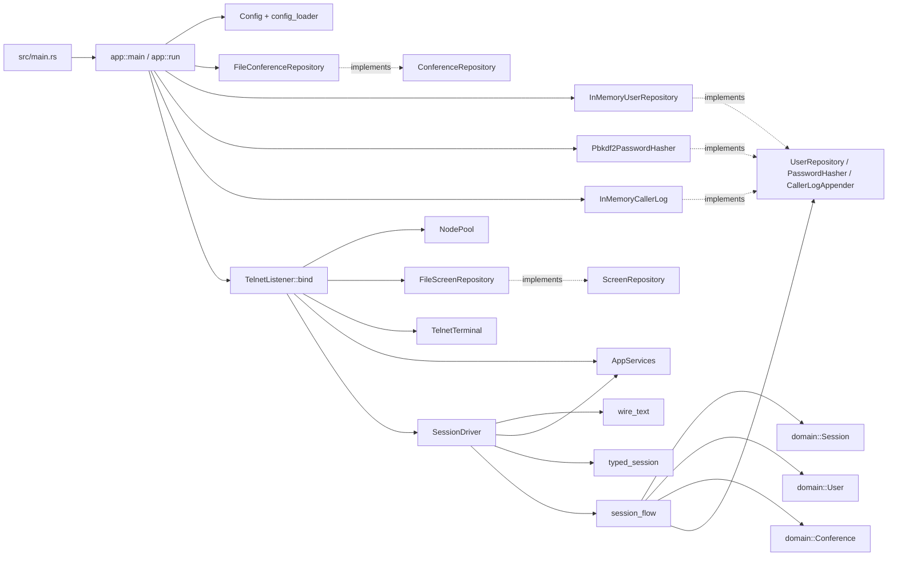
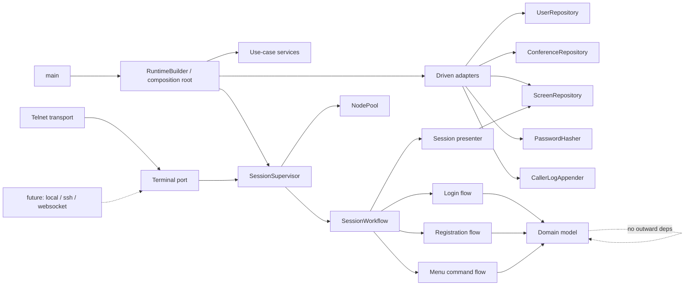

# NextExpress System Notes

This document captures the current internal design of the Rust implementation
under `rust/` and the highest-impact refactorings that would make the system
easier to understand and extend. It is descriptive only; none of the proposed
Rust changes have been applied.

## Current Shape

The implementation already follows a ports-and-adapters direction:

- `rust/src/domain/` holds core BBS concepts: `Session`, `User`, `Conference`,
  `Node`, repositories, password hashing, caller logs, and session policy.
- `rust/src/app/` is the application layer: configuration, composition,
  session orchestration, terminal/screen ports, typed session wrappers, and
  use-case functions.
- `rust/src/adapters/` holds concrete technology choices: telnet, file-backed
  conferences/screens, in-memory users/logs, and PBKDF2 hashing.
- `rust/tests/architecture.rs` guards the most important rule today: domain
  code must not import `app` or `adapters`.

The design is in good shape for the current feature set. The main issue is not
direction; it is concentration of responsibility. A few files now represent
several concepts at once:

- `domain/session/mod.rs` is the central session aggregate and also contains
  lifecycle, authentication, registration, time budget, conference join/scan,
  caller-log formatting hooks, and a large test body.
- `app/session_driver.rs` owns terminal I/O, prompt loops, screen rendering,
  menu parsing, registration form collection, and mapping domain outcomes to
  wire text.
- `adapters/telnet_listener.rs` is both a transport adapter and part of the
  composition root because it builds screen storage and `AppServices` from
  `Config`.
- `domain/user.rs` is the user aggregate, but it is accumulating credentials,
  lockout, time accounting, profile data, access rights, ratios, and conference
  membership state.

## Target Shape

The direction I would move toward is still one crate and still ports-and-
adapters, but with a sharper application boundary and smaller feature slices.

In this shape:

- transport adapters only adapt transport protocols into the `Terminal` port;
- the composition root owns all concrete adapter construction;
- the session workflow is split by user-visible sub-flow;
- domain modules remain pure but are organized by capability;
- repository ports expose atomic operations where the business rule needs
  atomicity.

## Recommended Refactorings

### 1. Move session runtime wiring out of `TelnetListener`

`TelnetListener::bind` currently accepts `Config`, creates
`FileScreenRepository`, derives policy values, builds `AppServices`, creates
`NodePool`, accepts TCP connections, and starts `SessionDriver`.

That makes the telnet adapter more than a transport adapter. It knows about
file-backed screens, config fields, session policies, and new-user registration
settings.

Refactor toward:

- `app::run` or a small `RuntimeBuilder` constructs `AppServices`, screen
  repository, policies, and the node/session supervisor.
- `TelnetListener` only binds, accepts streams, performs telnet negotiation,
  wraps the stream as `Terminal`, and delegates to a supplied session runner.

Why this is better:

- adding SSH, local console, websocket, or test transports will not duplicate
  runtime wiring;
- telnet tests can focus on telnet behavior instead of full BBS composition;
- composition is visible in one place.

### 2. Split `SessionDriver` into workflow sub-flows

`SessionDriver` is transport-agnostic, which is good, but it is becoming the
place where every interactive detail lands. It currently handles login,
password verification, registration, menu dispatch, join handling, interrupts,
screen output, prompt output, and wire-message selection.

Refactor toward:

- `LoginFlow`: name prompt, known-user auth, new-user branch.
- `RegistrationFlow`: password gate and registration form collection.
- `MenuFlow`: command loop and command dispatch.
- `SessionPresenter` or `BbsPresenter`: semantic rendering methods such as
  `unknown_user`, `wrong_password`, `joined_conference`, `prompt_menu`.
- shared `PromptReader`: converts `TerminalRead` into line/input/interrupt
  outcomes consistently.

Why this is better:

- future menu commands will not all land in one `run_menu` loop;
- registration complexity can grow without obscuring login/menu behavior;
- rendering decisions become reviewable independently from state transitions;
- tests can target one sub-flow without constructing an entire session run.

### 3. Make user creation atomic at the repository port

`UserRepository` exposes `next_free_slot()` and `create(user)`. The registration
flow calls them separately. That is a race-prone contract: two concurrent
registrations can observe the same next slot before either creates a user,
unless every adapter invents its own reservation behavior.

Refactor toward one atomic operation, for example:

- `create_registered_user(profile, credential, defaults) -> Result<User, ...>`,
  if slot allocation belongs inside the repository; or
- `allocate_slot_and_create(build_user) -> Result<User, ...>`, if the domain
  constructor should stay outside the adapter.

Also make duplicate-slot rejection explicit in the repository contract.

Why this is better:

- the port expresses the real consistency boundary;
- file/database-backed repositories have a clear place to use locks or
  transactions;
- registration no longer relies on a multi-call protocol that is easy to use
  incorrectly.

### 4. Move the `NEW` login literal out of `UserRepository`

`InMemoryUserRepository::find_by_handle` returns `UserTypedNew` for the literal
`NEW`. That mixes input-command semantics into a persistence port. Every future
repository would need to remember the same special case.

Refactor toward:

- the application login flow checks the typed value for the registration
  command;
- `UserRepository::find_by_handle` returns only `Found` or `NotFound`;
- the special literal remains covered by app/session-flow tests that reference
  the legacy AmiExpress behavior.

Why this is better:

- repository adapters become pure storage;
- the behavior is consistent across all user-store implementations;
- future login commands or aliases do not expand the repository API.

### 5. Decompose the `Session` aggregate by capability

`domain::Session` is the right aggregate root, but `domain/session/mod.rs` is
now too broad. Some helper modules already exist (`budget`, `lockout`,
`outcomes`, `errors`, `transitions`), but the main module still carries many
feature areas directly.

Refactor toward modules such as:

- `session/state.rs`: `Session`, `SessionShared`, `SessionPhase`, core
  transition helpers.
- `session/identity.rs`: name prompt and unknown-name rules.
- `session/registration.rs`: new-user gate and completion.
- `session/authentication.rs`: password match/mismatch and reset entry points.
- `session/activity.rs`: idle timeout, carrier loss, budget ticking.
- `session/conferencing.rs`: auto-join, explicit join, conference scan.
- `session/logging.rs`: logon/logoff line formatting.

Why this is better:

- new Allium slices have an obvious home;
- tests can sit near the capability they prove;
- reviewing changes becomes less risky because unrelated session behavior is
  physically separated.

### 6. Break `User` into internal value objects

`domain::User` is also becoming a broad aggregate. It currently holds identity,
credentials, lockout state, access tier, contact profile, terminal preferences,
time accounting, ratio settings, conference memberships, and last-joined state.

Keep `User` as the aggregate root, but internally group data and behavior into
small value objects:

- `Credentials`: hash kind, hash, salt, last updated, password-reset flag.
- `AccountStatus`: access level, lock state, validation status, invalid
  attempts.
- `UsageAccounting`: calls, last call, daily counters, time limits.
- `Profile`: location, phone, email, line length, ANSI preference, flags.
- `ConferenceAccess`: memberships and last joined message base.
- `RatioPolicy`: mode and value.

Why this is better:

- future file/message/ratio/admin slices will not all edit one large struct;
- invariants can live near the data they protect;
- persistence adapters get clearer mapping boundaries.

### 7. Introduce a real user-store adapter before more account features

The runtime currently always seeds an in-memory sysop and warns that production
needs a real user store. That is fine for early slices, but account features
such as registration, lockout, password reset, ratios, and conference
membership become hard to reason about when all state is process-local.

Refactor toward:

- a file-backed `UserRepository` before expanding user/account workflows much
  further;
- a bootstrap step that creates the default sysop only when the configured
  store is empty;
- migration-friendly serialization around the smaller `User` value objects
  above.

Why this is better:

- user-facing behavior survives process restart;
- registration and lockout semantics become meaningful operationally;
- storage format decisions are made while the account model is still small
  enough to reshape.

### 8. Strengthen architectural tests

`rust/tests/architecture.rs` catches direct `use crate::app` or
`use crate::adapters` from domain files. That is useful, but narrow.

Refactor toward tests that also assert:

- domain code does not refer to forbidden modules through fully-qualified paths;
- adapters do not construct unrelated adapters as part of transport behavior;
- composition-only code stays in the composition root;
- domain modules remain free of Tokio, filesystem, and networking dependencies.

Why this is better:

- architecture rules remain enforceable as the codebase grows;
- future contributors get fast feedback when a dependency boundary drifts;
- the intended ports-and-adapters design becomes executable documentation.

## Suggested Order

1. Fix repository semantics first: atomic user creation and `NEW` outside the
   repository. These are small changes with correctness payoff.
2. Move runtime wiring out of `TelnetListener`. This clarifies the system
   boundary before more transports or adapters arrive.
3. Split `SessionDriver` by login, registration, menu, and presentation.
4. Decompose `Session` and `User` internally as the next feature slices touch
   those areas.
5. Add a durable user repository before building more account/admin behavior.
6. Strengthen architecture tests after the new boundaries exist.

## Refactorings Not Worth Prioritising Yet

- Splitting the crate into multiple crates. The module boundaries are still
  sufficient; separate crates would add ceremony before the domain is stable.
- Introducing a DI framework. Plain construction in the composition root is
  enough.
- Rewriting every async port just for style. The current boxed-future ports are
  serviceable; change them only if they block a concrete refactor.
