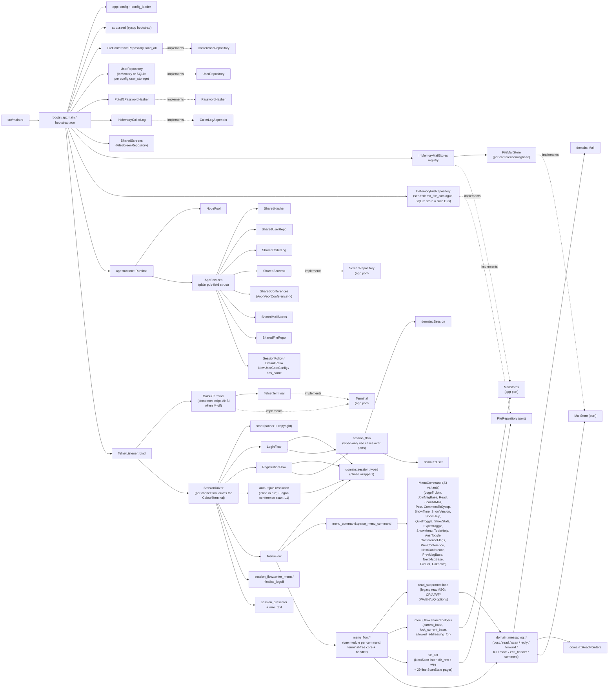

# NextExpress System Notes

This document captures the current internal design of the Rust implementation
under `rust/` and the larger refactorings worth considering next.

## Current Shape

The implementation is a hexagonal (ports and adapters) layout split across four
top-level modules under `rust/src/`:

- **`domain/`** — pure behaviour and entities distilled from the Allium specs in
  `specs/`. Aggregates (`Session`, `User`, `Conference`, `ConferenceVisit`,
  `Mail`, `Node`, `File`, `FileArea`) plus the per-session
  `ConferenceActivity` sub-aggregate (owns the `Vec<ConferenceVisit>` +
  `Option<ConferenceScan>` and lives outside the phase enum so it
  survives `Onboarded → Menu`), value objects (`ReadPointers`,
  `MessageBaseRef`, `Bytes`, `ConferenceScan`, and the `pub(crate)`
  `FlaggedFiles`/`FlaggedKey` — the session-scoped flagged-file set the
  `F`/`R` pager verbs build, an impl detail shared by `domain/files`,
  `domain/session`, and `app/menu_flow/file_list`, slice D2f; D5
  persists it),
  port traits (`UserRepository`, `ConferenceRepository`, `MailStore`,
  `PasswordHasher`, `CallerLogAppender`, `FileRepository`), phase-typed session wrappers, the
  `messaging.allium` rule family (`read_mail`, `scan_mail`, `post_mail`,
  `post_comment_to_sysop`, `reply_to_mail`, `forward_mail`, `delete_mail`,
  `edit_mail_header`, `move_mail`, `attach_file_to_mail`), the password
  helpers, caller-log entry shape, and `SessionPolicy`.

- **`adapters/`** — concrete tech: `TelnetListener` (transport),
  `FileConferenceRepository`, `FileScreenRepository` (file-backed assets with
  caching), `FileMailStore` (one JSON file per message),
  `InMemoryMailStores` (registry), `InMemoryUserRepository`,
  `SqliteUserRepository`, `InMemoryFileRepository` (the seeded demo
  file catalogue, slice D1), `InMemoryCallerLog`, `Pbkdf2PasswordHasher`,
  `telnet_line` codec (`read_telnet_line` with an `EchoMode` plus
  `read_telnet_key`, the single-keystroke decoder that lets the NextScan
  pager run true hotkeys and emit its own captured echo bytes — slice D2b).

- **`app/`** — application layer: ports, services, flows, and
  transport-agnostic drivers. Carries application-layer ports
  (`Terminal`, `ScreenRepository`, `MailStores`), configuration types,
  the runtime value (`Runtime` + `AppServices`), the per-connection
  orchestrator (`SessionDriver`), three sub-flows (`LoginFlow`,
  `RegistrationFlow`, `MenuFlow`), one command module per menu command
  under `app/menu_flow/*` (terminal-free core fn + terminal-aware
  handler in the same file), and the `ColourTerminal` decorator
  (`app/colour_terminal`) that strips ANSI SGR escapes from output
  while the `M`-toggled colour mode is off. Production code under `app/` is forbidden from
  importing `crate::adapters`; the boundary is enforced by
  `tests/architecture.rs::app_does_not_depend_on_adapters_in_production_code`.

- **`bootstrap.rs`** — composition root (a single file, no submodules).
  The only module allowed to
  construct concrete adapters: it loads the config, picks the user
  repository (in-memory vs. SQLite), opens one `FileMailStore` per
  known msgbase, builds a `FileScreenRepository`, wires the lot through
  `Runtime::new`, binds the `TelnetListener` and runs the accept loop.
  The `nextexpress` binary's `main` calls `bootstrap::main` and does
  nothing else.

### Architectural invariants

`rust/tests/architecture.rs` walks the source tree and rejects:

1. Any `use` path under `src/domain/` that names `crate::adapters`,
   `crate::app`, or a bare `adapters::` / `app::` sibling.
2. Any non-comment line under `src/domain/` that mentions an
   infrastructure crate or module (`tokio::`, `serde_json::`, `toml::`,
   `std::fs::`, `std::net::`).
3. Any production-code `use` path under `src/app/` that names
   `crate::adapters` (or the bare sibling). Test modules
   (`#[cfg(test)] mod …`) are excluded since unit tests legitimately
   reach for adapter test doubles; the walker tracks braces to skip
   those blocks. Only `src/bootstrap.rs` is allowed to import adapter
   types.

The infrastructure-reference guard is stronger than a plain import
check — a domain error like `source: serde_json::Error` would fail it
even without an import, so the domain stays free of those infrastructure
types in signatures as well as bodies.

**Known gap:** the forbidden list is `tokio::`, `serde_json::`, `toml::`,
`std::fs::`, `std::net::` — it does **not** include `std::io::`. Two
domain port errors today embed `std::io::Error`
(`MailStoreError::Io`, `ConferenceRepositoryError::Io`) and carry
`Box<dyn Error + Send + Sync>` `#[source]` fields
(`StoreSourceError`, `ConferenceRepositorySourceError`), and both sail
through the guard. Closing this is the doc-hygiene half of refactoring 2
(rebalance port error boundaries); the `std::io::` ratchet can only be
added to the list after those leaks are removed.

### Sync domain, async edges

Every domain port (`UserRepository`, `ConferenceRepository`, `MailStore`,
`PasswordHasher`, `CallerLogAppender`) is **synchronous**. Async only
appears at the application boundary: `Terminal`, `ScreenRepository`, and
`MailStores` are async traits, defined in `app/`. The pattern lets the
messaging rules and session rules stay free of `await`, while the
listener and the menu loop drive I/O cooperatively. The async traits
return `Pin<Box<dyn Future + Send + 'a>>`. For `ScreenRepository` and
`MailStores` this keeps them object-safe behind `Arc<dyn …>` (they are
genuinely held as `Arc<dyn …>`). `Terminal` is the odd one out — it is
**always** a generic `T: Terminal` bound (there is no `dyn Terminal`
anywhere in the tree), so it carries the boxed-future alias only for
shape consistency and is monomorphised at every call site.

The `Terminal` port offers `write` and `flush` (raw byte IO),
`read_line` (one line under an echo policy + timeout), `read_key` (one
single hotkey, no echo — the caller owns every visible byte; the
NextScan pager drives its `More?`/ns-confirm/flag prompts off this,
slice D2b), and `ansi_colour`/`set_ansi_colour` (the `M`-toggle colour
state the `ColourTerminal` decorator reads).

### Build-time provenance

`rust/build.rs` captures the short git SHA (`git rev-parse --short HEAD`)
into the `NEXTEXPRESS_GIT_SHA` compile-time env var. The connect banner
(`app::wire_text::COPYRIGHT_LINES`) and the startup log line emitted by
`bootstrap::run` (via `startup_version_line`) both embed the SHA so operators can pin a running process to
a source commit. The build script falls back to `unknown` outside a
working tree.

### Composition diagram



### Phase-typed session

`domain::session::typed` lifts the phase enum into eight wrapper types so
the wrong handle for a given transition becomes unrepresentable at
compile time:

`ConnectingSession` → `IdentifyingSession` → `AuthenticatingSession` →
(`NewUserRegisteringSession`) → `OnboardedSession` → `MenuSession` →
`LoggingOffSession` → `EndedSession`.

A ninth construct, the `ActivePhase` enum (`typed.rs:449`), folds the
four readable phases (`Identifying`/`Authenticating`/
`NewUserRegistering`/`Menu`, but not `Onboarded`, which the driver
passes straight through) together so the cross-phase idle-timeout and
carrier-loss handlers can take one value and return a
`LoggingOffSession`.

`SessionDriver::run` threads these wrappers across the sub-flows. There
are **no** mail/messaging transitions on `Session` (the narrowing
refactor removed them): the menu use cases obtain `&mut User` via
`MenuSession::user_mut()` and call the `domain::messaging::*` rules
directly, so the typed module imports no messaging rules and stays
focused on the state machine rather than acting as a command registry.

### Application services container

`app::runtime::Runtime` is the single composition point for driven
adapters, policy values, the screen repository, and the `NodePool`. It
holds an `AppServices` value (also `Clone`, `Arc`-backed) that the
listener clones per accepted connection. `AppServices` carries:

| Field | Type |
|---|---|
| `user_repo` | `Arc<dyn UserRepository + Send + Sync>` |
| `hasher` | `Arc<dyn PasswordHasher + Send + Sync>` |
| `caller_log` | `Arc<dyn CallerLogAppender + Send + Sync>` |
| `screens` | `Arc<dyn ScreenRepository + Send + Sync>` |
| `conferences` | `Arc<Vec<Conference>>` |
| `mail_stores` | `Arc<dyn MailStores + Send + Sync>` |
| `file_repo` | `Arc<dyn FileRepository + Send + Sync>` (slice D1: file areas + listings for the `F` family; the seeded in-memory demo catalogue until slice D2s lands the SQLite metadata store) |
| `session_policy` / `default_ratio` / `new_user_gate` | `Copy` / small `Arc` |
| `bbs_name` | `Arc<str>` (menu-prompt BBS name) |

The container replaced a borrow-bag that threaded lifetimes through every
flow signature; cloning is now one `Arc` bump per port. After
refactoring 6 there are no accessor methods (no `impl AppServices`, no
`AppServices::new`): the sub-flows take `&AppServices` and read its
fields directly — `services.<port>.as_ref()` for the `Arc<dyn …>` ports
and a plain field read for the `Copy` policy values.

### Menu command surface

`app::menu_command::parse_menu_command` is effect-free. The
`MenuCommand` enum currently covers (with the corresponding handler
module under `app::menu_flow/`):

| Command | Variant | Handler |
|---|---|---|
| `G` | `Logoff` | dispatch |
| `J` / `J <n>` / `J <n>.<b>` / `J <n> <b>` | `Join(JoinArg)` | `join` (direct in-range arg joins; everything else opens the legacy `Conference Number (1-N): ` single-shot prompt; the dotted / two-token forms carry a message-base request, out-of-range bases opening the `Message Base Number (1-N): ` prompt whose answer goes to the join unclamped) |
| `JM` / `JM <b>` | `JoinMsgBase(MsgBaseArg)` | `join` (message base of the current conference; single-base conferences get the legacy "does not contain multiple message bases" notice; missing/out-of-range args open the base prompt, whose answer is clamped — the legacy `J`/`JM` asymmetry; a dotted arg delegates to `J`) |
| `<` / `>` | `PrevConference` / `NextConference` | `join` (nearest granted conference below/above, primary base, skipping revoked; past the edge → the `J` prompt) |
| `<<` / `>>` | `PrevMsgBase` / `NextMsgBase` | `join` (current base ∓ 1; past either edge → the `JM` no-arg flow) |
| `R` / `R <n>` | `Read(NumberArg)` | `read_mail` → `read_subprompt` (bare `R` = prompt-first at the read-pointer resume point; `R <n>` = read-first; the `RP`/`FW`/`K`/`MV`/`EH` verbs live inside the sub-prompt, not at the menu — Tier B B8) |
| `E` / `E <to>` | `Post(PostArg)` | `post_mail` (body via `read_editor_body` — the ruler / numbered-line editor + `Msg. Options:` save menu) |
| `C` | `CommentToSysop` | `post_mail` (same ruler editor) |
| `T` | `ShowTime` | dispatch (`render_time_line`) |
| `VER` | `ShowVersion` | dispatch (`VERSION_BANNER`) |
| `H` | `ShowHelp` | dispatch (`bbs_help_screen` asset) |
| `Q` | `QuietToggle` | dispatch (`toggle_quiet_mode`) |
| `S` | `ShowStats` | dispatch (`render_stats_screen`) |
| `X` | `ExpertToggle` | dispatch (`toggle_expert_mode`; gates menu display) |
| `?` | `ShowMenu` | dispatch (`render_menu_screen`, expert mode only) |
| `^<topic>` | `TopicHelp(String)` | dispatch (`screens().topic_help`) |
| `M` | `AnsiToggle` | dispatch (`terminal.set_ansi_colour`; `ColourTerminal` strips ANSI when off) |
| `MS` | `ScanAllMail` | multi-conference mail scan — `scan_all_mail`; per base with matched mail, offers `Would you like to read it now` and (on Yes) attaches that base as a transient read visit and drops into `read_subprompt`, restoring the home conference after |
| `CF` | `ConferenceFlags` | `conf_flags` — the M/A/F/Z scan-flag editor (legacy `internalCommandCF`); redraws the listing, reads a mask key then a conference expression (`+`/`-`/`*`/list) and applies it to the caller's own `ConferenceMembership` flags via `domain::conference_flags`. Gated on `Right::EditConferenceFlags`. |
| `F` / `F <dir>` / `F A`/`U`/`H` / `… NS` / `F ?` | `FileList(FileListArg)` | `file_list` — the NextScan lister (Tier D D1+D2; parity target is the AquaScan door the stock deployment shadows `F` with, NextScan-branded — `comparison/evidence-tierD/live-observations.md`). `dir_row` renders the legacy upload-writer row layout from `File` fields; `wire` holds the capture-pinned `&[u8]` constants (banners, separator art, prompts, in-pager help, `F ?` screen) and the date-group frame assembler; the module-local `ScanState` pager pages at 29 lines with the captured `More?` verb set (`Y`/`n`-hold/`ns`+confirm/`C`/`F`/`R`/`?`/`Q`) over true single-key hotkey reads (`Terminal::read_key`, slice D2b; held-`n`/Enter and bare-LF corners probe-pinned). `F`/`R` flag listed files into the session's `FlaggedFiles` set (slice D2f), rendered as an on-row `[X]` marker and repainted in place when ANSI is on; `ScanState` carries the scan-wide `listed` registry the flag verbs match against. Reads `services.file_repo` only — listings are generated at runtime; no DIR files on disk. |
| anything else | `Unknown` | dispatch (`UNKNOWN_COMMAND_LINE`) |

`read_subprompt` is the legacy `readMSG` sub-prompt loop (Tier B). `R <n>`
and the `MS` read-it-now flow enter it read-first (display the message,
then loop with the pointer past it); bare `R` enters prompt-first at the
read-pointer resume point and reads the first message on the first `<CR>`
(slice B10). The range lower bound is the next message to read and
collapses to `( QUIT )` once the pointer passes the last message; `<CR>`
walks forward to the next message and `Q` returns to the menu. The
message-action options dispatch to their existing rules, preserving the
legacy post-action navigation: `A`gain re-displays (stays), `R`eply
advances, `F`orward stays, `D`elete advances (gated by
`delete_mail::can_delete`), `M`ove advances on success only (gated by
`move_mail::can_move`), `EH` edits the header then re-displays (gated by
`edit_mail_header::can_edit_header`). `?` / `??` render the short / long
help list (gated the same way), and `L`ist shows the legacy `listMSGs`
table (start-message prompt, addressed-to-reader rows via
`menu_flow/list_messages`) paginated through the shared `menu_flow::pager`
(`(Pause)...More(y/n/ns)?`). The surface is modelled in
`messaging.allium:MailReadPrompt`. The three access gates currently
diverge from the legacy `ACS_*` flags — tracked as Tier B slice B9.

Each non-trivial command lives in **one module** under
`app/menu_flow/*`: a terminal-free core fn (plus its outcome enum)
that resolves stores/repositories and returns an outcome, followed by
the `impl MenuFlow` handler that owns the prompts and wire rendering.
The terminal-free seam is the core fn's *signature* (it never takes a
`Terminal`), which is what the unit tests drive with in-memory stores;
a separate core fn is added only when there is real store/repository
resolution to keep terminal-free — never to ceremonially forward a
domain transition. The one outsized command, `MS`, keeps its walk in a
`scan_all_mail/core.rs` submodule. Adding a new command means adding a
module under `app/menu_flow/`, a `MenuCommand` arm, and (usually) a
domain rule. It must also be advertised in the main menu: the
`main_menu_advertises_exactly_the_implemented_commands` test pins
`Conf02/Menu5.txt` against the `MenuCommand` set via an exhaustive
`advertised_token` match, so a new variant fails to compile until it is
given a menu token and the assertion then fails until the menu asset
lists it (simple toggles/queries are otherwise handled inline in
`MenuFlow::dispatch` rather than in their own module).

### Driver and sub-flow split

`TelnetListener` only binds, accepts streams, runs the IAC negotiation,
and constructs a per-connection `SessionDriver`. `SessionDriver` is a
thin orchestrator:

1. `start` — write banner + copyright, return an `IdentifyingSession`.
2. `LoginFlow::identify` — ask the graphics question (`ANSI_PROMPT`;
   `n`/`N` turns the terminal's live colour mode off so screens render
   with ANSI stripped), then prompt for name, dispatch to register,
   verify password, return
   `Onboarded | LoggingOff | Ended | NeedsRegistration`.
3. `RegistrationFlow::run` — only on `NeedsRegistration`. Owns the
   new-user gate, profile collection, hash + persist, returns
   `Onboarded | LoggingOff`.
4. Auto-rejoin resolution (inline in `run`) — apply
   `conferences.allium:JoinConference`, attaching the home visit and
   **capturing** the `JOINED` announcement (it is replayed in step 6,
   after the logon scan — the legacy emits it at
   `SUBSTATE_DISPLAY_CONF_BULL`, after `confScan`). No join scan fires
   here: the legacy auto-rejoin carries `FORCE_MAILSCAN_SKIP` because
   the logon scan (step 5b) covers every flagged base.
5. `enter_menu` then **logon conference scan** (L1) —
   `MenuFlow::run_logon_conference_scan` runs the legacy `confScan`
   before the menu: the same multi-conference `scan_all_mail` walk the
   `MS` command renders (header, per-conference banner, listing, and the
   read-it-now offer), but filtered to `mail_scan`-flagged bases
   (`ScanFilter::MailScanFlagged`) and skipped on a quick logon. The
   driver then **replays** the captured auto-rejoin `JOINED` + name-type
   promotion and renders the user-stats screen (`render_stats_screen`,
   post-`enter_menu` so `times_called` reflects the logon bump).
6. `MenuFlow::run` — the command loop above, returns `LoggingOffSession`.
7. `finalise` — apply `session_flow::finalise_logoff` and persist.

Rendering helpers shared by the auto-rejoin and explicit-join paths live
in `app::session_presenter`. The wire byte constants live in
`app::wire_text`.

### Phase 6–8 messaging behaviour

The messaging rule family is wired end-to-end. The domain rules stay
pure; the app layer resolves the per-msgbase `MailStore` handle through
the `MailStores` registry service
(`services.mail_stores().for_msgbase(...)`), locks it, threads it into
the rule, and writes the legacy ANSI output.

- **Phase 6 (read)**:
  - `domain::Mail` (Slice 37) plus the `MailStore` port. `FileMailStore`
    writes one JSON file per message at `<msgbase-dir>/<seven-digit
    zero-padded number>.json`, scans the directory at open time to
    recover `highest_message`, and holds the spec's
    `lock_msgbase(msgbase)` predicate as an in-process
    `tokio::sync::Mutex`. Timestamps on the wire (`posted_at`,
    `received_at`) are RFC 3339 strings in UTC via the `time` crate's
    `serde-well-known` adapter.
  - `domain::ReadPointers` (Slice 38) attached as a `Vec` on every
    `ConferenceMembership`. `read_pointers_for(user, msgbase)` is the
    spec's black box; rows are lazily created on first
    `ReadMail`/`ScanMail` for a base.
  - Slices 39–41 wire `read_mail`, `scan_mail` and the join scan. The
    `R <num>` handler does the `MailStore::load` → `read_mail` →
    `MailStore::save` dance; `MS` walks the stores via `scan_mail`
    (bare `M` is the ANSI toggle since the A8 rebind); the
    explicit-join path fires `scan_mail_on_join` (inlined beside the
    `J` handler in `menu_flow/join.rs`). The auto-rejoin no longer
    scans on join (L1): the logon conference scan covers every flagged
    base just before the menu opens.
  - Slice 41a wires the file-backed registry into the composition root:
    `bootstrap::run` walks the loaded conferences and opens one
    `FileMailStore` per `(conference, msgbase)` coordinate.

- **Phase 7 (write)**:
  - Slice 42: `domain::post_mail` plus the `E` / `E <to>` handler. The
    rule allocates the next number via the store, persists, and bumps
    the user-level `messages_posted` and per-membership counters.
  - Slice 43: `AllowedAddressing` / `AllScanScope` land as
    `[[msgbase]]` fields. `domain::mail::addressing_allows` is the
    permission black box; `post_mail` enforces it; the `E` handler
    normalises `ALL` / `EALL` / empty before the rule sees them.
  - Slice 44: `domain::post_comment_to_sysop` reuses `post_mail::apply_post_mail`
    so users with `CommentToSysop` but not `EnterMessage` can post. The
    recipient resolves through `UserRepository::find_sysop`.
  - Slice 47: `User.censored` and the visibility downgrade
    (censored → `PrivateToSysop`, EALL → `Public` still wins).

- **Phase 8 (advanced + sysop ops)**:
  - Slice 45 `reply_to_mail`, Slice 46 `forward_mail`, Slice 48
    `attach_file_to_mail` (with the `domain::bytes::Bytes`
    newtype), Slice 49 `delete_mail` / `edit_mail_header` /
    `move_mail`.
  - Slice 49a / 49b wire `RP`, `FW`, `K`, `MV`, `EH` through
    `menu_flow/{reply_forward, sysop_admin}` (terminal-free cores +
    handlers in the same modules). `tests/phase7_smoke.rs` /
    `phase8_smoke.rs` drive the compiled binary end-to-end over
    telnet.

### User storage

The composition root picks the user-repository adapter from
`config.user_storage`:

- `None` → `InMemoryUserRepository`. Always seeds the default sysop.
  Data is lost on shutdown. Default for `cargo run` against a fresh
  tree, and the default for every test.
- `Some(path)` → `SqliteUserRepository::open(path)`. Three tables:
  `users` (single-valued fields), `conference_memberships` (joined to
  `users`), `read_pointers` (joined to memberships). Schema laid out in
  `designs/USERS.md`. Round-trips through the domain's
  `PersistedUser` snapshot.

Seeding the default sysop runs only when the chosen store is empty
(`SqliteUserRepository::is_empty`), so restarting against an existing
database preserves on-disk state. `tests/sqlite_user_storage_smoke.rs`
covers two-boot persistence with a `tempdir`.

### Concentration-of-responsibility hotspots

The current top files by line count (figures verified June 2026; the
two largest are command modules whose bulk is inline tests):

| File | Lines | Notes |
|---|---|---|
| `app/menu_flow/file_list/mod.rs` | 2241 | NextScan lister: `ScanState` pager + `F`/`R` flagging. **~624 production / ~1617 inline tests** (`#[cfg(test)]` at line 625). Already split `wire.rs`/`dir_row.rs` out; the test block is the carve-up candidate (refactoring 13). |
| `app/menu_flow/join.rs` | 2186 | `J` / `JM` / `<` / `>` / `<<` / `>>` family + the inlined `scan_mail_on_join`. **~603 production / ~1583 inline tests** (`#[cfg(test)]` at line 604). |
| `domain/session/tests.rs` | 2062 | Cross-capability session tests in 14 nested mods, internally grouped but monolithic. |
| `adapters/telnet_listener.rs` | 1793 | **~218 lines of production `TelnetListener` + `TelnetTerminal`; ~1575 lines of in-process integration tests** (`#[cfg(test)]` at line 219). |
| `app/wire_text.rs` | 1746 | Wire-format constants and rendering helpers. Growing ~100–200 lines per command (`CF` added 132, `MS` 207); see refactoring 9. |
| `domain/user/mod.rs` | 1527 | `User` aggregate, cross-VO invariants, co-located tests. Private value objects now live in sibling files (`account_status.rs`, `conference_access.rs`, `credentials.rs`, `profile.rs`, `ratio_policy.rs`, `usage_accounting.rs`) plus the public DTOs (`draft.rs`, `persisted.rs`). |
| `app/session_flow.rs` | 1423 | Login-path use cases over the phase wrappers + `(UserRepository, PasswordHasher, CallerLogAppender)` plus the registration-flow facade (refactoring 5 deleted the twin layer). |
| `app/menu_command.rs` | 1256 | `parse_menu_command` if-chain + the 23-variant `MenuCommand` enum + the parse/reject test battery + the `advertised_token` safety net. |
| `adapters/file_mail_store.rs` | 1196 | Per-msgbase JSON store + lock + tests. |
| `adapters/sqlite_user_repository.rs` | 1127 | Schema init + row codec + queries + ~30 tests. |
| `adapters/file_screen_repository.rs` | 1019 | File-backed screen assets with caching + tests. |
| `domain/messaging/scan_mail.rs` | 941 | Scan rule + extensive test fixtures. |
| `domain/conference.rs` | 896 | `Conference`, `MessageBase`, `ConferenceMembership` (incl. the M/A/F/Z `ScanFlag` accessors), `NameType`, `AllowedAddressing`, `AllScanScope`. The `CF` edit semantics live in the focused `domain/conference_flags.rs`. |
| `domain/messaging/post_mail.rs` | 886 | Post rule + helpers + tests. |
| `app/session_driver.rs` | 851 | Per-connection orchestrator + logon-order tests. |
| `app/menu_flow/post_mail.rs` | 671 | The `E`/`C` editor command module (core fns + editor handlers + tests). |
| `domain/session/typed.rs` | 644 | Phase-typed wrappers and their constructors. |

## Idiomatic-Rust read

What is already idiomatic:

- **Domain ports are sync, application ports async.** The domain has
  zero `tokio::*` references; `async` lives at the boundary
  (`Terminal`, `ScreenRepository`, `MailStores`). This makes the rules
  trivial to test with stack-allocated stores and keeps `await`
  pressure on the I/O side.
- **Hexagonal invariants are enforced by an integration test**, not by
  convention. The infrastructure-reference guard catches the leak shape
  most projects miss (`source: serde_json::Error`).
- **Cheap-clone services container** (`AppServices`). Each port is held
  behind `Arc`, so per-session clone is a fixed cost and no lifetimes
  leak into flow signatures.
- **Phase-typed session wrappers**. Eight wrappers turn "session is in
  state X" assertions into compile errors.
- **Tight value-object grouping inside `User`** — six private structs
  group related fields; two of them (`Credentials`, with
  `SaltMatchesAlgorithm`, and `AccountStatus`, with
  `LockoutClearsAttempts`) enforce their own invariants in their
  constructors, the other four are plain field bundles.
- **`thiserror` enums everywhere**, with `#[from]` only where the
  conversion is unambiguous. `Box<dyn Error + Send + Sync>` is used at
  the binary entry point. It *does* also appear as a `#[source]` field
  on two domain port errors (`StoreSourceError` on `MailStoreError`,
  `ConferenceRepositorySourceError` on `ConferenceRepositoryError`) —
  a storage-shaped leak the architecture guard does not catch, tracked
  by refactoring 2.
- **Effect-free parsers** (`menu_command`) decoupled from the dispatch
  loop. `parse_menu_command` is pure; reasonable to fuzz.
- **`#![forbid(unsafe_code)]` plus clippy pedantic at warn level.**

What is less idiomatic and worth flagging:

- **`NameLookupResult::Found(Box<User>)`** boxes the resolved record to
  keep the enum small. Sensible (User is ~2 KB) but ad-hoc.
- **Production `ConferenceVisit` resolution is already clean.** (An
  earlier note here claimed "six `panic!` accessors" — that was wrong on
  every count: there are three `panic!`s, all inside `#[cfg(test)]`
  helpers (`assert_resolved`/`assert_granted`, test mod starts at line
  339), and the production accessors at `conference_visit.rs:64-97` never
  panic. The resolvers return data enums — `JoinResolution{Resolved|NoAccess}`,
  `ExplicitJoinResolution{Granted|Denied}` — that callers match
  exhaustively, so the `ResolvedVisit`/`PendingVisit` type-state idea
  solved a non-problem. Bullet retained only to record the correction.)
- **`Pin<Box<dyn Future + Send + 'a>>` boilerplate** on `Terminal` and
  `ScreenRepository`. With Rust 1.75+ `async fn` in trait, the
  `Terminal` trait could shed the alias (`Terminal` is already generic
  at call sites — there is no `dyn Terminal`); `ScreenRepository` would
  need `async_trait` or the `RPITIT` variant because it lives behind
  `Arc<dyn …>`. The boilerplate is overwhelmingly in **test** code:
  there are 11 `impl Terminal` sites, **9 of them `#[cfg(test)]`
  doubles**, carrying ~29 `Box::pin` wrappers vs ~6 in production. So
  the win is in writing the consolidated capture-terminal double once
  without `Box::pin` — fold the conversion into refactoring 12 (which
  rewrites those exact impls), not as a standalone change. (`Send` must
  still hold at the `tokio::spawn` boundary, which it does because the
  spawn resolves at the concrete `ColourTerminal<TelnetTerminal>`.)
- **`std::sync::Mutex::lock().expect("…")`** in three adapters
  (`SqliteUserRepository`, `InMemoryUserRepository`,
  `InMemoryCallerLog`). Panic-on-poison is acceptable here, but the
  duplication suggests a thin helper.
- **`eprintln!` for operational logging** in `file_mail_store.rs` (1
  call) and `sqlite_user_repository.rs` (5 calls);
  `file_conference_repository.rs` has none. No structured logging or
  level control. Acceptable while there's no `tracing` dependency, worth
  revisiting before more adapters land.
- **Bespoke TOML mirror enums** (`NameTypeToml`, `AllowedAddressingToml`,
  `AllScanScopeToml`) in `file_conference_repository.rs`. Each exists
  only to satisfy serde's snake_case deserialization. A
  `serde(rename_all = "snake_case")` attribute directly on the domain
  enums would remove the mirrors — but that couples domain types to
  serde, which the architecture test would (correctly) reject. The
  mirrors are the right tradeoff; just noting them as boilerplate.

## Large-scale refactorings worth considering

The list below focuses on system-boundary improvements rather than
naming or small local cleanups. It skips refactorings already landed,
including the `domain/user/` value-object split, the repository
`create_user(NewUserDraft)` shape, the bootstrap/app split (a
dedicated `bootstrap` module owns adapter construction; the `app`
module is forbidden from importing `crate::adapters` in production
code, enforced by `tests/architecture.rs`), the mail-store
registry's locking API (the trait now exposes `lock(msgbase) ->
MailStoreGuard` and `lock_pair(source, target) ->
MailStorePairLockOutcome`; the raw `Arc<tokio::sync::Mutex<_>>` is
gone, and `lock_pair` centralises lock ordering and detects
same-store requests before acquiring a second lock), and the
session-typed narrowing (`domain::session::typed` no longer imports
any messaging rules; the per-command `read_mail`/`post_mail`/etc.
methods on `MenuSession` are gone. `MenuSession` now exposes only the
phase concerns it needs as inherent `pub(crate)` methods —
`current_msgbase` (`typed.rs:287`) and `user_mut` (`typed.rs:264`) —
and the menu use cases under `app/menu_flow/*` call the
`domain::messaging::*` rules directly with `session.user_mut()`).

Items 3–12 come from a multi-lens design assessment (June 2026): five
independent review lenses (command-dispatch friction, idiomatic Rust,
hexagonal boundaries, duplication, structural simplicity), with every
suggestion adversarially verified against the code before inclusion.
LOC figures are the verifier's adjusted estimates, not the finders'
optimistic originals. The headline finding: the add-a-command friction
was accidental, not essential to the hexagon — it came from the
then-parallel `app/menu/` + `app/menu_flow/` trees (now folded into one
by refactoring 3 — there is no `app/menu/` directory today), dead
generality left behind by the L1 refactor, and `wire_text.rs` being a
mandatory stop on every command's tour. Items 3, 4 and 9 together cut
the add-a-command tour from ~6 app-layer touch-points to ~4 (empirical
baseline: the `CF` commit touched 9 files / ~630 lines; `MS` touched
13 files).

### 1. Evolve user persistence away from full aggregate saves

`UserRepository::save(User)` persists the whole aggregate, and flows
clone the session-bound user back to storage after logon, menu entry,
logoff, read-pointer changes, message-post counters, and account-state
changes. The SQLite adapter responds with a broad upsert over almost
every user column.

That is simple and has worked well for a single active session, but it
becomes a lost-update risk as more mutable user subdomains land or if a
user can be touched by background/sysop actions while logged in.
Consider command-style writes or optimistic versioning for separate
state families: login/account status, read pointers, usage counters,
conference position, profile fields, and password changes.

This does not need to happen immediately. It becomes important before
adding cross-session sysop edits, background maintenance jobs, or
multiple concurrent logons for the same account.

### 2. Rebalance port error boundaries

Some domain-side ports carry storage-shaped errors. `MailStoreError`
contains `std::io::Error`, path strings, and serialization details;
`ConferenceRepositoryError` models TOML/path failures and lives in
`domain` even though conference loading is a startup/configuration
concern.

Prefer semantic domain/application errors at port boundaries and keep
adapter-native details in adapter-specific error types or log context.
`MailStore` may still belong near the messaging rules because the rules
need a storage port, but the error shape can be less file-specific.
`ConferenceRepository` is a stronger candidate to move out to
app/bootstrap because runtime rules consume an already-loaded
`Vec<Conference>`, not a repository.

Verified June 2026 (both are real but LOC-modest, not LOC-wins):

- **`ConferenceRepository` move (~−15 to −25 net).** The trait is never
  used polymorphically — `bootstrap.rs:47` is the *only* production
  import, in scope solely so `bootstrap.rs:197` can call `load_all()` on
  the concrete `FileConferenceRepository`; `AppServices` holds
  `Arc<Vec<Conference>>`, not a repository. All five
  `ConferenceRepositoryError` variants are constructed only in the
  adapter. The clean version: make `load_all` an inherent method on
  `FileConferenceRepository`, re-home the error enum into the adapter,
  delete the trait and the `bootstrap.rs:47` import, retarget the three
  domain doc-comment cross-references.
- **`MailStoreError` reshape (≈ LOC-neutral; architectural hygiene).**
  No caller above the adapter destructures any variant — every domain
  rule just `#[from]`-wraps it, and every app consumer only `Display`s
  it (`eprintln!` + a fixed `MAIL_STORE_ERROR_LINE`). The rich
  variants are constructed and matched exclusively inside
  `file_mail_store.rs`, so they can collapse to one opaque port error
  with the file-specific enum moved adapter-private. This removes the
  second of the two `std::io::Error` couplings from `domain/`; expect
  the rich enum to *reappear* adapter-side, so it is hygiene, not
  reduction. Best done as one error-boundary pass alongside the
  `ConferenceRepository` move, and closed off by adding `std::io::` to
  the architecture guard's forbidden list (see "Known gap" above).

### 3. One module per menu command: fold `app/menu/*` into `app/menu_flow/*`

**Landed** (one command per commit: J, R, E/C, RP/FW, K/MV/EH, MS, L).
The `app/menu/` tree is gone. Each command's terminal-free core fn +
outcome enum now sit at the top of its `app/menu_flow/<cmd>.rs` module
(module-private — the handlers were their only consumers), with the
`impl MenuFlow` handler below; unit tests kept calling the core fns
with in-memory stores throughout the move. The terminal-free seam that
matters for TDD is the *function signature* (no `Terminal` parameter),
not the directory boundary.

Two layers were pure ceremony and were deleted outright:
`app/menu/join.rs` (a rewrap of the domain `ExplicitJoinTransition`
into an identically-shaped enum) and the driver's `AutoRejoinResult` +
`resolve_auto_rejoin` repackaging (inlined into `SessionDriver::run`,
which owns the terminal for the `NoAccess` notice;
`AutoRejoinAnnouncement` stays — deferring the `JOINED` line past the
logon scan is real behaviour). The substantive cores (`post_mail`,
`reply_forward`, `sysop_admin`, `scan_all_mail`, `list_messages`) earn
their keep — real lock acquisition, repo lookups, recipient
classification — and survived as terminal-free fns in the merged
modules. The rule going forward: a separate core fn exists to keep
store/repo resolution terminal-free, never to ceremonially forward a
domain transition. `MS` (the outsized one) keeps its walk in a
`menu_flow/scan_all_mail/core.rs` submodule.

Add-a-command touch-points dropped from ~6 to ~4; new files per
command from 2 to 1.

### 4. Delete the pre-L1 scan-on-join generality

**Landed.** `app/mail_scan_on_join.rs` and `app/menu/scan_mail.rs`
existed so scan-on-join could run from either an `OnboardedSession`
(auto-rejoin) or a `MenuSession` (explicit join); since slice L1 the
auto-rejoin path no longer scans, leaving exactly one production
caller. Both modules are deleted: the lock-and-call body lives in a
single `scan_mail_on_join` fn beside the `J` handler
(`menu_flow/join.rs`), with the `JoinScanMode::FollowPointer`
semantics inlined as the `from_message = 0` sentinel — now pinned by a
behavioural test (a broadcast message behind the read pointer must not
re-surface on the next join) instead of the old enum-accessor pins.
The `BoundMenuUser` trait and both impls are gone; `MenuSession` has
an inherent `user_mut` and the menu use cases call it directly
(−160 net lines).

### 5. Merge `session_flow`'s typed/untyped twin functions

**Landed.** Every login-path use case existed twice: an untyped fn
over `&mut Session` (`name_typed`, `verify_password`,
`verify_new_user_password`, `enter_menu`, `finalise_logoff`,
`NewUserRegistrationFlow::complete`) and a typed wrapper in the nested
`typed` module doing `into_inner → call → expect → from_session`.
Production code called only the typed variants. Each pair is now one
function taking/returning the phase wrappers directly; the untyped
twins, the `typed` delegation module, and the now-redundant
`WrongState` guards are gone (the wrong-state test for registration
completion was deleted with them — the wrapper type makes the case
unrepresentable). Tests build wrappers via the existing `pub(crate)`
`from_session`/`into_inner` and assert on the returned transition — a
stronger pin than post-state checks. (`complete_password_reset` still
drives the raw `Session`; its driver path lands with the
password-reset slice.) Net −130 lines; a new flow rule is written
once, not twice, and the per-rule file split (refactoring 13) got
cheaper.

### 6. Make `AppServices` a plain pub-field struct

**Landed.** The 10-positional-argument constructor and ten accessor
methods were ceremony around a bag of `Arc` fields; `services.rs` is
now a documented pub-field struct (~75 lines shorter). Construction
sites use named struct literals (the test fixtures read better than
the positional list did); port reads are `services.<port>.as_ref()`
and `Copy` policy values are plain field reads. Adding a service field
is now the field plus the construction sites — no constructor or
accessor to keep in sync.

### 7. Delete the dead `NumberArg` plumbing in the read-subprompt handlers

**Landed.** `handle_reply` / `handle_forward` / `handle_kill` /
`handle_move_mail` / `handle_edit_header` were called only from
`read_subprompt.rs`, always with `NumberArg::Number`; their
`Missing`/`Invalid` match arms were unreachable and untested. They now
take a plain `u32`; the five match blocks, the `NumberArg` imports in
the read-subprompt handlers, and the orphaned `READ_REQUIRES_NUMBER_LINE`
constant are gone (−76 net lines). `NumberArg` itself is unchanged — it
remains the parser's numeric-argument representation in
`menu_command.rs` (`Read(NumberArg)`, `parse_number_command`).

### 8. Shared current-base helpers for the mail use cases

**Landed.** The `current_msgbase → lock → addressing` preamble was
copy-pasted across the mail command cores (including three
byte-identical `current_msgbase()` resolution copies). Three private
helpers in `menu_flow/mod.rs` — `current_base`, `lock_current_base`
(returns the `(MessageBaseRef, MailStoreGuard)` pair) and
`allowed_addressing_for` — now serve every command module via
`super::`; the existing `NoMailBase` outcome tests keep killing
mutants inside them.

### 9. Colocate command-specific wire bytes with the command module

Policy change: a new command's single-consumer renderers and prompt
constants live in its own `menu_flow` module (`pub(super)` items or a
private `wire` submodule), not in `app/wire_text.rs`; the shared file
keeps genuinely shared text (`UNKNOWN_COMMAND_LINE`, `GOODBYE_LINE`,
`render_stats_screen`, …). `wire_text.rs` is at 1746 lines and grows
~100–200 per command (`CF` added 132, `MS` 207 — both
single-consumer). The policy is **already adopted for new commands**:
the `F`-family bytes live in `app/menu_flow/file_list/wire.rs` (818
lines), not `wire_text.rs`. What remains is migrating the existing
`CF` block (`wire_text.rs:1071-1148`) and `MS` block
(`wire_text.rs:659-770`) opportunistically when next touched; two
shared private helpers (`left_field`, `scan_row_status`) still need
`pub(crate)` widening. This is
*not* the skip-listed "rewriting `wire_text.rs`": no shared constant
moves and no string changes — it only removes the file from every
command's mandatory tour and puts bytes-pinned tests next to the
handler that emits them.

### 10. One parameterised line reader + pure outcome-to-bytes functions

Two mechanical de-duplications inside `menu_flow`, no new layer (this
supersedes the earlier "small menu renderer" idea):

- Merge the three near-identical single-line readers
  (`read_required_line`, `read_optional_line`,
  `read_optional_unchanged_line`) into one helper parameterised by
  empty-line meaning and abort-notice policy, keeping thin named
  wrappers at the call sites. The `record_input` idle-clock stamp then
  cannot be forgotten on a new prompt. **This carries a real bug fix,
  not just dedup** — see below.
- Convert the static error-rendering matches (`sysop_admin.rs`'s
  `render_delete/move/edit_header_error`, the static arms of
  `render_post_outcome`) from async methods into pure
  `fn line_for(err) -> &'static [u8]` functions co-located with each
  handler — unit-testable with a plain `#[test]`, no capture terminal
  or async runtime, and friendly to cargo-mutants. Caveat: the
  `Store(err)` arms carry an `eprintln!` side-effect and `Posted(mail)`
  needs the message number, so only the *static* arms extract; a smaller
  async `match` remains per handler.

> **Latent bug surfaced by this refactor (`EH` edit-header).**
> `read_optional_unchanged_line` (`sysop_admin.rs:390`) returns
> `Ok(None)` for **both** a blank line ("keep current") **and**
> `Eof`/`IdleTimedOut` (abort). Its doc comment even claims a
> three-state `Some(None)`/`Some(Some)`/`None` API that the
> `Result<Option<String>, _>` signature cannot express. Its only caller,
> `handle_edit_header` (`sysop_admin.rs:286`), feeds that `Option`
> straight into `edit_mail_header`, where `None` means "keep current" —
> so an idle timeout or dropped carrier during the subject/recipient
> prompt is silently treated as "keep current" and the header edit
> proceeds instead of aborting. Fix this with a failing test first; the
> reader merge then makes the keep-current-vs-abort distinction explicit
> for every future prompt.

Verified impact: net production LOC is roughly neutral to −25 (the
finder's −35 to −55 was optimistic — the named wrappers, the
empty-meaning/abort-policy enum, and the residual error `match`es claw
most of it back). Test LOC *grows* (~+40 to +80): the readers and error
arms are currently unpinned by any unit test (`sysop_admin.rs` has no
`mod tests`), so the sync byte asserts are net additions. Justify the
slice on the bug fix and mutant-resistance, not the line count. Land
the error-arm `line_for` extraction + asserts as a standalone TDD move;
fold the reader merge into the next slice that touches `post_mail.rs` or
`sysop_admin.rs`.

### 11. Declarative command listing in `menu_command.rs` (low priority)

A const table (`&[(&str, ArgSpec)]`) or a ~40-line `commands!` macro
can drive the parser if-chain, `every_menu_command`, and the **ten**
near-identical `*_rejects_extra_tokens` test fns from one listing —
mirroring the legacy dispatch shape (`express.e:28286` splits the line
into `(cmdcode, cmdparams)` then string-matches the code). The
`main_menu_advertises_exactly_the_implemented_commands` safety net
survives either way: `advertised_token` stays as the one exhaustive
match. Scope it to the no-arg/exact-token commands only — the bespoke
`parse_*` helpers (`J`/`JM`/`R`/`E`/`F`, the angle-brackets) and their
**load-bearing ordering** (bare-token `eq_ignore_ascii_case` checks must
precede the greedy prefix parsers — commit `3899bb8` was a mis-binding
fix) stay untouched. Verified at ~−60 to −90 lines, the bulk of it
test-side (the reject-test battery), confined to one file, so do it for
the shape — one row per command beats a 16-branch if-chain — when next
in the file, not as a priority.

### 12. Test-support consolidation

Zero production risk, large test-code wins:

- **`tests/support/` smoke harness.** There are **two** harness
  families, and only one is addressable: the **7 in-process** smokes
  (`cf_conference_flags`, `confnav`, `logon_conference_scan`,
  `quickwins`, `tierb_read_subprompt`, `tierd_file_list`,
  `tierb_mail_scan`) re-roll a byte-identical async helper quintet
  (`write_line`/`drain_until`/`contains`/`end_session`/
  `sign_in_seeded_sysop`) plus a stable bind/spawn tail. The **6
  binary-subprocess** smokes (`phase1/4/6/7/8`, `sqlite_user_storage`)
  use an incompatible sync `Result<_, String>` shape over a spawned
  binary and must stay separate (they deliberately exercise the argv /
  config path, per AGENTS.md item 6). Extract a `tests/support/mod.rs`
  (declared `mod support;`) for the in-process family only, with a
  parameterised `TestBoard` builder carrying optional conferences /
  memberships / file-repo / seeded-mail / config fields (the
  scenario-specific seed prologues stay caller-passed). Verified net
  **−330 to −360** test lines (the earlier −440/−480 figure counted
  both families); every future in-process command smoke starts
  ~100–130 lines smaller.
- **Crate-root `#[cfg(test)] mod test_support`.** The clean win is
  `test_services()` — **4 byte-identical copies** (`menu_flow/mod.rs`,
  `read_subprompt.rs`, `pager.rs`, `reply_forward.rs`) collapse to one
  builder. `CaptureTerminal` is messier than once thought: **6 copies
  in 4 distinct shapes** — only the two identical `output+inputs` pairs
  (`pager`+`reply_forward`, `mod.rs`+`read_subprompt`) cleanly share a
  double; `colour_terminal.rs` (different field name) and the
  63-line `file_list/mod.rs` superset (adds `keys`/`ansi`) realistically
  stay local. Realistic net **−90 to −150** test lines, not −180/−280.
  Pairs well with the `Terminal` RPITIT conversion (write the shared
  double once without `Box::pin`).

Test clarity beats DRY in this codebase: only the scaffolding moves;
scenario-specific assertions stay in the test files.

### 13. Keep file-size refactors opportunistic

The older navigability refactors are still useful, just lower leverage
than the work above:

- **Carve `app/session_flow.rs` into per-rule modules** when the next
  slice would otherwise add to it. Refactoring 5 (which deleted the
  typed/untyped twin layer) has landed, so the split is now smaller.
  Suggested shape:

  ```
  app/session_flow/
    mod.rs              -- re-exports + shared types (NewUserGateConfig, DefaultRatio)
    name_typed.rs       -- + NameTypedFlowError
    verify_password.rs  -- + VerifyPasswordFlowError
    enter_menu.rs       -- + EnterMenuFlowError
    finalise_logoff.rs  -- + FinaliseLogoffFlowError
    registration.rs     -- NewUserRegistrationFlow + Complete* errors
    password_reset.rs   -- complete_password_reset + CompletePasswordResetFlowError
  ```

- **Move giant inline test modules into sibling files.** This is a
  pure code move (net-zero LOC — frame it as navigability, not
  reduction) that keeps production modules readable; the sibling
  `mod tests;` stays a descendant of the same parent, so all the test
  code's `super::`/`super::super::` paths resolve unchanged
  (`domain/session/tests.rs` is the existing precedent). The highest-
  value targets are now the two biggest files in the tree, each ~72%
  inline tests: **`app/menu_flow/file_list/mod.rs`** (2241 → ~624
  production; it is already a directory module, so `mod tests;` drops
  straight in) and **`app/menu_flow/join.rs`** (2186 → ~603 production;
  needs a `join/` directory or a `#[path]` attribute). The adapter
  targets still hold — `adapters/telnet_listener/tests.rs` (1793 →
  ~218 production; simplest, uses `use super::*`),
  `adapters/sqlite_user_repository/tests.rs`, and
  `adapters/file_screen_repository/tests.rs`. Do these one-per-commit
  when the file is otherwise quiet (the move noises up `git blame`).

## Refactorings to skip for now

- **Splitting the crate into workspace members.** Module boundaries and
  the architecture test already give us the invariants a workspace
  split would enforce. The split would add ceremony before the domain
  is stable.
- **A DI framework.** `AppServices` plus plain `Arc<dyn …>` is already
  the simplest thing that works.
- **Generic-everywhere `AppServices`.** Parameterising on
  `<U: UserRepository, H: PasswordHasher, …>` would buy compile-time
  specialisation at the cost of code-size blow-up across every flow
  signature, and would block runtime adapter swapping (which is the
  whole point of holding ports behind `Arc<dyn …>`). Type erasure here
  is intentional.
- **Async-fn-in-trait for `ScreenRepository`.** Until `RPITIT` works
  cleanly behind `Arc<dyn Trait>`, the manual `Pin<Box<dyn Future>>`
  alias is the shortest path. Revisit when `dyn` support catches up.
- **Standalone RPITIT conversion of `Terminal`.** There are 11
  `impl Terminal` sites, **9 of them `#[cfg(test)]` doubles** (~29
  `Box::pin` wrappers in test code vs ~6 in production), so the win is
  in writing the consolidated capture-terminal double once without
  `Box::pin` — fold it into refactoring 12, which rewrites those exact
  impls, not as a standalone change. Verify `Send` still holds at the
  `tokio::spawn` boundary (it should, since the spawn resolves at the
  concrete `ColourTerminal<TelnetTerminal>`). Keep `ScreenRepository`
  and `MailStores` on the manual alias — they are genuinely `Arc<dyn>`.
- **A dyn `Command`-trait registry for menu dispatch.** Handlers are
  inherent async methods on `MenuFlow<'a, T: Terminal>`; a dyn
  registry would force type-erasing the terminal (rippling through
  `ColourTerminal` and every flow) for no line savings. The dispatch
  `match` arms also encode real heterogeneous behaviour — `G`'s
  early return, `J`'s NoAccess→logoff, `CF`'s rights gate — not
  ceremony. Checked and rejected by the June 2026 assessment; the
  data-driven shape that *does* fit is the parser-side listing
  (refactoring 11).
- **Rewriting `wire_text.rs`.** The legacy strings are the wire
  contract; the file is long because the BBS has many lines, not
  because of poor structure. (Refactoring 9 — colocating *new*
  single-consumer text with its command — is a placement policy, not
  a rewrite.)

## Suggested order

Refactorings 3, 4, 5, 6, 7 and 8 have **landed** (June 2026), one
commit each, with the full suite plus a focused `cargo mutants
--in-diff` run per commit. What remains:

0. **Fix two latent bugs first** (failing test first, each its own
   slice) — these are correctness, not cleanup:
   - The `EH` edit-header abort bug: `read_optional_unchanged_line`
     conflates "blank = keep current" with "EOF/idle = abort", so an
     idle timeout silently keeps the field instead of aborting the edit
     (refactoring 10). The reader merge naturally encodes the fix.
   - `login_flow.rs:207` `.expect()` discharges
     `VerifyPasswordFlowError`, whose `Save(UserRepositoryError)` arm is
     a genuine persistence failure, not a typestate invariant — a DB
     write error after password verify panics with a misleading
     message. Handle the `Save` arm (log + clean logoff) instead of
     `.expect()`-ing it.
1. Apply the placement policies (9, 10) opportunistically whenever a
   command is touched; the declarative command listing (11) when next
   in `menu_command.rs`.
2. Test-support consolidation (12) the next time a smoke or handler
   test is being written; bundle the `Terminal` RPITIT conversion into
   it. Move the giant inline test modules (13) — `file_list/mod.rs`,
   `join.rs`, then the adapter trio — one-per-commit when each file is
   quiet.
3. Add optimistic or command-style user writes (1) before
   cross-session sysop/background mutations; do the port-error-boundary
   pass (2) as one slice — move `ConferenceRepository` out to
   bootstrap, reshape `MailStoreError`, then add `std::io::` to the
   architecture guard's forbidden list to ratchet it shut.
